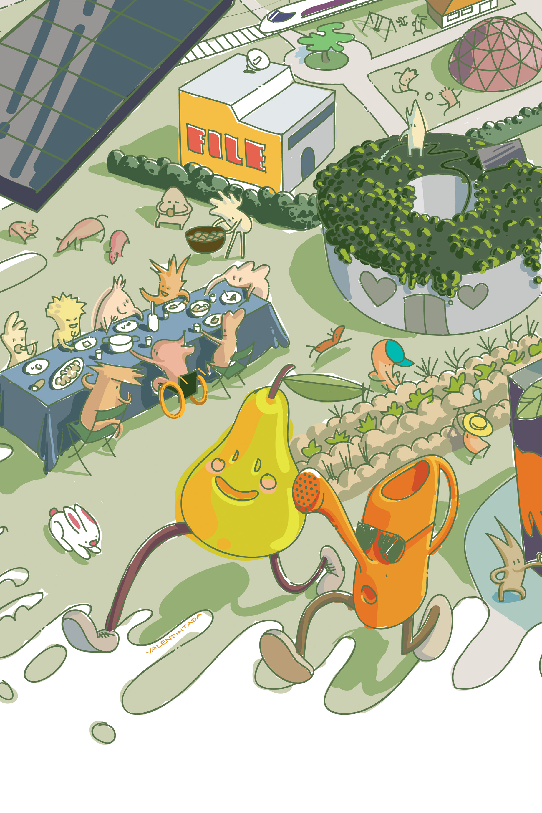

---
Pr-id: MoneyLab
P-id: INC Reader
A-id: 10
Type: article
Book-type: anthology
Anthology item: article
Item-id: unique no.
Article-title: title of the article
Article-status: accepted
Author: name(s) of author(s)
Author-email:   corresponding address
Author-bio:  about the author
Abstract:   short description of the article (100 words)
Keywords:   50 keywords for search and indexing
Rights: CC BY-NC 4.0
...

Reclaiming Food

# 5. Territories of Commons in Europe: Niches of a Much Needed Transition

by Jose Luis Vivero Pol

We have to move to a Common Food Policy instead of a Common Agricultural
Policy (CAP, the European policy framework that exists today). That idea
is gaining traction in more and more circles, from the
[proposal](http://www.ipes-food.org/pages/CommonFoodPolicy) by the
International Panel of Experts on Sustainable Food Systems – IPES
Food to the European Economic and Social Committee. Hundreds of
alternative food movements are already supporting the idea.^1^ A shift like
this would solve the current policy incoherence between the different EU
policies, such as trade, food, agriculture, environment, climate, health
and social issues. Right now, these policies do not row in the same
direction.

Another good reason for leaving the CAP behind and moving towards a
Common Food Policy, would be the disproportionate power of big
agriculture and transnational food corporations in the European policy
arena. They exert their influence through revolving doors and lobbyists
that literally draft and amend EU guidelines. This corporate policy
capture purely aims to maximise stakeholder profits instead of public
health, environmental protection or food security. It leads to huge
monopolies in food retailing and agro-chemicals, patented seed research
and supply, land grabbing in many parts of Eastern Europe and food
safety circumventions (for example, glyophosate or neocotinoids). It is
already common place in scientific circles to call the current way of
producing and consuming food, the industrial food system, neither fair
nor sustainable. Our industrialised food system is one of the main
drivers of planetary destruction.

As global warming already poses a threat to human lives and agricultural
production, what is needed for the sustainability transition is indeed
more democracy, more rational and forward-looking management of
food-producing resources and a different moral economy for the entire
food system. Based on my international expertise as a food security
specialist and my scholarship on food systems in transition, I believe
that we need to value food differently. We need to re-conceptualise the
entire food system so that it bolsters human health, nature stewardship,
farmers’ livelihood and landscape protection. We need a food system that
works for the common good, not just for profit maximisation. To get
there, it helps to look at the food system through the lens of the
commons. This has the potential to cure the myopia that makes food and
food-related elements (like seeds, water, land, knowlegde) exclusively a
matter of market transaction. The industrial food system values and
governs food as a mere commodity and that is wrong. The meanings of food
are more diverse than that, as I have proposed recently. In the
multi-dimensional [framework](https://www.mdpi.com/2071-1050/9/3/442)
to understand the value of food to humans, there are economic and
non-economic dimensions.^2^ Some can be valued in monetary terms, others
cannot. What is the price of a human right to be traded in the market?
As food is essential to everyone’s survival, its market price could be
priceless when someone is in desperate need. How can the cultural
importance of any given food be priced when that valuation is rather
personal and subjective?

> We need to re-conceptualise the entire food system so that it bolsters
> human health, nature stewardship, farmers’ livelihood and landscape
> protection.

These critical reflections imply that not all food values can be reduced
to supply and demand market rules, in which food prices do not properly
represent the multiple meanings food has for different people. These
meanings and social constructs simply cannot be reduced to food prices.
Commodified food is the most reductionist approach to food, where those
non-economic dimensions are superseded and obscured by the tradeable
dimension (represented by quantity, quality, size, place of origin,
homogeneity, durability and other features appreciated by the industrial
food system).

Within this current framing, food cannot be enforced as a mandatory
human right and traded as a commodity at the same time. As long as we
see it as a commodity, it cannot be governed as a public good by a
nation-state or as a commons by a community. Market rules prevail over
other allocation mechanisms. However, if we consider food as a human
right (which is currently [not the case in any EU member
state](https://gh.bmj.com/content/1/1/e000040)), a public good or a
commons, then we should broaden the debate and look at grassroots
movements in Europe for inspiration.^3^ The rejection of the narrative of
food-as-commodity and the adoption of
[food-as-commons](https://www.routledge.com/Routledge-Handbook-of-Food-as-a-Commons/Vivero-Pol-Ferrando-Schutter-Mattei/p/book/9781138062627)
or food-as-human-right can be found in many new initiatives that are
popping up in cities as well as in a myriad of customary practices that
have successfully resisted the commoditization wave.^4^ Did you know for
instance that [12 million hectares of land in
Europe](https://blog.p2pfoundation.net/food-commons-europe/2017/02/01)
are still managed collectively as a commons?^5^ They include croplands,
pasturelands, estuaries, coastlines, forests, mountains and rural roads
in all EU countries. Common lands have nearly all vanished in European
countries that actively encourage private or state appropriation of
communal lands, such as Belgium and Germany. Some of these countries do
not even have a legal status for common land. In France, Spain, Italy or
Sweden however, there are still millions of hectares of [“territories of
commons”](http://wiki.p2pfoundation.net/Territories_of_Commons_in_Europe)
that enable people to survive.^6^ Well-known examples are the oyster beds
in Arcachon Bay, to the Water Jury in Valencia, long-term rental
contracts of agricultural lands owned by communities in Nonantola or the
Everyman’s Rights that enable any Swede to collect berries, fish or camp
in anybody’s landplot. Another example is from Galicia, my home region
in Spain: the proportion of commonland is one fifth of the total area,
legally owned and managed by those who actually inhabit in parishes.

The “territories of commons” are reservoirs of:

-   climate-adapted practices based on agro-ecology

-   biodiversity and fundamental ecosystems services

-   governance systems, based on centuries of experience, with their own
    institutions and regulations

-   cultural heritage and collective knowledge, accumulated for
    centuries and adapted to local conditions

-   participatory and de-centralized democratic mechanisms.

The commons require a collective search for new shared governance
systems that work in different contexts. They represent political
alternatives to the representative democratic systems that we now have
in Europe: systems that are detached from citizens, [co-opted by
corporations](https://corporateeurope.org/sites/default/files/captured-states-exec-summary-fr.pdf),
focused on economic growth and the exploitation of common resources.^7^
Therefore, it is not surprising that there is not a single mention of
the commons, commons-based food systems or collective governance in the
current CAP documents.

And yet, as a word of caution: the territorial commons and the
food-producing commons are not governing arrangements that are devoid of
inequality, exclusion or discrimination of certain community members.^8^
The commons, understood as governing mechanisms crafted by human
collectivities, are embedded in the communities that have instituted
them and in the formal states where those communities live. Therefore,
the commons mirror the inequalities and hierarchies already found in
those groups and countries. As human institutions, the collective
mechanisms devised to govern the commons are far from perfectly fair and
flawless, although they are useful and resilient. Those mechanisms are
complex combinations of formal and informal rules, customary norms and
modern laws, being in many cases legally protected or at least tolerated
by the state mechanisms where those commons are embedded.^9^

New initiatives like Community Supported Agriculture farms (CSA) or Food
Buying Groups are popping up everywhere, adopting a logic that goes
beyond the price tag of a strawberry. These initiatives enable organic
farming to be a coproduction of eaters and farmers, sharing risks,
restoring common sense in the food system. Eat what is in season, do not
use agro-chemicals that kill pollinators. These initiatives, however
diverse the motivations of their members may be, share a rejection of
the absolute commodification of food. They seek to re-create the lost
bonds between producers and eaters, to re-embed food into the moral
economy and local environment, and to make non-economic food dimensions
more salient and relevant.

A commons approach to food systems recognizes the multiple values of
food that cannot be reduced to its economic transactions. Food is not
only essential for everybody’s survival, it is also a human right and a
cultural determinant. It has been a public good throughout history, from
the Roman Empire to the CAP subsidies today. To reduce it to just
something with a price tag, like a car, feels absurd and awkward.
Purchasing power cannot exclusively determine your access to such an
essential resource.

> They share a rejection of the absolute commodification of food. They
> seek to re-create the lost bonds between producers and eaters, to
> re-embed food into the moral economy and local environment.

If policy makers are ready to shift from an agricultural policy focus to
a food-related policy focus, they should take into account [new and old
food-producing
commons](https://www.righttofoodandnutrition.org/commons-and-commoning-new-old-narrative-enrich-food-sovereignty-and-right-food-claims)
and partner with them.^10^ The “territories of commons”, rural and urban,
customary and contemporary, are innovative niches of transition full of
tasty and healthy organic food, institutional novelties, digital
technologies, participatory democracies and enviromental caring
practices. Local solutions to the challenges affecting the industrial
food system already exist. They are a complex set of self-regulated
actions and state-imposed laws that succeed relatively well to satisfy
community needs to govern common resources. Enabling food democracy, in
which food citizens can re-gain control of their food systems, would
indeed bring us closer to the values and the benefits of a regime based
on the food commons. The aim would be sustainable agro-ecological
production using open-source knowledge, seeds, fish stocks, land,
forests and water as commons to reach food and nutrition security for
all Europeans, as a commonwealth.

The change I propose is as much about technologies, subsidies, legal
frameworks or specific policies as it is about moral shifts and
narrative changes. This change implies devolving power to local
communities to command their own transition pathways to reach fairer and
more sustainable food systems. In walking that path, communities may
fail or succeed, and other stakeholders such as the state and the market
may or may not find a constructive role in that transition. But all of
them shall value food and the food-producing resources differently than
before. Considering food as a commons, a public good and a human right
is an aspirational and inspirational narrative that may substantiate the
proposed Common Food Policy, by unlocking political innovations that
have not been explored so far. Let’s dare to do it.
