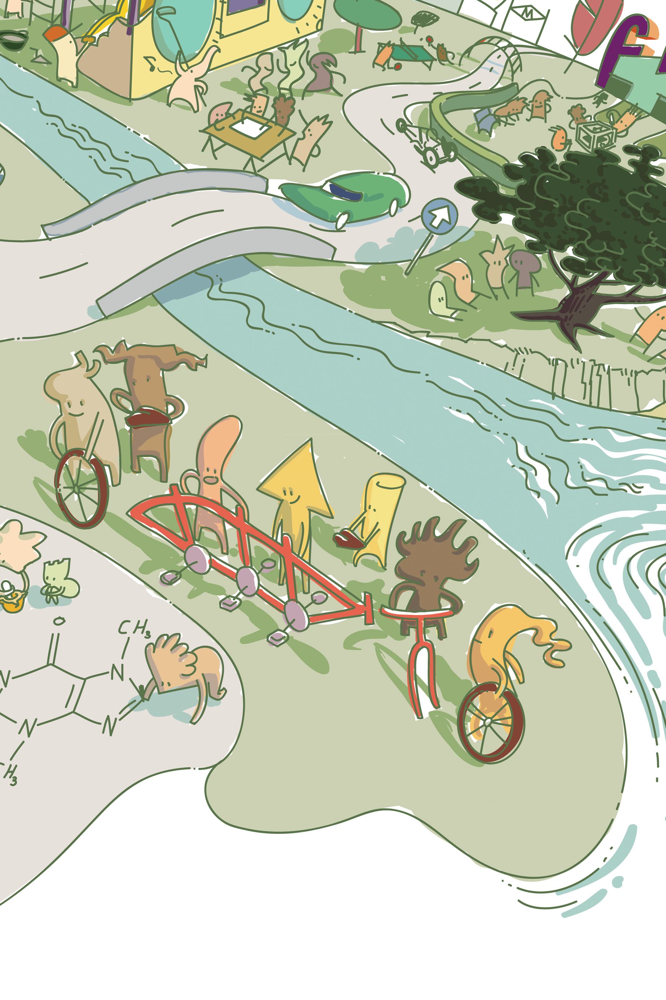

---
Pr-id: MoneyLab
P-id: INC Reader
A-id: 10
Type: article
Book-type: anthology
Anthology item: article
Item-id: unique no.
Article-title: On the Commons and Europe
Article-status: accepted
Author: Michel Bauwens, Silke Helfrich, David Bollier
Author-email:   corresponding address
Author-bio:  about the author
Abstract:   short description of the article (100 words)
Keywords:   50 keywords for search and indexing
Rights: CC BY-NC 4.0
...

Conclusion

# 16. On the Commons and Europe

with Michel Bauwens, Silke Helfrich and David Bollier

Michel Bauwens, Silke Helfrich and David Bollier are three of the most
reknowned commons-thinkers in the world. Michel Bauwens is the
co-founder of the P2P Foundation, one of the most important
organisations in the commons movement. He is the author of countless
important publications about the commons. Together with Vasilis Kostakis
and Alex Pazaitis, he just released a new book titled *Peer To Peer:
The Commons Manifesto* (2019).^1^ Silke Helfrich and David Bollier
co-founded the Commons Strategies Group with Michel Bauwens. Helfrich
and Bollier also co-wrote two important works about the commons in
recent years: *The Wealth of the Commons* (2012) and *Patterns of
Commoning* (2015). In September of 2019, the duo will release their
latest book: *Free, Fair and Alive: The Insurgent Power of the
Commons* (2019), a truly seminal work for anyone interested in the
commons.^2^ David Bollier is also a board member of Commons Network.

***Thomas de Groot**: Out of all the major crises we face today, which
one is the most urgent?*

**Silke Helfrich:** You mean: Which are the most important factors that
*led to* the interconnected crises we are facing?

**David Bollier:** Good point, because from the perspective of the
commons, the question is self-contradictory. The power of commoning is
precisely that authority and action are distributed. Diverse players in
particular local settings can determine their own fates, using rules
that make sense for them in their special contexts. So even
theoretically there is no ’single, most urgent struggle’. There are
always multiple arenas of meaningful struggle and one can never know in
advance which one will shock and surprise everyone with impressive
results. This is also known as resilience.

**Michel Bauwens:** David is right. Nonetheless, the most urgent
question today is undoubtedly climate change, which is itself an
expression of deeper structural problems that we must tackle at the same
time as a context for solving climate disruption.

> We are immersed in an epistemological delirium – as Bruno Latour would
> put it. When we think of nature as a resource to be used for our
> purposes, we imply that it is separated from us!

***TdG**: What are these deeper structural or systemic problems?*

**MB:** In my analysis, the structural problem is threefold. First of
all, we believe that nature and natural resources, that we unfortunately
see as being ‘outside’ ourselves, are infinite resources to be used for
human need and private profit. Second, we believe that resources that
are eminently shareable, and should be shared to advance humankind,
should be made artificially scarce, so we privatize and marketize
knowledge, making it unavailable for advancing the common good and
solving issues more quickly. Finally, we develop our societies in ways
that create inequality and increasing social instability, leading to
more and more authoritarian outcomes.

**SH:** I’d like to highlight one of the aspects Michel points to. The
deeper problem is the way we think; or more precisely, the way we are
taught to think. We are immersed in an epistemological delirium – as
Bruno Latour would put it. An example: when we think of nature as a
resource to be used for our purposes, we imply that it is separated from
us! Framed that way, everything comes down to a management problem – the
management of some*thing*. And then we manage and manage and at the end
of the day, we get burned out, suffering from that cultivated
separation. So, the root cause of the problems mentioned by Michel, and
of many other problems, is that we ignore the most important element
that makes us truly thrive: relatedness, connection.

**DB:** Exactly. Any of us could prioritize certain problems, but the
more critical challenge is identifying the most suitable framework for
understanding them. Climate change and inequality are obvious
mega-problems, but what really matters is adopting the correct
ontological premises and epistemology. This is so important because we
need to frame our problems right – identify their most important
dimensions -- if we want to address them effectively.

**SH**: Right, this means that we need to go a level deeper and look at
the way we conceive the world and conceive ourselves as human beings. If
these conceptions are too limited or shallow, or if they presume that
human beings are merely hyper-rational, utility-maximizing machines the
way economics does, the “solutions” that follow will be based on an
erroneous foundation.

**DB**: True. In our new book, *Free Fair and Alive*, we call this ‘the
OntoSeed’. If the seed we plant is ‘flawed’, the yield will be
disappointing – or worse, doomed to fail.

**SH**: It’s like the DNA that contains a certain programme that unfolds
and we have only a certain impact on the results it brings about. If it
is structurally flawed, there is almost nothing we can do about it.

> Mutualization of physical resources and provisioning systems has an
> enormous capacity to diminish the human footprint while maintaining
> complex social systems for human wellbeing.

In their book^2^ *Free, Fair and Alive*, Bollier and Helfrich write*:*
“Enacting Peer Governance needs to be a living, developmental process in
itself. Therefore, instead of offering a full set of prescriptive
formulas, our patterns amount to procedural guidelines that enable a
stepwise, adaptable path for developing a commons. Enacting a commons
through Peer Governance resembles the way in which DNA provides general
guidance, but not strict instructions, for the autonomous development
and differentiation of an embryo. “Does the DNA contain a full
description of the organism to which it will give rise?” asks British
biologist Lewis Wolpert. “The answer is no. The genome contains instead
a program of instructions for making the organism — a generative program
…” So, the bad news is that there is no blueprint, no panacea. Peer
Governance is not a prescriptive, rule-driven program for fabricating
commons or managing resources. But the good news is that Peer Governance
is a generative process. It is a reliable means by which commoners can
build authentic, living relationships among themselves, and in so doing,
develop a coherent, stable commons.” \[TdG\]

**DB**: Indeed. The ‘OntoSeed’, in turn, affects the structural analyses
that are possible and how we can respond. Conventional market-based
solutions, international treaties, and state regulation -- for example
-- are not going to overcome deep, systemic problems because they are
based on the same premises that gave rise to the problems in the first
place. They presume homo economicus as an idealized model of a human
being, which has proven itself incapable of responding to both
scientific evidence and urgent collective-action needs.

**SH**: And this homo economicus is conceived as an isolated being that
focuses on self-maximizing its individual gain. The problem is, that by
believing in this story and shaping our institutions accordingly, we
actually *become* a homo economicus. But this conception of ourselves as
human beings will not ever make us realise our full potential.

> Knowledge, code and design can simply be shared widely and generously,
> because they become more useful for everybody as we share them. The
> only thing that prevents us from sharing knowledge generously is the
> socio-economic model that surrounds us, aka capitalism.

***TdG**: What do the commons have to offer in response?*

**MB:** We have made substantial progress in recreating commons of
shared knowledge, and have started redistribution mechanisms, like urban
commons, using commons-centric ecosystems, but it is vital to move the
commons-centric economic and social systems to actual material
production, as is now already happening in food and energy. Why is this
vital: First of all because mutualization and pooling of knowledge,
makes sure that all innovations and solutions can be replicated, learned
from, and adapted, wherever they are needed. Next, because mutualization
of physical resources and provisioning systems has an enormous capacity
to diminish the human footprint while maintaining complex social systems
for human wellbeing. And finally, because the commons-based model of
cosmo-local production^3^, whereby ‘all that is light is global and
shared and all that is heavy is localized to the extent possible’, is
also one that can regenerate local and bioregional economies, where we
can move from extractive economic models, to generative economic models,
that heal the earth, its resources and communities. Transforming our
means of production and distribution will be vital, by integrating all
positive and negative, social and ecological externalities, at all
levels of human decision-making.

**SH:** I agree in general, but I think that we have to pay a lot of
attention to the way we conceptualize things. An example: the idea of
“mutualizing knowledge” does not make sense to me, at least not in a
commons context. Knowledge, code and design can simply be shared widely
and generously, because they become more useful for everybody as we
share them. The only thing that prevents us from sharing knowledge
generously is the socio-economic model that surrounds us, aka
capitalism. It is only in this context that it is functional to make
what is abundant – such as knowledge – artificially scarce. The purpose
for doing this, of course, is to ensure that potential competitors are
kept at distance and that everything can be traded on the market.
Markets *require* scarcity in order to work!

Furthermore, we need to be very careful, almost meticulous, not only
with the concepts we refer to, but with our wording. We can hardly be
truly transformative if we use the language of market economics, state
power, and political liberalism. I actually think that we need to come
up with a language that is able to capture the essence of commoning and
its transformative power. Rather than isolated I’s and homo economicus,
we are “Nested I’s!” – biological and social creatures with deep
relational connections and dependencies.

> By asserting a coherent alternative vision, the commons as a discourse
> begins the process of changing politics and culture. It opens up a
> space for talking about practical alternatives that escape the
> destructive logic of neoliberal capitalism and state power as
> historically exercised.

**DB:** The great potential of the commons lies in helping us re-imagine
what human beings actually are -- and then to re-orient our
perspectives, policies, laws, and institutions accordingly. The commons
is at one level a discourse and political history, but more
fundamentally it is a set of social practices and ethical values that
honor fairness, self-determination, inclusion, and responsibility
aligned with entitlements. The commons is pre-political in the sense
that commoning is an ancient impulse of humanity. It tends to precede
any political system and function somewhat autonomously.

The commons points to a different vision of how society might be
ordered, relative to modernity and capitalism. It emphasizes peer
governance and provisioning at a more local, participatory level. It
prioritizes fairness and inclusion. It is not about maximum material
throughput -- growth, consumerism, profit, GDP -- but about responsible
long-term stewardship on behalf of all. By asserting a coherent
alternative vision, the commons as a discourse begins the process of
changing politics and culture. It opens up a space for talking about
practical alternatives that escape the destructive logic of neoliberal
capitalism and state power as historically exercised.

***TdG**: What is the role of institutions?*

**MB:** The role of institutions, and thus of European institutions,
must change their focus from their functioning as market-centric state
forms, and the EU certainly has very strong neoliberal biases which
block many necessary pathways, towards commons-centric public-social
partnerships.

**SH**: Which we could call Commons/Public Partnerships, commons first,
of course.

**MB**: Yes. And territorial common good institutions can eliminate the
multitude of obstacles standing in the way of collaboration and
mutualization, and facilitate the autonomy of civil society actors at
the personal and collective level.

**DB:** As commons grow in size and influence, some sort of *modus
vivendi* is needed between the state (law, bureaucracy, policy,
representative law-making) and the very different logic and ethic of
commoning, which is more ecologically and socially grounded. The state
may have legality on its side, but the commons more often has social and
moral legitimacy.

> Inste*ad of presuming that markets are the only efficient way to
> produce wealth (when in fact, they are often merely extractive and
> predatory for private gain), policymakers need to recognize that
> commons are value-generating social systems.*

***TdG**: What can commoners do to change these institutions?*

**MB:** Beyond public-commons cooperation protocols and mechanisms,
there is also a necessary process of the commonification of public
services, so that the public resources become inalienable and governed
‘poly-centrically’ by the multiple stakeholders.

**SH:** Yeah, we need to -- metaphorically speaking -- put up stickers
everywhere and shout out: “This is not for sale, because it is ours.”
But we also need to get clarity about who is “us” and what rights and
obligations this process of commonification entails. After all, we
should not forget that commons comes from Latin cum + munus. Cum
(English “with”) denotes the joining of elements. Munus — which is also
found in the word “municipality” — means service, duty, obligation, and
sometimes gift. All terms that conjoin cum and munus, such as communion,
community, communism, and, of course, communication, point to a
co-obligation — or a linkage between use rights, benefits, and duty.

**MB:** This means that poly-centric governance includes a special role
for all citizens but also specifically for transition agents which can
prove their impacts. We must overcome the merely competitive public
procurement processes and mobilize the whole society towards the
eco-social transition. Contributory democracy means that multi-governed
institutions can give a place at the decision-making table to
commons-oriented civic communities that are exemplars for the
transition. Collective institutions like the EU must become
commons-facilitating institutions, that start judging projects and
initiatives on their regenerative, common good impact, and are thereby
able to promote and finance regenerative activity, by mobilizing the
whole society and not just firms, and by creating a planning framework
of global thresholds and allocations, which can be used granularly at
every level, so that production of human needs (and all other beings)
can proceed within planetary boundaries and resource boundaries. The
role of territorial organizations like the EU is to focus also on
capacity building, so that commons engagement can be undertaken by all
citizens at their full capacity. One of their central tasks is to help
strengthen ‘commons of capabilities’.

**DB:** But how can state power and commoning coexist? That is a
significant challenge that commoners and European policymakers alike
must address. A first priority should be to decriminalize commoning in
cases where it is illegal, such as in seed-sharing and certain forms of
information-sharing. We also need new types of law to affirmatively
support commoning. It has taken ingenious "legal hacks" such as Creative
Commons licenses, the General Public License for free software, and
community land trusts to make certain forms of sharing explicitly legal
and practical. Instead of presuming that markets are the only efficient
way to produce wealth (when in fact, they are often merely extractive
and predatory for private gain), policymakers need to recognize that
commons are value-generating social systems. Even better, the commons
usually do so without the "externalities" that businesses routinely
impose upon the environment, communities, and future generations.

***TdG**: What would a transition of these roles and mentalities of
institutions look like?*

**MB:** Climate change, the vital necessary transition towards a mode of
production and distribution that is fully compatible with the
maintenance of life, the health of the planet, is certainly the fight of
our times, but it cannot succeed without more social equity and massive
sharing of knowledge. Which means that it becomes a vast process of
eco-social transition processes, not just focused on mere
decarbonisation. One of the associated priorities is to create means of
managing human production that fully integrate externalties, and
therefore, the accounting and management of externalities is also a
vital part of the transition. Humans must become thermo-dynamically
informed in their productive decision-making and society as a whole must
become life-centric, not only for humans but for all life and beings,
and future generations. This goes well beyond mitigation towards
generative and regenerative models. None of this can succeed without
giving commons, a vastly more important place in the way society and its
institutions are organized. The common good, and nature, must have a
voice, and we need institutions that allow for this voice to be heard,
not occassionally but as the vast ground of all human decisions.

**DB:** An added benefit of a commons-based strategy is greater
resilience and popular empowerment by distributing authority more widely
and at appropriate levels (the idea of "subsidiarity"), rather than
concentrating too much power with politicians and centralized
bureaucracies. By deconcentrating power, state assistance to commons
would in effect promote greater democratic participation and control
while reducing large-scale abuses of power and ecological harm.

> The common good, and nature, must have a voice, and we need
> institutions that allow for this voice to be heard, not occassionally
> but as the vast ground of all human decisions.

***TdG**: Can you give me some examples of practices that have inspired
you recently?*

**DB:** Commons/public partnerships in which the state actively and in
good faith assists the work of commons, have already been mentioned.
Imagine expanding the Drugs for Neglected Diseases Initiative, DNDi,
which is a partnership among commons, state institutions, and private
companies to reduce the costs of drug R&D and distribution. DNDi
releases medically important drugs under royalty-free, non-exclusive
licenses so that benefits so that the drugs can be made available
everywhere inexpensively.

Or consider how the Humanitarian OpenStreetMap Team has helped various
states in the wake of natural disasters, such as the earthquake in
Haiti. HOT is a commons-driven solution that brings together volunteer
hackers to produce invaluable web maps showing first-responders and
victims where to find hospitals, water, and other necessities.

The System of Rice Intensification is a global open-source community
that trades advice and knowledge about the agronomy of growing rice.
Working totally outside of conventional multilateral channels, SRI has
brought together farmers in Sri Lanka and Cuba, India and Indonesia, to
improve their rice yields by two or three-fold.

The state could help decommodify land and make it more available to
ordinary people through community land trusts. If this is the agenda,
special attention should be paid to developing commons-friendly
infrastructure. This could be hugely beneficial, as seen in
community-owned Wi-Fi like Guifi.net, free and open source software, and
regional food systems that empower smaller farmers and enterprises.

Developing legal hacks that can provide legal recognition to commoning
is vital. Platform cooperatives that offer alternatives to the "gig
economy" (Uber) are one innovation that needs support. So are certain
distributed ledger technologies such as Holochain, which aims to be a
commons-friendly alternative to the blockchain as emboded in Bitcoin.

Ultimately, the most urgent struggle is not to "pick battles to fight"
with the state or ideological adversaries, or to attempt to seize state
power, an achievement that may be Pyrrhic, as the experience of Syriza
has shown. The most urgent struggle is to build out the world of
commoning as a parallel social economy with its own stability, autonomy,
and effectiveness. That is the foundational base upon which a
transformational politics can be built.

**SH:** Exactly. State institutions are misconstrued as solutions when
they are often part of the problem. Representative democracy purports to
be fair and effective, but because it is hierarchical and corrupted by
money – the wider problem of ‘Governing-through-Money’ – it is not TRULY
representative and centralized bureaucracies have trouble being
responsive to dynamic, local circumstances. I think we have to ask
ourselves if commons and commoning can be reconciled with representative
democracy and bureaucracy, and if so, how. The challenge for all of us
is to learn to think like a commoner and to feel like a commoner. This
basically means to learn to really feel and recognize that we are
inescapably related to each other – to see that we are interdependent on
each other and that my personal development depends on the development
of yours, and vice versa.
