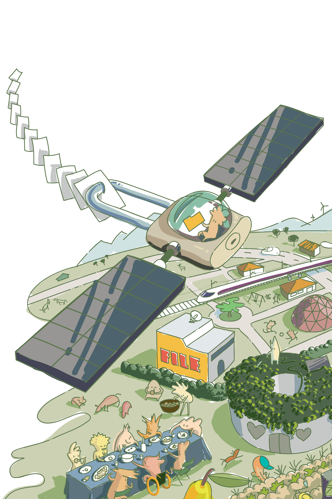

# Our Commons: Political Ideas for a New Europe
Edited by Sophie Bloemen and Thomas de Groot

#Colophon

**Our Commons: Political Ideas for a New Europe**
 Editors: Sophie Bloemen and Thomas de Groot

Authors: Kate Raworth, George Monbiot, David Hammerstein, Cecile Blanchet, Jose Louis Vivero Pol, Christian Iaione, Sheila Foster, Doina Petrescu, Constantin Petcou, Trebor Scholz, May Ishikawa Sutton, Ellen 't Hoen, Jean-Francois Allesandrini, Benjamin Coriat, Michel Bauwens, Silke Helfrich, David Bollier, Thomas de Groot and Sophie Bloemen

Copy-editor: Mai Ishikawa Sutton
 Cover art and illustrations: Mercè M. Tarrés/Guerilla Media Collective
 Typesetting: Donnie Spirelli
 Production: Sepp Eckenhaussen and Donnie Spirelli

Published by the Institute of Network Cultures, Amsterdam, 2019.
 ISBN 978-94-92302-35-9

**Contact**
 Commons Network 
 Keizersgracht 102, 1015CV, Amsterdam, The Netherlands
 Email: info@commonsnetwork.eu
 Web: http://www.commonsnetwork.org

This publication is published under the Creative Commons Attribution-NonCommercial-NoDerrivatives 4.0 International (CC BY-NC-SA 4.0)-license.
Art and illustrations under P2P license.

# Preface

Our world is darkening and major shifts are coming. Our social and
economic systems are strained and we have reached the limits of what the
planet can endure. We are yearning for change, but what does that look
like and where do we go from there?

We believe real change happens when we challenge the status quo and
embrace the future. The commons help us do both. In this book, we have
tried to showcase how powerful that combination can be.

This book would not have been possible without the support of the
Fondation Charles Léopold Mayer pour le Progrès de l’Homme. We also
could not have done any of this without the work of our partners,
teachers and friends in the international commons movement.

Thomas and Sophie, Amsterdam, April 2019.

# Table of Contents

I. *SHIFTING PARADIGMS*

1\. **Introduction** - by Thomas de Groot and Sophie Bloemen

2\. **The Potential of the Commons** - with Kate Raworth and George
Monbiot

II\. *ENERGY*

3\. **Commons-Based Renewable Energy in the Age of Climate Collapse** -
by David Hammerstein

4\. **Energy Commons: The Missing Link Between Energy Transition and
Climate Justice** - by Cecile Blanchet

III\. *FOOD*

5\. **Territories of Commons in Europe: Niches of a Much Needed
Transition** - by Jose Luis Vivero Pol

6\. **Social Circularity: Food-sharing Platforms Are Re-inventing Urban
Solidarity** - by Thomas de Groot

IV\. *CITIES*

7\. **Ostrom in the City: Design Principles and Practices for the Urban
Commons** - by Christian Iaione and Sheila Foster

8\. **Designing, Sustaining and Defending Resilient Urban Commons** - by
Doina Petrescu and Constantin Petcou

9\. **Could This Local Experiment Be the Start of a National
Transformation?** - by George Monbiot

V. *DIGITAL COMMONS*

10\. **A New Vision for a Shared Digital Europe** - by Alek Tarkowski,
Paul Keller and Sophie Bloemen

11\. **Own This! A Portfolio of Platform Cooperativism in Progress** - by
Trebor Scholz

12\. **Digital Commoning and the Fight for a Human-Centered Internet** -
by Mai Ishikawa Sutton

VI\. *ACCESS TO MEDICINES*

13\. **From Lab to Commons: Health as a Common Good** - by Sophie
Bloemen

14\. **The Medicines Patent Pool: A Remedy for the Anti-Commons** - by
Ellen ‘t Hoen

15\. **Developing Drugs through the Commons** - by Jean-Francois
Allesandrini and Benjamin Coriat

VII *WHAT’S NEXT?*

16\. **On the Commons and Europe** - with Michel Bauwens,
Silke Helfrich and David Bollier

17\. **References and Resources**

18\. **List of Contributors**

Shifting Paradigms

# 1. Introduction: Shifting Paradigms

by Sophie Bloemen and Thomas de Groot

‘Europe’ is more an idea than a geographical unit. In many ways, it
remains a promise, something that one day might take shape. How we
design that promise is continuously up for debate. The current dominant
shape of the idea that we call Europe is simply not good enough. We must
reinvigorate its promise.

Our Europe is optimistic, driven by ideas and stories that have the
common good in mind. Our Europe is inspired by human flourishing and
mutual trust. Our Europe is built on generosity and hope, not on
extraction and dogma. It is built on communities and citizens, not on
markets and consumers.

The foundational stories of collective post-war reconstruction and the
mantra of ‘never again’ have lost their appeal. Europe is now facing
various forms of social and political regression, notably the rise of
new forms of nationalist, neo-fascist and undemocratic movements.

Europe needs new stories that orient us towards a brighter future. We
believe that one of these stories is that of the commons. It is the
story of people jointly stewarding resources, like water or energy or
even cities and knowledge. It is a story of communities, of
collaborative and democratic practices. The commons have been a
forgotten sector of our society and our economy. They convey the space
in which communities write their own rules. The commons presuppose
activity, communication and democratic stewardship. They move us away
from linear thinking and individualism, towards ecosystems and social
relationships.

Perceiving our shared resources — like water, land, air, cultural
heritage and scientific achievements — as global commons inspires us to
take a certain ethical perspective. It leads us to recognize the
imperative to jointly and equitably govern these resources, in a way
that maintains the wealth of our planet. It implies a regenerative
economy that sustains the planet, not an extractive one that destroys
it. Embracing the commons fosters a culture of reciprocity to bring
about a more socially and ecologically sustainable society.

Commons Network has in the last several years worked to tell that story,
to convey the logic of the commons in policy circles, in civil society
and in the public debate. Together with others, we saw the enormous
power and potential of this story and practice, the collective potential
of all commoners. We have acted as a think tank, as organisers, as
activists and advocates. We published papers, wrote articles, organised
Assemblies, met countless people and learned about thousands of
initiatives. We saw how the commons connects struggles in different
realms and bridges movements and approaches: it provides a new
vocabulary for social justice and collective action for a
social-ecological transition.

This renewed claim to community, belonging and collaborative values
makes a new politics and a new economy possible. Yes, we argue that this
vision brings us closer to the ideal of Europe as a post-nationalist
space.<super>1</super> Through trans-local solidarity and multilayered belonging, we
can escape the stand-off between detached cosmopolitanism and regressive
nationalism.

Having learned about the different practices and forms of commons and
what they need from institutions to thrive, we decided to bring it all
together. Here, we showcase the ideas, the people, the practices and the
policy implications. This book offers an insight into this growing
movement. While we are writing this, new commons initiatives are
emerging, adding to the theories and practies and further developing the
discourse.

Working on the commons, we have come to observe transformative ideas
emerging all around us. More and more people dare to imagine radically
different futures, beyond ‘there is no alternative’. More and more
policymakers are adopting new concepts like food sovereignty or ‘the
Doughnut’. More and more activists are merging anti-racism and
eco-feminism in one intersectional and emancipatory theory of change.
Even de-growth, a concept that is still too radical for most greens and
social-democrats, is slowly becoming more mainstream. We have moved past
the neoliberal consensus. We have come to recognize the limits of our
planet and the boundaries of the living world as we respect our embedded
role in it.

The commons are not primarily a political theory, but first and foremost
a practice emerging from the bottom-up. Everywhere, people are engaging
in alternative practices as part of the struggle for ecological, social
and cultural transition within their communities. Local energy
cooperatives are prioritising community wealth and open access medical
journals are sharing knowledge – these practices represent social and
cultural shifts in value models.

While societal shifts are often framed in terms of economy or
technologies, they are rooted in cultural change. Our culture reflects
and shapes our values and how we attribute meaning to our lives. Many
current community-led and social innovation initiatives contain strong
elements of practical cultural change. New social values and practices
are enabling communities to be generative instead of extractive. This is
creating a new civic and cultural ethic that is breaking with
conventional notions of citizenship and participation. The regeneration
activities of commoners showcase, above all, cultural manifestations of
new ways of daily life.

The European Union and its member states have a huge role to play in
facilitating social and ecological transition. The political project of
the European Union could be truly transformative. Yet for now, our
institutions are firmly grounded in outdated frames of thinking. Most of
the policy that originates in Brussels is based on endless growth,
markets and competition. In order to transition to a different economy
and society, we must first have a vision. It is crucial that a large
transformative vision gains the support of institutions and
policymakers.

The commons often emerge from the bottom up; they are dependent on
community processes and their logic is mostly at odds with the EU’s
institutional logic. However, we believe there is an important role for
EU politics and policy to create the right incentives, to remove hurdles
and to support this re-emerging sector. Supporting communities means
addressing the sense of losing control, identity and security. As a
post-nationalist project, the EU will, ideally, undergo a change in
consciousness away from nationalism, moving toward a flexible mode of
citizenship that allows for multiple belongings.

This publication explores these new politics and describes the commons
in different spheres of society, economy and politics. With these
stories, positions, and visions we aim to inspire but also give clear
direction. The book is divided into seven thematic sections. Most
sections have a theoretical position and a practical case study. All
sections feature influential thinkers whose voices we want to amplify.
This book is comprised of the insights of more than 20 writers,
activists and pioneers, standing on the shoulders of hundreds more.

Kate Raworth and George Monbiot invited us to Oxford to discuss the role
of the commons in their work, which led to the second chapter. In our
conversation, George Monbiot addresses the political potential of the
commons as a fundamental building block for a new ‘politics of
belonging’. Kate Raworth explains how the commons can help us arrive at
a new, different economy, one that serves people and planet.

In the next chapter, we continue to re-think what aspects of our daily
life belong to the domain of the market and the commons. Energy as a
commons is presented by Commons Network co-founder David Hammerstein
with a clear message: unless we accept de-growth as the only viable path
forward, no amount of renewable energy will help us. Cecile Blanchet
takes us on a journey to an energy cooperative in chapter 4, setting the
scene for a good overview of the current debate on renewables and energy
democracy.

In chapter 5, Jose Luis Vivero-Pol offers a passionate plea for food as
commons. Food as a system, from farmer to our plate, from the cultural
notion of food to its function in our society, should never be a
commodity, he argues. In chapter 6, Thomas de Groot investigates how
commoners on the ground are bringing this idea to life, in a case study
of FoodTopia in Spain and BuurtBuik in The Netherlands.

Urban policies are of critical importance to the emergence of the
commons. The groundbreaking work that Sheila Foster and Christian Iaione
have done in the emerging field of urban commons gives us tools to do
this. In chapter 7, they describe how they arrived at their vision. In
chapter 8, Doina Petrescu and Constantin Petcou deliver an urgent appeal
to architects to embrace the commons through their case study on R-Urban
and ‘aaa’, a collective of autonomous architects that take the commons
as the foundational principle of their work. George Monbiot returns in
chapter 9, to tell the story of Barking and Dagenham, one of the only
‘Leave-voting’ boroughs in the London area. Monbiot convincingly
presents this case study as the potential start of a national
transformation.

A citizen-based digital sphere that works for people? In chapter 10,
Sophie Bloemen, Alek Tarkowski and Paul Keller present their new vision
for a digital Europe, built on core principles like decentralisation and
digital commons. Democratic ownership is a path forward, away from an
economic dead end. That is why, in chapter 11, we asked Trebor Scholz to
write about platform cooperatives, which are a good example of
democratising the internet. How hard it is to imagine a different
internet, one without near-monopolies from SIlicon Valley and
surveillance capitalism, is shown by Commons Network fellow Mai Ishikawa
Sutton in chapter 12.

As long as we refuse to see biomedical knowledge as a commons, we will
never achieve full accessibility to medicines. That is what Sophie
Bloemen argues in chapter 13, in her invocation of the commons to
bolster the access to medicines movement. How this might work in
practice is demonstrated in chapters 14 and 15, where we present the
cases of the Drugs for Neglected Diseases Initiative (DNDi) and the
Medicines Patent Pool (MPP). Benjamin Coriat and
co-authors of DNDi brief us in detail about how a
non-profit medicines developer functions as a commons. MPP-founder Ellen
’t Hoen gives us a detailed account of the vision and the process that
led to the Patent Pool.

Finally, we talk to commons-thinkers Michel Bauwens, Silke Helfrich and
David Bollier for an in-depth discussion about the commons movement,
what commoners can do for Europe and vice versa.

*Our Commons* is first released online, as an e-book. In the summer of
2019, the team behind this work will continue the process of organic
publication. We will release individual sections as booklets, addressed
at different audiences. We will work on a web-version of all the texts,
for easier re-use and remixing. We embrace the principle of design
global, produce local or in this case, print on demand. Towards the
autumn of 2019, we will start the process of translating this work in
Dutch, to publish it in traditional book form in The Netherlands. We
hope that *Our Commons* will inspire people to take action.

# 2. The Potential of the Commons: A Conversation with Kate Raworth and George Monbiot

by Thomas de Groot and Sophie Bloemen

It’s hard to overstate the influence Kate
Raworth and George Monbiot have had on the increasing popular attention
to the commons. *Doughnut Economics*, the best-selling book that
Raworth published in 2017, sent shockwaves through the world of
economics and politics.^1^ *Out of the Wreckage*, Monbiot’s best-selling
book from 2017, struck a chord with policymakers and activists.^2^ More
importantly, both writers have managed to reach an audience that goes
far beyond academia or policy circles. Their ideas are discussed in
mainstream media, from newspapers to talkshows, and they are quoted by
politicians and activists. Both have managed to built platforms for
themselves that reach milions of people. And both of them discuss the
commons at length. We sat down with them in Oxford for a conversation
about the problems we face and how the commons can help us make things
better.

## The Doughnut and the commons

*Doughnut Economics*, according to some, represents a true paradigm
shift in economics. The book fundamentally challenges the legitimacy of
the market as the basis of economic thought. Moreover, *Doughnut
Economics* is a j’accuse to almost all mainstream political parties that
blindly take economic theories for granted and base their entire policy
platforms on the narrow scope of neoliberal factoids.

"For me, the commons is a way of broadening peoples’ economic
perspectives." Kate Raworth says, "And it’s much needed too. Even just
that new and smaller position of economics, as just a subsystem, is too
radical for most mainstream economists."

In the ‘Doughnut’, the economy is divided into four fundamental ways
people provision for their wants and needs. Raworth explains: "We all
know the market and the state," she explains. "Those two have been the
subject of an ongoing ideological boxing match, fighting over which side
can deliver the most growth. And old economics has been so focused on
them, that we have lost sight of the household, the space in which
caring work is done and the commons. We’ve massively over-emphasized the
market and the state. The commons and the household have been neglected
for decades if not centuries. So we are not very skilled at those two
systems anymore."

> That’s why I tell economists that if you ignore the commons, you’re
> ignoring one of the most vibrant spaces of the 21st century economy.

While lambasting economists and policymakers, Raworth also offers an
optimistic vision full of hopeful ideas and insights. "Elinor Ostrom was
briliant in showing the commons in a fishing area or a piece of
farmland. Add to that the incredible potential of the digital commons. I
think both her Nobel Prize and the rise of the digital commons mean that
the commons is going to become resurgent. That’s why I tell economists
that if you ignore the commons, you’re ignoring one of the most vibrant
spaces of the 21st century economy."

## A new Politics of Belonging

*Out of the Wreckage* endeavours to lay the groundwork for a "new
politics of belonging", as George Monbiot himself puts it. And just as
in the Doughnut, the commons are at the heart of this new progressive
narrative. "Kate talks about the commons as a starting point for her new
vision on economics and I look at the commons for their potential for
political renewal. We both agree that this is mostly a difference in
nuance, our visions on the commons are very connected."

Monbiot carves out a path towards these new politics. "We need to build
bridging communities within geographical neighbourhoods, we need a
participatory economy, we need to implement democratic innovations and
we need the commons. I see the commons as a re-democratising space."
Prospering communities, he explains, are founded on thick networks that
foster a culture of collaboration, in which "being an involved citizen"
is no longer the exception, but the norm. That is when political change
happens.

"Participatory democracy is crucial in reclaiming trust in our political
systems. It allows us to re-gain a sense of ownership over our political
systems." Monbiot describes the current representative system of
democracy as "preposterous". "We vote for a government every four years
and that government then assumes a mandate for everything it wants to do
for the next four years, even for things that were not in their
manifestos. It is an assumption of consent. No wonder we are alienated
from politics, no wonder we don’t trust our leaders anymore."

> Participatory democracy is crucial in reclaiming trust in our
> political systems. It allows us to re-gain a sense of ownership over
> our political systems.

Monbiot says participatory budgeting is another essential step towards
political renewal. In the Brazilian city of Porto Allegre, for instance,
people of many different backgrounds re-claimed a role in policymaking
by pioneering new ways of setting the municipal budget together. As
Monbiot says, "if you can do it there, you can do it anywhere."

The final step is economic transformation. "Very much in line with
Kate’s vision, we need to start shifting resources out of the market and
the state and into the commons. Let’s start by moving land out of the
hands of the private sector and into the hands of the community and the
commons."

## The Potential of the Digital Commons

The commons are the protagonist in the new story that Raworth and
Monbiot are trying to tell. They offer an untapped potential in economic
terms and they form the cornerstone of the new political discourse that
is emerging from the wreckage of opaque representative democracy and
free market fundamentalism. Their hopeful message is that we are only at
the beginning.

That promise is exemplified in new technology, according to Raworth.
"Twenty-first century technologies and the digital commons offer
incredible potential. Look at how we generate energy, how we run
machines, how we communicate and how we create and share knowledge.
These forces were always centralized, by design. Energy came from an oil
rig, production was done in a factory, communications came from an
operator’s switchboard and knowledge was held under patent and
copyright.

"Now, thanks to distributive technologies like solar panels on your own
roof or 3D printing, you can literally own your own production system.
Communication has also been transformed into a distributive force,
thanks to smartphones that allow each and everyone to become a node onto
the network. Even knowledge is now being re-distributed, thanks to
Creative Commons and commons-based licenses. All these developments
completely flip the idea that you have to separate the workers and the
means of production. The production means used to be so big that no one,
apart from the upperclass, could own or manage their own. But now, they
are so small, they fit in your pocket. This is revolutionary."

> The first internet was open source and non-commercial and slightly
> utopian. The second version of the Internet was captured. So let’s see
> the possibility and make the internet 3.0 truly distributive.

Raworth continued: "We’ve only just begun to see how the commons work.
But we already know that it is near zero-marginal cost to operate in the
digital commons. So it offers huge opportunities. All we have to do is
learn the skills needed to make something, to collaborate. That is the
art of the commons. The potential is unprecedented. I feel a great
excitement about what’s going to happen."

Does that mean that technology will solve everything? "No, not at all,"
says Raworth. "There is a total bifurcation of how this can go. Right
now it is not going in the right way. Networks have the potential to be
distributive, but because of their architecture, they have just as big a
potential to be captured. By itself, it is never going to go well. All
this centralised infrastructure, these captured networks, that is really
just ‘Internet 2.0’. That’s not the end of the Internet. We are just
beginning. The first internet was open source and non-commercial and
slightly utopian. The second version of the Internet was captured. So
let’s see the possibility and make the internet 3.0 truly distributive.
There is nothing inherent about these networks that says they will be
captured or distributive. We have to put in place regulation that make
it distributive and keep it distributive."

## The commons fallacy

Monbiot and Raworth also agree on their analysis of the
misunderstandings about the commons. The commons are not tragic, as
Garrett Hardin had famously asserted^3^. Or as Monbiot puts it: "Garrett
Hardin, as it turns out, had never actually encountered a commons in
real life before. He didn’t even know how they worked in theory, let
alone in practice. He didn’t even know what a commons was. He mistook a
commons for an open access regime. An open access regime is something
entirely different. Oceanic fisheries are open access, for instance.
Anyone can plunge in, drop a net and catch some fish. As a result, they
are massively overfished."

Successful commons are tightly regulated systems. Hardin presumed that a
commons has no regulation. In some ways, argues Monbiot, a commons is
more effectively regulated than either a state or a market system.
"Because you have the whole community involved in decisions, making sure
that those decisions are equitable, that they are made by the collective
mind, and that they reflect the needs of the whole community."

> Neoliberalism claims that the market is the only legitimate sphere and
> that when states seek to change social outcomes, they act
> illegitimately. That belief has been internalised by us all.

## "We Are in Control"

Democracy and its flaws constitute another unifying element of the
vision of these two thinkers. This is a topic that is ever more
controversial in times of Brexit. But Monbiot is adamant. "The Brexit
campaign was won using the slogan ‘Take Back Control’. This was actually
a really good slogan. There is an urgent need felt by many people in
this country and in many other countries to take back control over their
lives."

Monbiot says governments have become managerial and technocratic. "We
have less and less purchase on the decision-making that affects our
lives. We believe less and less in the government as a force for social
change. We trust less those who govern us. Neoliberalism claims that the
market is the only legitimate sphere and that when states seek to change
social outcomes, they act illegitimately. That belief has been
internalised by us all. It is very hard for us to shake. We have come to
lose the idea that we can change our lives through voting in governments
that are more *dirigiste*."

Democratising our systems means granting control over decision-making
processes, treating people as intelligent citizens, according to
Monbiot. "Evidence from all over the world shows that people respond
like intelligent citizens when you treat them as such. We make informed
choices because we recognise that power has been placed in our hands.
This can lead to remarkable phenomena. At one point, in Porto Allegre,
people took to the streets demanding their taxes were *raised*. It seems
bizarre, but it makes perfect sense: if it takes you three hours
everyday to get to work, you feel incentivised to improve the public
transport system. The idea of re-engaging people in decision-making
processes is one of the great strengths of the commons: we are in
control."

> Mainstream economics only looks at people as highly individualized,
> ego-driven creatures. But there is so much more to us than just the
> homo economicus.

Monbiot concludes that democratising our systems is empowering. "It
means giving back meaning, purpose and utility. This is about the
fundamentals of human flourishing. Without meaning, purpose and utility,
we fall into despair. Feeling useful to others, and as an active
citizen, you feel useful to yourself and to the people around you. This
is a fundamental human need, wanting to feel useful. People get
depressed when they feel useless."

## Re-Frame Ourselves to Re-Frame Reality

To fundamentally change the system, both authors argue, a paradigm shift
is needed. For Raworth, that shift happens when we change the way we
look at ourselves. "Look at human nature, look at all the different
characteristics we carry within ourselves. Mainstream economics only
looks at people as highly individualized, ego-driven creatures. But
there is so much more to us than just the homo economicus. In the
household we are partners or parents, neighbours or friends. In relation
to the state we are voters, protesters, residents, service users. And in
relation to the commons we are creators, repairers, makers and stewards.
Economics tells us we are only labourer, consumer and producer. That is
a very narrow depiction."

The way we frame reality, re-enforces that reality, Raworth explains.
"There are traits they tell us we have. And when we are told over and
over again about those traits, they are activated and stimulated. It
becomes self-fulfilling. But there is a much richer story to be told, if
you look at the other traits of human beings. That to me is the
beginning of the paradigm shift. Start with a different picture, a much
richer picture."

## The Predistribution of Wealth

Raworth’s *Doughnut* offers another major discursive shift that
politicians and economists alike should take heed of. "These days, most
progressive economists and politicians talk about redistribution and
taxes. What they are really doing is just accepting that the system is
the way it is, and that taxes are needed to even it out, from those that
have a lot to those that do not have enough. They debate what the top
tax rate should be, or what a minimum living wage should be. But we
should go beyond redistributing income, to predistributing the sources
of wealth creation. Do we agree that fundamentally, wealth lies within
the potential of every human being? Then everyone should have a stake in
the sources of wealth creation."

> Access to knowledge is access to means of wealth creation. We don’t
> have to own the idea, we collectively add to the idea, we share it, we
> remix it, and by doing so, we collective create new ideas.

Predistributive measures are those that prevent the rise of economic
inequalities before they occur, as opposed to state measures that try to
mitigate them after the fact, through taxation and other similar
actions. Examples of predistributive design of economic systems, Raworth
claims, are abound. "We have just left behind us a century of corporate
ownership. The worker used to get a wage and the capitalist would get
his dividend. Thanks to the decentralisation of the means of production,
we now see the potential for small-scale employee-owned enterprises.
There, the return on the business stays with those who did the work."

Access to knowledge is another good example, Raworth says. "Access to
knowledge is access to means of wealth creation. We don’t have to own
the idea, we collectively add to the idea, we share it, we remix it, and
by doing so, we collectively create new ideas."

## Shaping the Commons in Europe

Our conversation could not have been more timely with the European
Elections around the corner. Both Raworth and Monbiot have clear ideas
about what the EU could do to advance the commons. "I think the EU is
uniquely placed to tackle environmental breakdown by transcending
national interests", Monbiot says. "This is an existential crisis that
nations have singularly failed to respond to effectively. This is not
just about climate breakdown, which everybody thinks of first, but
actually, there are natural breakdowns happening even faster than that.
The loss of fertile soil, the loss of ecosystems cascading in ecological
collapse in many parts of the world. Some of them accelerated by
policies like the Common Agricultural Policy and the Commons Fishery
Policy. The horrendous impact of biofuel, like biodiesel coming from
palm oil."

> The EU needs to recognise the existence of the commons and make space
> for them. The commons is about networks. Networks need nodes to
> connect. The EU needs to conceptualize the commons, facilitate those
> nodes and be a partner state to the commons.

Raworth agrees. "At the European level, you have the possibility of
scale. For instance, if a small town wants to build a circular economy,
it will be hampered by the fact that they are tied into a national
network of goods and services and regulations. The EU can change this,
to empower local towns to be the change. The EU could ban all but three
sorts of plastics and require them to be recycled. They could ban
landfills. This would have such an impact, that it would create market
opportunities. This offers opportunities of scale for entrepreneurs."

At best, Monbiot argues, the EU should be a truly transnational
organisation. "That organisation should be able to manage the
transnational commons. Right now the EU treats some parts of the commons
like an open access regime, like the atmosphere. We need to turn that
into a commons. And only institutions that transcend national interests
can make that shift. Only the EU can start turning our open access dump
into a commons in which we feel we all have a stake and we all a
responsibility."

"I agree," Raworth says, "the EU needs to recognise the existence of the
commons and make space for them. The commons is about networks. Networks
need nodes to connect. The EU needs to conceptualize the commons,
facilitate those nodes and, as Michel Bauwens would say^4^, be a partner
state to the commons. I would add that something that the EU can do that
private companies will never do, is to have a vision of a place we want
to get to. This is why I like Mariana Mazzucato’s work, talking about
the role of the state to foster a vision^5^, to shape the direction we
are going in."

## Bringing Down the Old and Promoting the New

Both Raworth and Monbiot emphasize that we cannot merely depend on
politicians and experts to bring forth the change that is needed. "Any
sustained political change is going to have to be underpinned by social
movements," says Monbiot. "They are the backbone of societal change. And
they always will be."

"This transition we talk about is not easily going to come about," says
Raworth. "*The old* is going to hang on for as long as it can to the
power it has and to the narratives that it holds. A lot of energy will
have to go into bringing down the old and promoting the new. Each of us
have to decide what energizes us, where we choose to work. I personally
like bringing up the new. There is nothing more powerful than showing a
real example and saying: ‘Yes, this is real, this is happening, it
obviously works, so stop saying it will never work’.

"Some social movements are very much against the old, and we really need
them too. Others are focusing on making the new thing happen, and we
need those too. More than a hundred cities are now producing more than
70 percent of their energy from solar and hydro. Let’s tell those
stories of regenerative practices that are coming into play to say: this
is happening.

"So, old power will absolutely resist this”, says Raworth. "We’ll see
that the old and the new will ride along side each other for a while, in
a very uncomfortable way. And there will be continued disruptions and
challenges, like Brexit. Or new technologies. Or schools and students on
climate strike. The question is, will we allow these disruptions to be
captured by the old powers? Brexit is a perfect example of this. The
Conservative and the Labour parties both have exceptionally positive
hopes for their versions of Brexit, and those are both unrealistic. Will
disruptions be captured by the old powers to extend themselves, or can
we harness them for the new?"

Reclaiming Energy

# 3. Commons-Based Renewable Energy in the Age of Climate Collapse

by David Hammerstein

*“… the main lesson to be learned from the collapses of past societies
is that a society's steep decline may begin only a decade or two after
the society reaches its peak numbers, wealth, and power.”*

Jared Diamond, Collapse^1^ 

One of the fallacies in our unrealistic thinking about the future is the
idea that renewable energy can substitute the fossil fuels that have
been the basis of economic growth over the last two centuries. The “100%
renewables” slogan suggests that all we have to do is change energy
technologies in order to go on with business as usual. This
techno-optimist marketing spin reinforces a certain social complacency,
leading us to grossly underestimate the great challenges that a real
energy transition would pose. The global collapse of our environment and
our climate demands much more than a change in our energy production
model. It requires us to question the basic premises of our extractive
models of agriculture, industry, tourism, transport and construction.^2^

A simple ’tech-fix’ approach to renewables is promoted to avoid
structurally challenging the basic premises of our growth-dependent and
extractive economies that cause most of the current life-threatening
climate disorders and extinctions. We can only approach 100% renewables
in a socially fair and environmentally sustainable world if we
substantially reduce our use of energy and resources by shrinking our
physical economies, especially among the wealthiest, most consumerist
20-30% of the global population. This de-growth of our economies is not
possible only by means of technical efficiency measures. It requires
major political change and state regulations in favor of sufficiency and
the preservation and regeneration of the global natural commons. This is
a daunting task.^3^

Today, solar energy and wind energy represent only around 2% of our
global energy mix, while fossil fuels supply over 80% of our energy
needs. A rapid substitution of fossil fuels by these renewable sources
would demand a war-like mobilization of people and financial means that
today is nowhere to be seen on the political horizon. Our energy
transition has not even begun in earnest while our window of opportunity
for slowing catastrophic climate change is rapidly closing. Today 98% of
global trade, 100% of aviation, 99% of vehicles, 99% of construction,
over 90% of agriculture and the vast majority of household heating are
powered by fossil fuels. The increase of renewables, which is around 5%
of current energy production (mainly hydroelectric power and biomass),
is almost exclusively focused on electricity, even though electricity
only represents 18% of global energy use. The other 82% is used mainly
for heating, transport, industry and agriculture, among other
activities. In total contradiction to what is now needed, global energy
demand grew 2.1% in 2017 while CO2 emissions rose 1.4% amidst growing
and more desperate calls for drastic CO2 reductions from the scientific
community.^4,5^

To be realistic about our energy crunch, we must first exit the denial
consensus. Due to ecological constraints, our present growth-driven and
expansive economy based on cheap fossil fuels cannot be maintained. We
are living the beginning of the end of a historical anomaly of sustained
economic growth based on access to abundant, easily accessible fuels and
other raw materials. But it is precisely this economic growth that has
facilitated the growth of liberal democratic societies and the
consolidation of individual freedoms and human rights. The structural
lack of sustained global economic growth, coupled with climate change,
resource scarcity and ethnic conflicts are stressing our democratic
liberal societies. These situations are increasingly exploited by
extreme right-wing authoritarian and populist movements.

> Major political, economic and cultural shifts towards sufficiency,
> self-contention, sharing, social equality and redistribution of wealth
> need to take place to avoid violent societal collapse.

Nevertheless, we can still try to mitigate or prevent this crisis. We
need to consciously slow down and re-orient our economies toward
re-localization of production and the regeneration of communities and
nature. If we start now, the down-scaling of our economies can be done
in a relatively organized and fair way, with relative social acceptance.
Major political, economic and cultural shifts towards sufficiency,
self-contention, sharing, social equality and redistribution of wealth
need to take place to avoid violent societal collapse. If we maintain
our present expansive course we might very well be condemned to an
abrupt and chaotic economic stagnation that protects the privileges of
the most powerful and locks out the majority of the population by means
of violence and repression.

Most political leaders have placed all their money on one very
improbable bet: the world economy will continue to grow indefinitely
thanks to some miraculous technological inventions that have yet to be
invented. This flies in the face of overwhelming scientific evidence of
humanity’s tremendous overshoot of the Earth’s carrying capacity. Our
leaders cannot act responsibly because they cannot escape their world
view of never-ending global competition, extraction and economic growth
that is impossible on a finite planet. They are ideological prisoners of
a diabolical pact: in exchange for a few generations of intense economic
growth with relative social well-being and democratic freedom, we shall
all be forced to accept some form of autocracy in the context of
environmental demise and scarcity.

The energy transition to confront climate change is not mainly about
increasing renewable energy production but about quickly reducing CO2
and other greenhouse gases: it is not principally about doing good
things but drastically and urgently reducing the bad. More renewables
does not necessarily mean less use of oil or gas nor less ecological
destruction of our life support ecosystem. More electric cars does not
mean less oil consumption by conventional cars, more organic food
production does not mean less use of pesticides by intensive
agriculture, more recycling and re-use does not mean less resource
extraction. A “circular economy” that does not reduce the total volume
of resource extraction can create an illusion of sustainability as
explained by the “Jevons paradox”.^6^ To make a difference, renewables
must substitute fossil fuels quickly and to the greatest degree
possible, while overall energy and resource consumption must be reduced
drastically. This is a monumental task that most politicians would say
is totally unrealistic. But today’s political realism has little to do
with the needs of our future social-ecological well-being.

> More electric cars does not mean less oil consumption by conventional
> cars, more organic food production does not mean less use of
> pesticides by intensive agriculture, more recycling and re-use does
> not mean less resource extraction.

Any positive energy transition also needs to take into account in its
cycle of life and value chain the preservation of biodiversity, fertile
soil, rivers, forests, oceans and aquifers. The production and use of
energy in industrial, agricultural and urban extractive activities
contributes heavily to the destruction of our basic life support
systems. It would be a horribly pyrrhic victory to finally achieve
plentiful, cheap renewable energy while our systems of life-support of
water, soil and biodiversity are fatally depleted and over-used in the
very process of constructing an energy transition.

Relative decoupling of economic growth from CO2 emissions is also a
false path. Today there is no decoupling of economic growth from
environmental destruction in absolute terms^10^ and even the relative
disassociation of economic growth from the growth of CO2 emissions is
usually a statistical manipulation that does not count the emissions
produced or accumulated in their imported materials, products and
services from every corner of the Earth.^7^

## The EU and the Tragedy of the Energy Anti-Commons

Climate change and many other ecological problems caused by the use of
fossil fuels are an example of the tragedy of the commons, because the
essential common resources of air, water, soil and biodiversity are
under-regulated, over-used, over-extracted and over-exploited. These
problems are also paradoxically an example of a tragedy of the
anti-commons, because they are caused by unbridled and intensive
enclosure, extraction and privatization of common resources. The
influence of enormous energy companies on the EU and its member states
through corporate regulatory capture, revolving-door corruption and
strong lobbying strategies prevent stronger regulation of our
climate-energy commons and protect the private rights of companies with
dominant positions over key energy infrastructures and services. Today
there are still legal barriers to the blooming and dominance of
community-based or municipal renewable energy.

While large, centralized energy companies are starting to invest more
and more in renewable sources, they are often not best suited for
alleviating our social-ecological dilemma, primarily because they have
little incentive to reduce overall energy consumption or to prioritize
the social engagement of local communities in their commercial
operations. The more energy they sell and the more energy is consumed,
the more profits they make. The more centralized and rigid their
physical and governance infrastructures are, the more vulnerable and
less resilient they are to crises.

Climate technologies that can play an important role in energy
transition are often not shared as quickly with countries in the Global
South as they could be. This is partly due to intellectual property
protections and a resistance to sharing know-how. In this conflict, the
EU fights to enclose climate technology knowledge, which should be a
common good, within United Nations forums (for example, the Paris
Climate Talks in 2015), giving priority to European private industrial
interests as opposed to calls from the Global South for more affordable
access to climate-friendly technologies.

> There is a surprising over-confidence that the same centralized energy
> model that got us into this mess is also going to get us out of it.

In general, despite some recent positive legal change, the EU’s energy
strategy has been oriented primarily toward big energy companies
promoting large gas pipelines, giant energy infrastructures, and modest
CO2 reductions (still light years away from fulfilling global climate
needs). Despite the fact that more and more Europeans are producing
their energy locally or at home, most proposed European market
regulations and budgets have not prioritized community-controlled or
self-produced renewable energy, they have not offered sufficient
financial support for community energy and they have not sufficiently
defended the right to re-sell electricity among prosumers (at once
producers of energy and consumers). EU policies have not sufficiently
supported community-based feed-in tariffs or micro-grid infrastructures
to support local renewables. Little has been done to eliminate massive
direct or indirect subsidies to large gas, coal and nuclear projects.

There is a surprising over-confidence that the same centralized energy
model that got us into this mess is also going to get us out of it.
Instead it should be evident that without major social change in the
relations of power between large energy companies and the common good,
there will be no paradigm shifting energy change in favour of equality,
democracy and a radical reduction of emissions. A much larger part of
the EU energy budget should be earmarked for community renewable
projects and compatible infrastructures, with broad citizen
participation. This would help optimize resilient and more flexible
energy supply costs through more efficient, short, and visible
distribution loops while promoting flexible local energy autonomy. With
this approach the EU would “commonify” a decentralised energy system as
opposed to the current principal strategy of commodifying a centralised
one.

The commons approach points at a number of problems and principles
concerning renewables and the fight against climate change. In order to
mitigate and adapt to climate disorder we need to focus on social and
political strategies that prioritize solidarity, sufficiency and limits.
The natural commons is both the source and the sink of our energy model.
No one can claim ownership of the sun, the wind, the sea or the air.
While it belongs to no one, we need to strongly and democratically
regulate its use in a socially equitable matter with the aim of
maintaining a sufficient level of sustenance of human and natural life.

> For a successful and rapid transition of our catastrophic energy
> model, we need strong political promotion of non-profit,
> decentralised, citizen-owned distributed energy systems that
> prioritise both consumer and climate profits over extractive private
> profits based on more consumption.

In the context of global climate collapse, much greater energy sobriety
is a prerequisite of energy justice. Considering the finite carrying
capacity of our climate commons, there is no sustainable way of
alleviating energy poverty of people globally without at the same time
alleviating energy obesity in wealthier countries of the North. When
energy is governed as a common resource that is pooled by a community
that governs semi-autonomous infrastructures, resilient sufficiency
coupled with efficiency can take priority over expansion, growth and
profits. Local stakeholders usually have very different interests from
corporate shareholders. Large, centralised and privatized energy
technology is often not appropriate for the real needs, the human scale
of democratic control of a visible, circular and resilient local
economy. In contrast, commons-based renewable energy is usually
dimensioned to satisfy basic social needs that respect bioregional
limits, boundaries and universal sharing.

Appropriate energy technology and knowledge developed with public money
also needs to revert back into the regeneration of the energy commons by
local communities (and with the Global South) through open source
technology transfer or socially responsible licensing instead of being
patented and privatised by private companies. Personal data on energy
consumption and habits also need to be governed as a commons by local
communities and municipalities without data commercialization or
marketing by digital platforms.

For a successful and rapid transition of our catastrophic energy model,
we need strong political promotion of non-profit, decentralised,
citizen-owned distributed energy systems that prioritise both consumer
and climate profits over extractive private profits based on more
consumption. This means lower energy demand, greater social acceptance
of new renewable installations and a new cultural paradigm that breaks
with big centralized market lock-ins we have today, wherein most
citizens cannot even imagine receiving energy other than from large
multinational corporations.

This means turning public investments upside-down with a major shift
toward localization. Instead of investing in giant centralised
interconnecting power lines, the priority should be aiding the
installation of community micro-grids where prosumers, producers and
consumers are allowed to share, sell and buy community-based electricity
production. This paradigm shift favours demand management, much greater
citizen consciousness of saving energy and the building of flexible
resilience. This must happen in the face of future social-ecological
chaos and impending climate breakdown by investing in pooled district
heating, renewable energy storage and increased local autonomy.^8^

We need the application of an EU energy subsidiarity principle on all
levels of EU policy. This would mean that EU financing would be
conditioned to support fluctuating renewable energy installations as
close to the energy consumers as socio-economically possible. Large
interconnecting power lines should only be built after implementing
local and regional intelligent energy systems for fluctuating renewable
energy. Majority citizen/municipal ownership of all new energy
facilities should be supported by EU, national and local funding and
legislation.

The EU’s new “Clean Energy Package” approved in spring 2019 now
recognizes citizen energy communities as an essential part of the energy
transition. Now it is crucial that the rights of individual citizens or
citizens collectives are actively supported institutionally on all
government levels for producing, supplying and consuming renewable
energy without any discriminatory treatment in favor of large private
energy companies.^9^

The renewable energy commons is part of a larger strategy that at once
regenerates communities and the living world through democratic
governance, local control and common good values. The global
multiplication of these energy commoning initiatives can play a key role
in building the resilience, know-how and cooperation we desperately need
to face the enormous social-ecological challenges of the coming years.

# 4. Energy Commons: The Missing Link Between Energy Transition and Climate Justice

by Cecile Blanchet

In 2019, only oil lobbyists and shabby orange politicians persist in
denying the influence of human activities on the Earth’s climate.
Scientific evidence is piling up and we know that we must change our
ways. The concept of energy transition has become mainstream. However,
governments have remained remarkably motionless. They are so inactive
that kids strike school and demand climate justice in front of the
United Nations’ Conference of Parties. They are so immobile that citizen
groups actually sue their governments for their lack of climate action.
And when governments attempt to do something, it is so unjust that
people take to the streets even during the coldest months of the year,
screaming, filled with rage and frustration. Our leaders have forgotten
that the poorer half of our societies should not have to clean up the
mess produced by the richest half. That it should not be our kids
cleaning up our mess.

## Doing It Ourselves

In the face of the lack of political will, an interesting and vivid
grassroots movement has taken shape to reclaim our energy systems. From
households to city politics, and even at the European level, there has
been an unprecedented involvement from the public into energy and
electricity matters. This has for instance taken the shape of energy
cooperatives. According to the European Federation of renewable energy
cooperatives, RESCOOP, there are at present some 1,250 energy
communities in which a million people throughout Europe are involved.^1^
Through the RESCOOP federation, these groups actively lobby at a
European level to bend the legislation towards promoting and supporting
energy cooperatives.

This model of energy cooperativism dates back to the late 1990s in
Germany and was enabled by a set of disruptive laws supporting the
production of renewable energy. This bill kick-started the German energy
transition (dubbed “Energiewende”), which has become a landmark and is
being widely copied.^2^ The two main pillars were defined in the Feed-In
Act of 2000: the priority of renewable sources to the grid and feed-in
tariffs (fixed prices paid for renewable energy).

The particularity of this framework is that it has enabled small players
to enter the game. Citizen cooperatives and households have especially
benefited, because a fixed price for each kilowatt hour (KWH) could be
sold back to the grid, which gave them more space to invest in new
technologies. From the late 1990s onwards, the number of cooperatives in
Germany has grown exponentially, reaching 900 in 2019.^3^ It is a model
that comes with many advantages. Let’s virtually visit one of these
cooperatives together.

## The Revived Village

It's half raining and the landscape is dissolved in the mist when we
enter Feldheim after a one-hour drive from Berlin. Apart from a large
blue sign at the entrance of the village, nothing distinguishes the
Energieautarker Ortsteil Feldheim (Self-Sustainable Village Feldheim)
from the other villages in Brandenburg: all have similar houses with
their neat little front-gardens along a similar straight road.

There's a bit of wind, it's cold and nobody ventures outside, except for
our guide, Herr Kappert, his hat pulled all the way down, who comes to
greet us. He leads us to the brand-new visitor's center. It's big and
clean, and somehow reminds me of the over-dimensioned churches in small
villages along the Camino de Santiago in France, designed to host the
pilgrims on their journey. Indeed, I feel like a pilgrim reaching a
Mecca for community-based off-grid energy projects. Once pointed in the
right direction, we see the big giants peering through the fog, all
turned in the same direction and rotating out of phase.

Contrary to its appearance, Feldheim is very special. Its uniqueness
does not lie in the fact that there is about one wind turbine for every
three people here (47 wind turbines for 148 inhabitants). That is
actually quite common in Germany nowadays, especially in the former DDR.
The special thing here is that the inhabitants are largely involved in
the project.

At the turn of the century, Feldheim was just another post-communist
village in Brandenburg: people were leaving, the school had closed down
and unemployment was affecting more than 25% of the population. But in
1995, a joint venture between the villagers and a small local energy
developer,EnergieQuelle GmbH, installed a first batch of four wind
turbines. The success of that operation soon led to the installation of
another 40 wind turbines, a biogas factory, a solar park, a giant
battery and a parallel electricity and heating grid. This means that the
village is now self-sufficient in its energy needs. There are several
other spill-over effects from these energy developments in Feldheim.

As we strolled through the village to go to the windfarm, I approached
Mr. Kappert and asked him whether the price of the real-estate in the
village has suffered from the installation of so many wind turbines. He
looked at me a little puzzled, laughed and said: “no, not at all, why?”
So I explained that people in the media often talk about the opposition
from local populations to windfarms and the recurring argument of
plummeted prices of real-estate next to large projects. Mr. Kappert said
that the project is an asset to the village and that it has probably
increased the value of houses. And there is a major difference:
external, imposed projects versus internal, self-managed and
self-designed projects.

> All over Europe, a movement to reclaim public services from the
> private sector is gaining traction.

In Feldheim, the project was developed in collaboration with the
population over a period of more than 20 years and has been designed to
fit the needs and specificities of the village. For instance, the fact
that the local industry is mostly relying on agriculture rendered the
installation of a biogas production unit (which enables the conversion
of animals’ manure and land-crop waste into natural gas) desirable and
efficient. This shows how important it is to determine the appropriate
technology for a community.

As we chatted, Mr. Kappert told me that the success of the project had a
snowball effect on the life in the village. The income generated by the
windfarm could be reinvested in other local ventures, such as a company
designing arrays for solar parks. This, together with the maintenance of
the windfarm and the biogas unit, created jobs so that the employment
rate is now virtually 100% in Feldheim.

How can such a model be spilling over in neighboring villages? What
happens with families who do not have the financial means to get
involved in the project, in which a sum of 1500 euros was required to
enter the cooperative? These important questions regarding inclusiveness
and reproducibility are not fully answered by the cooperative model and
we must turn our sight to re-municipalization of electricity utilities.

## Municipal Utilities and the Energy Commons

According to a recent report from the Right to Energy Coalition^4^,
poorer households in many European countries face moderate to extreme
levels of fuel poverty. This means that these families can hardly access
energy to cook and heat their houses. The report also shows that
households spend an increasing proportion of their income on energy
expenditure (which can reach up to 33%). Although affecting most
strongly southern and eastern European countries, this problem is also
seen in cities like London, where the government has issued a plan to
tackle fuel poverty.^5^

All over Europe, a movement to reclaim public services from the private
sector is gaining traction.^6^ Municipal utilities are seen as a tool to
control tariffs, steward the energy transition and fight energy poverty.
And indeed, cities have a crucial role to play as they are accountable
to all citizens and are thus by definition more inclusive than
cooperatives. The re-municipalisation movement is complex and involves a
large range of interactions between local initiatives and governments,
intrinsic motivations and level of achievement (i.e., from full purchase
to public-private-partnerships).

An aspect of the energy transition which is often overlooked is the need
to drastically reduce our consumption of energy (a decrease by 50% is
planned in the German “Energiewende” plan).^7^ The cheapest and cleanest
energy is the one which is not produced and not used: all power plants,
even those harvesting renewable sources of energy, have large impacts on
the environment (e.g., by using rare earth elements for wind turbines).

> The cheapest and cleanest energy is the one which is not produced and
> not used: all power plants, even those harvesting renewable sources of
> energy, have large impacts on the environment.

Energy efficiency and conservation measures cannot be undertaken by
for-profit energy providers, because they have an incentive to sell as
much energy as possible. Municipal utilities, by effectively shifting
energy from the commodities market to the commons, can help to manage
the resource more efficiently and have a decisive role to play. An
example for this is provided by the Sustainable Energy Utility in the US
state of Delaware, which is a community-based institution aiming at
designing and financing local energy projects.^8^ The idea is to consider
the energy consumption of a community globally, with the primary aim
being to save it: when energy is needed, the SEU should implement an
appropriate renewable technology, and incorporate heat and transport
systems in the design.^9^

> The next step is therefore to combine the governance model of
> cooperatives with the inclusiveness of municipal utilities in order to
> implement a fully democratic and just energy transition.

Although municipal energy utilities have a great potential in achieving
a just transition towards cleaner energy, the question of the governance
is not always adequately tackled. In Hamburg for instance, a successful
citizen campaign and referendum in 2013 compelled the city government to
buy the energy (electricity, gas and heating) networks back from private
operators. Two publicly-owned companies are now operating the grids, but
citizens are still seen as clients and have no decisionmaking power. The
next step is therefore to combine the governance model of cooperatives
with the inclusiveness of municipal utilities in order to implement a
fully democratic and just energy transition.

In many places of the world, privatisation of the energy market led to
the appropriation of productive land by large multinationals (think of
solar farms in the Sahara to feed the European grid), with very little
or no spillover for the local economy.^10^ This could be described as
cases of enclosure of the commons and energy colonialism. Furthermore,
the present “over-grazing” of our finite energy resources, which results
from our “energy obesity”, questions the inter-generational liability:
our right to access energy should be limited by the legacy that we will
leave to our kids. Relocating energy in the commons (by de-privatising
or re-municipalising) would be a powerful way to address these
questions, by linking production to consumption and re-engaging our
liability as energy users. Finally, considering energy as a commons
would allow to benefit from the creative power and experience of
commoners to manage and share the resource.

Reclaiming Food

# 5. Territories of Commons in Europe: Niches of a Much Needed Transition

by Jose Luis Vivero Pol

We have to move to a Common Food Policy instead of a Common Agricultural
Policy (CAP, the European policy framework that exists today). That idea
is gaining traction in more and more circles, from the
[proposal](http://www.ipes-food.org/pages/CommonFoodPolicy) by the
International Panel of Experts on Sustainable Food Systems – IPES
Food to the European Economic and Social Committee. Hundreds of
alternative food movements are already supporting the idea.^1^ A shift like
this would solve the current policy incoherence between the different EU
policies, such as trade, food, agriculture, environment, climate, health
and social issues. Right now, these policies do not row in the same
direction.

Another good reason for leaving the CAP behind and moving towards a
Common Food Policy, would be the disproportionate power of big
agriculture and transnational food corporations in the European policy
arena. They exert their influence through revolving doors and lobbyists
that literally draft and amend EU guidelines. This corporate policy
capture purely aims to maximise stakeholder profits instead of public
health, environmental protection or food security. It leads to huge
monopolies in food retailing and agro-chemicals, patented seed research
and supply, land grabbing in many parts of Eastern Europe and food
safety circumventions (for example, glyophosate or neocotinoids). It is
already common place in scientific circles to call the current way of
producing and consuming food, the industrial food system, neither fair
nor sustainable. Our industrialised food system is one of the main
drivers of planetary destruction.

As global warming already poses a threat to human lives and agricultural
production, what is needed for the sustainability transition is indeed
more democracy, more rational and forward-looking management of
food-producing resources and a different moral economy for the entire
food system. Based on my international expertise as a food security
specialist and my scholarship on food systems in transition, I believe
that we need to value food differently. We need to re-conceptualise the
entire food system so that it bolsters human health, nature stewardship,
farmers’ livelihood and landscape protection. We need a food system that
works for the common good, not just for profit maximisation. To get
there, it helps to look at the food system through the lens of the
commons. This has the potential to cure the myopia that makes food and
food-related elements (like seeds, water, land, knowlegde) exclusively a
matter of market transaction. The industrial food system values and
governs food as a mere commodity and that is wrong. The meanings of food
are more diverse than that, as I have proposed recently. In the
multi-dimensional [framework](https://www.mdpi.com/2071-1050/9/3/442)
to understand the value of food to humans, there are economic and
non-economic dimensions.^2^ Some can be valued in monetary terms, others
cannot. What is the price of a human right to be traded in the market?
As food is essential to everyone’s survival, its market price could be
priceless when someone is in desperate need. How can the cultural
importance of any given food be priced when that valuation is rather
personal and subjective?

> We need to re-conceptualise the entire food system so that it bolsters
> human health, nature stewardship, farmers’ livelihood and landscape
> protection.

These critical reflections imply that not all food values can be reduced
to supply and demand market rules, in which food prices do not properly
represent the multiple meanings food has for different people. These
meanings and social constructs simply cannot be reduced to food prices.
Commodified food is the most reductionist approach to food, where those
non-economic dimensions are superseded and obscured by the tradeable
dimension (represented by quantity, quality, size, place of origin,
homogeneity, durability and other features appreciated by the industrial
food system).

Within this current framing, food cannot be enforced as a mandatory
human right and traded as a commodity at the same time. As long as we
see it as a commodity, it cannot be governed as a public good by a
nation-state or as a commons by a community. Market rules prevail over
other allocation mechanisms. However, if we consider food as a human
right (which is currently [not the case in any EU member
state](https://gh.bmj.com/content/1/1/e000040)), a public good or a
commons, then we should broaden the debate and look at grassroots
movements in Europe for inspiration.^3^ The rejection of the narrative of
food-as-commodity and the adoption of
[food-as-commons](https://www.routledge.com/Routledge-Handbook-of-Food-as-a-Commons/Vivero-Pol-Ferrando-Schutter-Mattei/p/book/9781138062627)
or food-as-human-right can be found in many new initiatives that are
popping up in cities as well as in a myriad of customary practices that
have successfully resisted the commoditization wave.^4^ Did you know for
instance that [12 million hectares of land in
Europe](https://blog.p2pfoundation.net/food-commons-europe/2017/02/01)
are still managed collectively as a commons?^5^ They include croplands,
pasturelands, estuaries, coastlines, forests, mountains and rural roads
in all EU countries. Common lands have nearly all vanished in European
countries that actively encourage private or state appropriation of
communal lands, such as Belgium and Germany. Some of these countries do
not even have a legal status for common land. In France, Spain, Italy or
Sweden however, there are still millions of hectares of [“territories of
commons”](http://wiki.p2pfoundation.net/Territories_of_Commons_in_Europe)
that enable people to survive.^6^ Well-known examples are the oyster beds
in Arcachon Bay, to the Water Jury in Valencia, long-term rental
contracts of agricultural lands owned by communities in Nonantola or the
Everyman’s Rights that enable any Swede to collect berries, fish or camp
in anybody’s landplot. Another example is from Galicia, my home region
in Spain: the proportion of commonland is one fifth of the total area,
legally owned and managed by those who actually inhabit in parishes.

The “territories of commons” are reservoirs of:

-   climate-adapted practices based on agro-ecology

-   biodiversity and fundamental ecosystems services

-   governance systems, based on centuries of experience, with their own
    institutions and regulations

-   cultural heritage and collective knowledge, accumulated for
    centuries and adapted to local conditions

-   participatory and de-centralized democratic mechanisms.

The commons require a collective search for new shared governance
systems that work in different contexts. They represent political
alternatives to the representative democratic systems that we now have
in Europe: systems that are detached from citizens, [co-opted by
corporations](https://corporateeurope.org/sites/default/files/captured-states-exec-summary-fr.pdf),
focused on economic growth and the exploitation of common resources.^7^
Therefore, it is not surprising that there is not a single mention of
the commons, commons-based food systems or collective governance in the
current CAP documents.

And yet, as a word of caution: the territorial commons and the
food-producing commons are not governing arrangements that are devoid of
inequality, exclusion or discrimination of certain community members.^8^
The commons, understood as governing mechanisms crafted by human
collectivities, are embedded in the communities that have instituted
them and in the formal states where those communities live. Therefore,
the commons mirror the inequalities and hierarchies already found in
those groups and countries. As human institutions, the collective
mechanisms devised to govern the commons are far from perfectly fair and
flawless, although they are useful and resilient. Those mechanisms are
complex combinations of formal and informal rules, customary norms and
modern laws, being in many cases legally protected or at least tolerated
by the state mechanisms where those commons are embedded.^9^

New initiatives like Community Supported Agriculture farms (CSA) or Food
Buying Groups are popping up everywhere, adopting a logic that goes
beyond the price tag of a strawberry. These initiatives enable organic
farming to be a coproduction of eaters and farmers, sharing risks,
restoring common sense in the food system. Eat what is in season, do not
use agro-chemicals that kill pollinators. These initiatives, however
diverse the motivations of their members may be, share a rejection of
the absolute commodification of food. They seek to re-create the lost
bonds between producers and eaters, to re-embed food into the moral
economy and local environment, and to make non-economic food dimensions
more salient and relevant.

A commons approach to food systems recognizes the multiple values of
food that cannot be reduced to its economic transactions. Food is not
only essential for everybody’s survival, it is also a human right and a
cultural determinant. It has been a public good throughout history, from
the Roman Empire to the CAP subsidies today. To reduce it to just
something with a price tag, like a car, feels absurd and awkward.
Purchasing power cannot exclusively determine your access to such an
essential resource.

> They share a rejection of the absolute commodification of food. They
> seek to re-create the lost bonds between producers and eaters, to
> re-embed food into the moral economy and local environment.

If policy makers are ready to shift from an agricultural policy focus to
a food-related policy focus, they should take into account [new and old
food-producing
commons](https://www.righttofoodandnutrition.org/commons-and-commoning-new-old-narrative-enrich-food-sovereignty-and-right-food-claims)
and partner with them.^10^ The “territories of commons”, rural and urban,
customary and contemporary, are innovative niches of transition full of
tasty and healthy organic food, institutional novelties, digital
technologies, participatory democracies and enviromental caring
practices. Local solutions to the challenges affecting the industrial
food system already exist. They are a complex set of self-regulated
actions and state-imposed laws that succeed relatively well to satisfy
community needs to govern common resources. Enabling food democracy, in
which food citizens can re-gain control of their food systems, would
indeed bring us closer to the values and the benefits of a regime based
on the food commons. The aim would be sustainable agro-ecological
production using open-source knowledge, seeds, fish stocks, land,
forests and water as commons to reach food and nutrition security for
all Europeans, as a commonwealth.

The change I propose is as much about technologies, subsidies, legal
frameworks or specific policies as it is about moral shifts and
narrative changes. This change implies devolving power to local
communities to command their own transition pathways to reach fairer and
more sustainable food systems. In walking that path, communities may
fail or succeed, and other stakeholders such as the state and the market
may or may not find a constructive role in that transition. But all of
them shall value food and the food-producing resources differently than
before. Considering food as a commons, a public good and a human right
is an aspirational and inspirational narrative that may substantiate the
proposed Common Food Policy, by unlocking political innovations that
have not been explored so far. Let’s dare to do it.

# 6. Social Circularity: Food-sharing Platforms Are Re-inventing Urban Solidarity

by Thomas de Groot

Foodtopia started three years ago in Murcia, a university town in the
southeast of Spain. Initially just a pop-up kitchen on the university
campus, it was run by a collective of four passionate people from
various backgrounds, from engineering to retail. “We were, and still
are, worried about the future that we leave to our grandchildren”, says
Jesús, one of the founders. “That is why we wanted to start a revolution
in the perverse food industry”.

And revolution is still needed, they claim. “The planet is warming at an
alarming rate and as a global community we are simply not doing enough.
People are already dying from climate collapse all over the world. The
chaos will increase. Meanwhile, ignoring warnings from everywhere, we
keep talking about economic growth. Our political representatives have
abandoned us, or so it seems.”

The idea behind Foodtopia was to ask people to bring their leftover
food to this campus kitchen, in order to turn it into communal meals for
all.^1^ The response was overwhelming right from the start. Within a few
weeks, the Foodtopia crew were feeding hundreds of people per day. Now,
they have food hubs in many other towns and villages, that run complete
circular systems, from local agriculture to production to communal
meals.

“We are learning a lot from the urban farming revolution that happened
in Cuba in the 1990s”, Jesús explains. After the Soviet Union collapsed,
Cuba lost their main trading partner. That, combined with stifling
economic sanctions from the US, they had no choice but to radically
change their agriculture and economy in order to stop the ensuing
famine. Cubans turned to urban farming on a massive scale, pioneering
techniques that people still use today, all over the world.

Food is more than just a means of sustenance, the people behind the
Foodtopia project claim. It is the basis for community building, for
civic life. Gathering food, or growing it, cooking together and
organizing meals, it is all part of creating healthy and inclusive
communities. And community members can only do their part to stop
climate change if they work together. Jesús explains that Foodtopia
strives for resilience in local food systems and that they all have a
strong sense of urgency. “We have all seen the studies: our planet will
collapse if we continue on this path of carbon dependence. Degrowth is
the only real solution.”

The Spaniards are not alone in their conviction. In cities all over the
world, organizations are creating new social practices by building
communities around food. Some work exclusively with food waste, others
don’t. Some never charge any money for the meals and others expect one
or two euros in return. But all share the belief that food stands for
something much more: it is a symbol for civic sovereignty and social
revival. “People need to feel sovereign in their neighbourhood”, says
Jesús. “Food turns out to be the perfect starting point for
strengthening the community by sharing resources.”

> Food is more than just a means of sustenance. It is the basis for
> community building, for civic life. Gathering food, or growing it,
> cooking together and organizing meals, it is all part of creating
> healthy and inclusive communities.

BuurtBuik is a Dutch non-profit that fights against foodwaste by
collecting surplus food from supermarkets, catering companies and
restaurants in order to cook free meals with that food for everyone in
the neighbourhood. It is also a movement to promote inclusive
sustainability or, as they call it, ‘social circularity’. BuurtBuik
works with companies like HelloFresh, social organisations like the
Salvation Army and institutions like the municipality of Amsterdam to
raise awareness about foodwaste, social exclusion, poverty, loneliness
and health.^2^

The Netherlands is one of the richest countries on earth, yet many Dutch
people have lived mostly the adverse effects of thirty years of
exceedingly neoliberal and austere policies. Decades of center-left and
center-right governments have led to a paradoxal situation. Dutch GDP
grows 1 or 2 percent each year, yet around 200,000 Dutch children and
8 percent of households live below the poverty line.^3,4^ In cities like
Amsterdam, 1 in 6 people live below the poverty line, 27,000 of which
are children.^5^ 7 per cent of the population (more than one million
people) feel severely lonely.^6^ In Amsterdam, that group accounts for
one-sixth of the population.^7^ Lonely people have a statistically
higher chance of being poor and vice versa.^8^ Both poverty and
loneliness are very bad for your health. In fact, lonely people that
live in poverty have a health-life expectancy (the number of ‘healthy
years’) that is 15 years lower than the average young urban professional
that might live in the same street as them.^9^

All over The Netherlands, teams of volunteers organize BuurtBuik-meals
in community centers. The meals are cooked using only surplus food from
supermarkets and restaurants in the neighbourhood. All meals are always
free and accessible for everyone. This is the formula that has made
BuurtBuik grow out to become one of the most vital and inspiring
initiatives in the country. The volunteers at BuurtBuik have set out to
battle food waste, which is a huge problem. In Amsterdam, for instance,
businesses and consumers together throw away more than 100,000 kilograms
of good food each year.^10^ If food waste were a country, it would be in
the top three biggest polluters in the world, right behind China and the
United States.^11^ The emissions that are released to sustain our global
food production accounts for one tenth of all human-made greenhouse gas
emissions.^12^

Just working on one of these challenges, whether it is poverty or food
waste, would be a daunting task for any organisation. But groups like
BuurtBuik in The Netherlands or FoodTopia in Spain explicitly choose a
systemic approach. This means that they see all of these challenges as
part of one problematic system. So they feel it is only natural that
they tackle all of these problems at once. “Less state, more
neighbourhood”, says Jesús. “We look for shared identities of our
neighbours, we strive for social, political and economic ownership of
people, of citizens. Our food system should be the empowering catalyst
for communities of people to become once again the drivers of their own
future.”

> If food waste were a country, it would be in the top three biggest
> polluters in the world, right behind China and the United States. The
> emissions that are released to sustain our global food production
> accounts for one tenth of all human-made greenhouse gas emissions.

BuurtBuik and FoodTopia make us change the way we look at the system.
*Food as a system* is a financial crisis, a health care crisis, a
natural crisis and a social crisis, they seem to say. The planet will
not survive if we don't change the way we produce, distribute and
consume food. “Our goals are to eliminate emissions and plastics from
the food sector”, Jesús says. But there is more. “We also want to
democratize food, make it more healthy, reduce water usage, increase the
resillience of cities, eliminate social exclusion, hunger and political
tension and serve as an inspiration to others.”

This seems ambitious, he agrees. “But the problem is all-encompassing
and so we need equally broad solutions. Food as a whole is responsible
for a large part of global energy consumption, emission of greenhouse
gases, plastic pollution, deforestation, fresh water usage and waste
production. For the planet, food as a system is a real problem. And the
need for food in general is the cause of most conflicts and social
tensions. The affect of food on our health is massive, a large part of
our health problems are caused by food.”

BuurtBuik anticipates a real shift in the way people think about ‘green’
issues. “For us to really counter climate change, we must do it
together”, says Suzanne, one of the coordinators of the organisation’s
Utrecht-branch. “That is why our meals are always free. We turn
everyone, from the guests that eat with us to the entrepreneurs who
donate food, into allies in the fight for a living planet.” The Dutch
organisation also tries to push this mentality shift. “We try to get
people to be a part of our fight against food waste. This can be as
simple as eating one of our meals. By talking about food waste we try to
get people to think about what they consume and what they waste. What do
they throw away and why?”

By starting small, you can make a big impact”, says Suzanne. BuurtBuik
works hyper-locally, in various neighbourhoods. All over cities like
Amsterdam, Utrecht and Eindhoven, there are local BuurtBuik-teams. The
young people that run these teams try to change the people’s attitude
towards food. They work with foods and vegetables that are not so pretty
anymore, but still very much edible. However, “you cannot taste what the
food used to look like”, says Suzanne. “In the end, it’s the taste that
matters.”

> We turn everyone, from the guests that eat with us to the
> entrepreneurs who donate food, into allies in the fight for a living
> planet.

Foodtopia works local too. It is what makes it work. Jesús says: “We
build and design factories in the heart of big cities. The innovative
design makes them adapt to local urban production.” From there, they
distribute the food to smaller neighbourhoods and villages. This system
of hubs is geared towards increased resilience. It allows for different
menus, depending on local traditions. “It also keeps our carbon
footprint low”, Jesús explains. “We process our own basic materials like
grains, vegetables and oils. We work with re-usable containers that
people use over and over and we don’t waste food so there is very little
waste.”

BuurtBuik follows a similar strategy, Suzanne says. “We use cargo
bicycles to move the food around, so we don’t produce any additional
emmissions. By using food that would otherwise have been thrown out, we
avoid water and emmission loss and make sure those investments in food
will not go to waste. We aim to cook healthy. So not only do we save
food, we also make a healthy 3-course meal out of it that teaches our
guests what healthy food can be. By working locally we are in close
contact with our guests. Any overflow of food can be taken home, in
containers they have brought from home. This was we try to not only keep
food waste down, but waste in general.”

In recent years, the people driving the organisation, mostly students
and refugees, have really started to make an impact on the popular
discourse in the country. Policymakers and private actors now aknowledge
the value of inclusive sustainability. In 2019, the municipal government
of Amsterdam is creating a new food strategy that emphasizes the need
for this social component to the food system. And all over The
Netherlands, start-up entrepreneurs are launching businesses that focus
on community wealth.

The philosophy and practice of Foodtopia and BuurtBuik represent the
transformation, democratisation and politicisation of culinary culture.
These are necessary steps toward an urgent ecological and social
transition out of the impending social and ecological collapse. Or as
Jesús puts it: “The cultural importance of food is critical to
understand the ongoing ecological and social crisis. The globalization
of the agro-industrial system has a harmful impact on the health of
societies and ecosystems. Unfortunately, most of western food culture
ignores the destructive consequences of agro-industrial practices.
Cultural practices and stories focused on food neglect the intrinsic
relationship between hegemonic food culture and the dominant economic
and energy regime. We are still an exception, in that we are
transforming food culture within neighborhoods by leading the way
towards a counter -hegemonic culinary culture that is economically
viable, socially desirable, and ecologically sustainable.”

Reclaiming Cities

# 7. Ostrom in the City: Design Principles and Practices for the Urban Commons

by Sheila R. Foster & Christian Iaione

*This text is an edited and shortened version of ‘Ostrom in the City:
Design Principles and Practices for the Urban Commons’ by Sheila R.
Foster and Christian Iaione, published in the Routledge Handbook of the
Study of the Commons, edited by Blake Hudson, Jonathan Rosenboom and Dan
Cole (Routledge 2019).^32^*

## Introduction

If cities are the places where most of the world’s population will be
living in the next century, as is predicted, it is not surprising that
they have become sites of contestation over use and access to urban
land, open space, infrastructure, and culture. The question posed by
Saskia Sassen in a recent essay — who owns the city? — is arguably at
the root of these contestations and of social movements that resist the
enclosure of cities by economic elites.^1^ One answer to the question of
who owns the city is that we all do. In our work we argue that the city
is a common good or a “commons” — a shared resource that belongs to all
of its inhabitants, and to the public more generally.

We have been writing about the urban commons for the last decade, very
much inspired by the work of Jane Jacobs and Elinor Ostrom. The idea of
the urban commons captures the ecological view of the city that
characterizes Jane Jacobs classic work, The Death and Life of Great
American Cities.^2^ It also builds on Elinor Ostrom’s finding that
common resources are capable of being collectively managed by users in
ways that support their needs yet sustains the resource over the long
run.^3^

Jacobs analyzed cities as complex, organic systems and observed the
activity within them at the neighborhood and street level, much like an
ecologist would study natural habitats and the species interacting
within them. She emphasized the diversity of land use, of people and
neighborhoods, and the interaction among them as important to
maintaining the ecological balance of urban life in great cities like
New York. Jacob’s critique of the urban renewal slum clearance programs
of the 1940s and 50s in the United States was focused not just on the
destruction of physical neighborhoods, but also on the destruction of
the “irreplaceable social capital” — the networks of residents who build
and strengthen working relationships over time through trust and
voluntary cooperation — necessary for “self governance” of urban
neighborhoods.^4^ As political scientist Douglas Rae has written, this
social capital is the “civic fauna” of urbanism.^5^

> Jacobs analyzed cities as complex, organic systems and observed the
> activity within them at the neighborhood and street level, much like
> an ecologist would study natural habitats and the species interacting
> within them.

This social capital — the norms and networks of trust and voluntary
cooperation — is also at the core of urban “commoning.” The term
commoning, popularized by historian Peter Linebaugh, captures the
relationship between physical resources and the communities that live
near them, to utilize and depend upon them for essential human needs.<super>6</super>
In other words, much of what gives a particular urban resource its
value, and normative valence, is the function of the human activity and
social network in which the resource is situated. As such, disputes over
the destruction or loss of community gardens, of open and green spaces,
and of spaces for small scale commercial and artistic activity are
really disputes about the right to access and use (or share) urban
resources to provide goods necessary for human flourishing.^7^

The urban commons framework thus raises the question to which Elinor
Ostrom’s groundbreaking work provides an intriguing answer. Ostrom
demonstrated that there are options for managing shared, common goods
which are neither exclusively public nor private. She found examples all
over the world of resource users cooperatively managing a range of
natural resources — land, fisheries, and forests — using “rich mixtures
of public and private instrumentalitie.”^3^ Ostrom identified the
conditions and “design principles” which increase the likelihood of
long-term, collective governance of shared resources. In many of these
examples, users work with government agencies and public officials to
design, enforce and monitor the rules for using and managing the
resource.

> Is it possible to effectively manage shared urban resources without
> privatizing them or exercising monopolistic public regulatory control
> over them, especially given that regulators tend to be captured by
> economic elites?

Building in part on the insights of Vincent Ostrom, and others, she
referred to this kind of decision making as “polycentric” to capture the
idea that while the government remains an essential player in
facilitating, supporting, and even supplying the necessary tools to
govern shared resources, the government is not the monopoly decision
maker.^8^ Polycentric systems have multiple governing entities or
authorities at different scales and each governing unit has a high
degree of independence to make norms and rules within its own domain.^9^
Polycentric systems also can unlock what she called “public
entrepreneurship”— opening the public sector to innovation in providing,
producing, and encouraging the co-production of essential goods and
services at the local level. Public entrepreneurship often involves
putting heterogenous processes together in complementary and effective
ways.^10^

As such, our work has explored whether the commons can be a framework
for addressing a host of internal and external resource challenges
facing cities, and specifically to rethinking how city space and shared
goods are used, who has access to them, and how their resources are
allocated and distributed. Recognizing that there are many tangible and
intangible urban resources on which differently situated individuals and
communities depend to meet a variety of human needs, what might it look
like to bring more polycentric tools to govern the city, or parts of the
city, as a “commons?” Is it possible to effectively manage shared urban
resources without privatizing them or exercising monopolistic public
regulatory control over them, especially given that regulators tend to
be captured by economic elites? Can the Ostrom design principles be
applied to cities to rethink the governance of cities and the management
of their resources? We think they cannot be simply adapted to the city
context without significant modification.

Cities and many kinds of urban commons are different from natural
resources and more traditional commons in important ways. This is why,
starting ten years ago, we both began to explore the governance of the
urban commons as a separate body of study. First, investigating
individually how different kinds of urban assets such as community
gardens, parks, neighborhoods and urban infrastructure such as
urban roads could be reconceived as urban commons, and later jointly
to conceive the whole city as a commons.^11,12^ We realized that we needed a
different approach to bridge urban studies and commons studies and
therefore to pose a slightly different set of questions for the
governance of the urban commons.^13^ We also needed to define a
different set of design principles for the management of urban commons
in the city and the city itself as a commons.

> To say that the city is a commons is to suggest that the city is a
> shared resource — open to, shared with, and belonging to many types of
> people.

For this reason, we have been surveying and mapping 100+ cities around
the world and 200+ examples of urban commons within them.^14^ The goal
of this research project is to enhance our collective knowledge about
the various ways to govern urban commons, and the city itself as a
commons, in different geographic, social and economic contexts. From
this study, we have extracted a set of design principles that are
distinctively different from those offered by Elinor Ostrom. They which
can be applied to govern different kinds of urban commons, and cities as
commons. Specifically, we investigate whether these design principles
can help cities transition to fairer and more inclusive, sustainable,
resilient futures given existing patterns of urbanization and the
contested nature of urban resources such as public spaces, open or
vacant land, abandoned and underutilized structures, and aging
infrastructure. In our study, we see examples of how these resources can
be governed as a commons in cities around the world.

## The City as a Commons

To say that the city is a commons is to suggest that the city is a
shared resource — open to, shared with, and belonging to many types of
people. In this sense, the city shares some of the classic problems of a
common pool resource — the difficulty of excluding people and the need
to design effective rules, norms and institutions for resource
stewardship and governance. Indeed, “the city analog to placing an
additional cow on the commons is the decision to locate one’s firm or
household, along with the privately owned structure that contains it, in
a particular position within an urban area.”^15^ Congestion and
overconsumption of city space can quickly result in rivalrous conditions
in which one person’s use of space subtracts from the benefits of that
space for others. For instance, different kinds of urban infrastructure
(roads, telecommunications systems, water systems, parks) otherwise
considered to be a nonrivalrous public good can become rivalrous either
through increased demand or because of regulatory slippage.^16^

In addition to more traditional concerns about congestion and rivalry,
the openness of cities also raises the question of distribution in the
commons. Many contestations of city space and resources revolve around
the question of how best to “share” the finite resources of the city
among a variety of users and uses.<super>7</super> To be sure, distributive concerns
fall outside of the considerations that motivated Garret Hardin’s
Tragedy of the Commons — i.e., consuming resources beyond the point
where they benefit anyone and in fact reduce the overall benefit of the
resource for everyone.^17^ But Ostrom’s institutional approach to
managing shared resources applies to a much broader range of human
behavior and social dilemmas than avoiding suboptimal results from the
cumulative actions of rational actors.^18^ Ostrom’s work generated an
approach that can be used in the analysis and design of effective
institutions (or instruments) to manage not just common pool resources
but many different types of shared resources.

The “commons,” as defined by scholars who build on Ostrom’s
institutional analysis and development (IAD) approach, is as much a
reference to community management or governance of shared resources as
it is to the nature of the resource itself. “The basic characteristic
that distinguishes commons from noncommons is institutionalized sharing
of resources among members of a community”.^19^ As such, it is not
surprising to see the emergence of “new” commons — or nontraditional
common pool resources — such as knowledge commons, cultural commons,
infrastructure commons, neighborhood commons, among others.^20^ These
new commons seek to provide an alternative to the private/public
(government) binary of governance solutions. These new kinds of commons
focus on “communities working together in self-governing ways to protect
resources from enclosure or to build newly open-shared resources”.^20^

It is tempting, in asking whether shared urban resources (including the
city itself) can be governed by local communities working together, to
apply Ostrom’s design principles to the city and to apply them to the
management of many kinds of public and shared resources in the city. For
many reasons, however, Ostrom’s ideas cannot be wholly adapted to the
city the way they have been used to understand the management and
governance of natural resources. Ostrom’s framework needs to be adapted
to the reality of urban environments, which are already congested,
heavily regulated and socially and economically complex. Without such
adaptation, Ostrom’s design principles will be lost in translation.

Ostrom’s study focused mainly on close knit communities in which it was
clear who was from the place and who was not (principle 1). For these
communities, social control/monitoring and social sanctioning were two
central pillars of Ostrom’s design principles for the governance
structure that communities often put in place to manage a common pool
resource (principles 5 and 6). For this reason, she observed that rules
of cooperation among users were written or modified by those who would
be entrusted with both the duty to obey them and the responsibility to
enforce them (principle 3). The fact that these rules were written by
the same community of users that apply them suggested the need to leave
some room for adaptation of such rules to local needs and conditions
(principle 2). Of course, these structures and rules were premised on
the assumption that communities' right to self-govern the resource would
be recognized by outside authorities (principle 4).

> Ostrom’s framework needs to be adapted to the reality of urban
> environments, which are already congested, heavily regulated and
> socially and economically complex. Without such adaptation, Ostrom’s
> design principles will be lost in translation.

Ostrom found, however, that for more complex resources this governance
responsibility or power was shared with other actors to form nested
enterprises (principle 8). Notwithstanding the above, she observed that
conflicts might arise because even the most united communities have
internal fractions and therefore require accessible, low-cost tools to
solve their own disputes (principle 7). These are the basic design
principles which for years have been driving the study and observation
of common, shared resources — namely scarce, congestible, renewable
natural resources such as rivers, lakes, fisheries, and forests.

Cities and many kinds of urban resources are different from natural
resources and more traditional commons in ways that render necessary
adjustments to some of Ostrom’s principles. First, cities are typically
not exhaustible nor nonrenewable, although they can become quite fragile
over time due to internal and external threats. There are, of course,
natural resources such as lakes, rivers, trees, and wetlands in urban
environments that can be rendered quite vulnerable by rapid
urbanization, migration, and landscape change.^21^

Because they resemble in most ways traditional common pool resources,
researchers have approached the possibility for collective governance
and polycentric management of these “urban commons” in a similar
fashion.^22^ However, much of the city consists of built urban
infrastructure — open squares, parks, buildings, land, streets, roads
and highways — which can be purposed and repurposed for different uses
and users. In this way, these resources —the kind of “urban commons” to
which we refer — are quite distinct in character and design from the
forests, underwater basins and irrigation systems that were the subject
of Elinor Ostrom’s study of common pool resource governance.

Second, cities and many of their resources are what we might call
“constructed” commons, the result of emergent social processes and
institutional design.^23^ As with knowledge commons, the urban commons
often require the creation of governance or management structures that
allow for not only the sharing of existing resources but also the
production of new resources which will be shared by a group or community
of actors.^23^ The process of constructing a commons — what some refer
to as “commoning” — involves a collaborative process of bringing
together a wide spectrum of actors that work together to co-design
and co-produce shared, common goods and services at different
scales.^24,25^ They can be created at the scale of the city, the district,
the neighborhood, or the block level.

Third, cities do not exist in a pre-political space. Rather, cities are
heavily regulated environments and thus any attempt to bring the commons
to the city must confront the law and politics of the city.^11^ Managing
and creating urban common resources most often requires changing or
tweaking (or even hacking, in a sense) the regulation of public and
private property and working through the administrative branches of
local government to enable and/or protect collaborative forms of
resource management. Legal and property experimentation is thus a core
feature of constructing different kinds of urban commons.^26^

Fourth, cities are incredibly complex and socially diverse systems which
bring together not only many different types of resources but also many
types of people.^27^ Because of this diversity and the presence of often
thick local (and sublocal) politics, social and economic tensions and
conflicts occur at a much higher rate and pace than many natural
environments. The economic and political complexity of cities also means
that governance of urban commons cannot be just about communities
governing themselves. Rather, collective governance of urban commons
almost always involves some forms of nested governance — perhaps
involving other levels of government — and in most cases cooperation
with other urban actors and sectors.^28^

## Design Principles for the Urban Commons

Based on these differences, we began to think anew about design
principles for the urban commons, taking into account what Ostrom
learned about successful governance of natural resources commons. While
many of her principles have clear applicability to constructed urban
commons — such as recognition by higher authorities (principle 7), the
importance of nestedness for complex resources (principles 8), the
existence of collective governance arrangements (principle 3), and
resource adaptation to local conditions (principle 2) — others are of
limited utility or need to be adapted to the urban context.

For instance, communities should drive, manage, and own the process of
governing shared urban resources, but we have seen time and time again
that they can rarely avoid dealing with the state and the market. While
this can be true of natural commons, and rural communities, we think
both the state and the market are even more omnipresent in cities,
making it difficult to side step them over the long run. As such, we
observe that many types of urban commons tend to benefit from
cooperation with other than internal community members and resource
users. Rather, they need to collaborate and manage resources with other
commons-minded actors, such as those constituting knowledge institutions
and civil society organizations.

> Communities should drive, manage, and own the process of governing
> shared urban resources, but we have seen time and time again that they
> can rarely avoid dealing with the state and the market.

We have observed that in contexts where the State is the strongest, and
markets are not as strong, local and provincial government actors can
lend assistance to, and form a solid alliance with, communities to
advance collective governance of urban resources. In this sense, the
State generally acts as an enabler of cooperation and pooling of
resources with other actors.

On the other hand, where the State is weak or weaker, either because of
corruption or lack of resources, the market seems to be the only answer
to enable the pooling of resources (i.e. human, economic, cognitive,
etc.) needed for collective action and collaborative management of urban
resources. The market could subsidize the commons if proper legal
structures and participatory processes are put in place and there is
sufficient social and political capital among resource users to
negotiate with market actors.

In both cases, the concept of “pooling” seems to capture the true
essence of commons-based projects and policies in the urban environment.
For these reasons, we have identified in our work two core principles
underlying many kinds of urban commons as an enabling state and
pooling economies.^11,29^

We also observed for instance that technology in cities plays a key role
in enabling collaboration and sustainability, as well as pooling users
of urban assets, shared infrastructure, and open data management.
Further, urban commons-based governance solutions are cutting-edge
prototypes and therefore often require careful research and
implementation. In other words, they are experimental: new approaches
and new methodologies are constantly being developed and require
prototyping, monitoring and evaluation.

These basic empirical observations are now the cornerstone of a much
larger and scientifically driven research project that we established
and call the “Co-Cities Project.” The idea of the “Co-City” is based
on five basic design principles, or dimensions, extracted from our
practice in the field and the cases that we identified as sharing
similar approaches, values and methodologies.^30^ While some of these design
principles resonate with Ostrom’s principles, they are each adapted to
the context of the urban commons and the realities of constructing
common resources in the city. We have distilled five key design
principles for the urban commons:

• Principle 1: Collective Governance (or co-governance) refers to the
presence of a multistakeholder governance scheme whereby the community
emerges as an actor and partners (through sharing, collaboration,
cooperation, and coordination) with four other possible categories of
urban actors in a loosely coupled system;

• Principle 2: Enabling State expresses the role of the State (usually
local public authorities) in facilitating the creation of urban commons
and supporting collective governance arrangements for the management and
sustainability of the urban commons;

• Principle 3: Social and Economic Pooling refers to the presence of
autonomous institutions (e.g., civic, financial, social, economic, etc.)
that are open, participatory, and managed or owned by local communities
operating within non-mainstream economic systems (e.g. cooperative,
social and solidarity, circular, cultural, or collaborative economies,
etc.) that pool resources and stakeholders often resulting in the
creation of new opportunities (e.g. jobs, skills, education, etc.) and
services (e.g. housing, care, utilities, etc.) in underserved areas of
the city or for vulnerable inhabitants;

• Principle 4: Experimentalism is the presence of an adaptive,
place-based and iterative approach to design legal and policy
innovations that enable the urban commons;

• Principle 5: Tech Justice highlights access, participation,
co-management and/or co-ownership of technological and digital urban
infrastructure and data as an enabling driver of cooperation and
co-creation of urban commons.

These design principles articulate the types of conditions and factors
that we observe are present and that instantiate the city as a
cooperative space in which various forms of urban commons not only
emerge but are sustainable. These conditions shape and define what we
call a “co-city.” The concept of the co-city imagines the city as an
infrastructure on which participants can share resources, engage in
collective decision-making and co-production of shared urban resources
and services, supported by open data and technology, guided by
principles of distributive justice. A co-city is based on polycentric
governance of a variety of urban resources such as environmental,
cultural, knowledge and digital goods that are co-managed through
contractual or institutionalized public-community or
public-private-community partnerships.

Polycentric urban governance involves resource pooling and cooperation
between five possible categories of actors — social innovators or the
unorganized public, public authorities, businesses, civil society
organizations, and knowledge institutions —the so-called “quintuple
helix governance” approach^31^. These co-governance arrangements have
three main aims: fostering social innovation in urban welfare provision,
spurring collaborative economies as a driver of local economic
development, and promoting inclusive urban regeneration of blighted
areas. Public authorities play an important enabling role in creating
and sustaining the co-city.

The ultimate goal of a co-city, we believe, is the creation of a more
just and democratic city, consistent with the Lefebvrian approach of the
right to the city.^7^

## Conclusion

The above design principles and practice are based on our observation
and study of the ways that a variety of resources in cities, both
existing and created, are being managed or governed by local communities
in a cooperative fashion with other actors and often enabled by
government bodies and officials. The five design principles, and some of
the mechanisms through which they manifest, together with the co-city
policy cycle/process, compose the beta version of what we call “the
co-city protocol.”^30^ We interpret such protocol as a language that could
guide collaboration among urban communities experimenting with the
governance of the urban commons, as well as the exchange of ideas and
practices on the commons at the urban level without impairing
institutional diversity and adaptiveness. Much like in the digital and
open source world, this protocol would allow local communities to build
a shared language that could be iteratively updated and could increase
shared knowledge around the city, ultimately contributing to the
construction of an urban methodological approach to the commons in the
city and to governing the city itself as a commons.

# 8. Designing, Sustaining and Defending Resilient Urban Commons: The Story of R-Urban

by Doina Petrescu and Constantin Petcou

The question of the commons is at the heart of the discussion on
democracy. According to Toni Negri, the contemporary revolutionary
project that is democracy is concerned with capturing, diverting,
appropriating and reclaiming the commons. The commons, in turn, have
been created or are emerging as a key constituent process.^1^ It is a
re-appropriation, and at the same time a re-invention.

The question of the commons is also directly related to the discussions
on the major environmental challenges we face: climate change, resources
depletion and related economic and social crises. The environmental
crisis is also a political crisis, a crisis of democracy and a lack of
collective control over the resources of our planet, which is indeed our
biggest commons. Learning how to govern our planet as a commons is part
of the imperative of becoming more resilient.^2^ Resilience is a term
used to characterize the way in which systems and societies adapt to
externally imposed change.^3^ We understand resilience as a
transformative condition, which allows us not only to adapt but also to
transform and re-invent our society towards a more balanced, more
equitable way of living on Earth. Elinor Ostrom convincingly
demonstrated that the commons could constitute a resilient alternative
to the current way of governing the world’s resources.^4^ She mainly
studied traditional rural commons across different global contexts
(exploring fisheries, forests, pastures) and has concluded on a number
of principles on how commons can be successfully governed.

## Urban Commons

Sheila Foster and Christian Iaione, two leading scholars in the emerging
field of urban commons, have shown that the conditions are far more
complex in cities.^5^ Urban commons are ‘constructed commons’ that need
a complex governance system. They involve not only commoners but also
other urban actors who are external to the community of commoners. These
actors are often in multiple interactions with a commons: public actors
such as municipalities and the state, private actors such as companies
and organizations - as well as various other communities.

> Commons oblige architects to design collectively and accessibly, to
> take privilege and commodity out of design. In a long-term process of
> commoning, their design should assemble and mobilise, rather than
> segregate and exclude.

Urban commons have to be understood, designed, supported and re-invented
as part of a complex process of transition towards more resilient forms
of governance of the cities. For this we need new institutions, new
protocols, a whole new infrastructure and agents to manage this process.
When we founded ‘atelier d’architecture autogérée’, a collective of
architects, we asked ourselves what we as architects can contribute to
this. We realised that designing and sustaining urban commons is a
special challenge for architects: it obliges them to design collectively
and accessibly. It requires them to take privilege and commodity out of
design. In a long-term process of commoning, their design should
assemble and mobilise, rather than segregate and exclude.

## R-Urban

This was the motivation for atelier d’architecture autogérée when we
engaged with urban commons.^6^ We started in 2001 with Ecobox, which was
a community garden made out of recycled materials and a social-cultural
center installed on a derelict site on Rue Pajol in Paris. We continued
in 2006 with Passage 56 in the 20th *arrondissement*, which was a
self-managed ‘ecological interstice’ instigating local ecological cycles
in the neighborhood and enabling the production and recycling of most of
its resources: electricity, water, compost and food. Although local,
both of these self-managed projects generated local networks of urban
commons, initiated by their stakeholders.

In 2008, we imagined a strategy model called R-Urban as an open-source
framework that enables residents to play an active role in changing the
city while at the same time changing their way of living in it.^7^ The
‘R’ in R-Urban stands for ‘resilience’, a term that we understood in
relation with the capacity of communities not only to take risks, but
also to transform themselves in the face of rapid global economic and
environmental changes. ‘R’ also signifies ‘resourcefulnes’, situating
resilience in a positive light and relating it to the agency of
community empowerment.^8^

Within the R-Uban framework we wanted to create a network of bottom-up
resilience in order to give more agency to citizens and grassroots
organizations around a series of self-managed collective hubs. These
self-managed collective hubs host economic and cultural activities and
everyday life practices that contribute to boosting the capacity of
resilience within neighbourhoods. All of these hub also constitute a
network of commons exploration, to develope and celebrate communities’
resources: space, skills, knowledge, labour and creativity.

## Designing

R-Urban has been conceived and initiated by architectural designers, yet
the framework itself is co-produced and open to a wide range of actors.
The first step in the implementation of the R-Urban strategy is the
installation of physical infrastructure that would create assets for
these new self-managed collective hubs. This can be achieved by using
available land as well as other existing assets that could be used
temporarily. In these spaces, change can be initiated, tested, learned
and practiced.

The second stage would involve stakeholders who could use the space
provided to share resources and training materials. Other allied
organizations and initiatives would also be able to be plugged into the
proposed network of civic hubs. The strategy would enable locally closed
ecological circuits at the level of the neighbourhoods, balancing the
activities of production and consumption: CO2 emissions would be
reduced, water and compost carefully managed and waste would be
collected and transformed locally under the control of the people
involved in the network.

In 2009, we succesfully pitched this model to the municipality of
Colombes, a suburban city near Paris. We subsequently set up a
partnership for a EU Life+ bid on environmental governance, with which
we were successful. In 2011, we identified assets for three possible
civic hubs: one for urban agriculture, one for recycling and
eco-construction, and the third for cooperative housing.

Agrocité was the first hub, which we set up on a social housing estate.
The plot belonged to the city and would be available for about 10 years.
Based on this projected timeline, we imagined a demountable building,
alongside a 1700 square meter plot of land that would included an
experimental farm, a community-garden and a pedagogical garden. Another
building included a small market, a café, a greenhouse and educational
facilities.

The building and the site would function themselves under principles of
economic and ecological circuits. The architecture and spatial
organisation were meant to reveal and showcase these circuits, which
otherwise would have remained invisible. These circuits would be part of
a network that performs at a local scale, with the idea that it could
progressively scale up to city and regional level. We started with the
community garden as a way of engaging with the local community and the
first harvest took place before we began to build. For the construction
of the building we used re-cycled materials to showcase the ecological
principles on which the strategy was based. From the beginning, we had
an economic concern about the function of the building. Our aim was to
host explicit economic activities (such as a market or café) at the same
time as collective activities that have to do with informal social
economies, such as exchange of skills and knowledge and bartering.^9^

We also prototyped a number of ecological devices. For example, we
constructed a water-filtration device that was self-built with
specialist help. It was the first of its kind in an urban setting. We
also tested compost-heating, green walls, drip irrigation and a
rainwater container to collect and use rainwater. We compiled quite
sophisticated studies on watering and cultivation techniques for the
poor urban soil we inherited. Urban agriculture in densely built
suburban estates is a completely new field of practice, which explains
why many of these techniques and devices needed to be invented.

Recyclab was the second hub we implemented, this time as a social
enterprise. It is a recycling and eco-construction unit comprised of
several facilities for storing and reusing locally salvaged materials,
by transforming them into eco-construction elements. We set up a
‘fablab’ for residents to use. Both hubs were built with ‘reversable
design’ on temporarily available public land. They could easily be
relocated and rebuilt at any time. The reversibility is an ecological
principle implying that the site can be repurposed by other urban
programmes, according to evolving needs and conditions. The building
itself can be dismantled and repurposed in a different context for
different users.

The third hub, Ecohab, was planned to be a cooperative housing hub.
Unfortunately, the project was blocked by municipal politicians.

## Sustaining

Commoning involves making and sharing that which supports a community.
The practice of commoning is at the same time the practice of becoming
community: working out how to access, use, care for, take responsibility
for and distribute its benefits. Commoning can take place on private or
public property. It can be practiced around open-access resources, such
as the atmosphere or waterways, over which there are no formal rules of
ownership. It is very important to remember that all those involved in
the R-Urban hubs are inhabitants of a working-class neighbourhood. Many
are unemployed, and some are retired, but they have become the main
stakeholders in these projects based on their self-employment or
voluntary work.

> The practice of commoning is at the same time the practice of becoming
> community: working out how to access, use, care for, take
> responsibility for and distribute its benefits.

In the Agrocité hub there was a local market where produce from the
garden, objects from Recyclab and local handicrafts were sold. Local
economy and entrepreneurship were actively supported. A good example is
one of the inhabitants who we supported to set up a worm compost
business. We set up a compost farm with him and he produced compost for
the garden in exchange for using the land for his wormery. He also set
up a Compost School and received accreditation as a compost specialist
trainer. He now makes a living as a trainer. Many local municipalities
need such a specialist, since organic waste is now processed by public
services. In two years, he has trained 160 compost masters and many of
his pupils have now set up their own compost businesses.

R-Urban advocates a specific cultural and political change, which is to
change *how we do things* in order to change our future. Our hope is
that new collective practices of civic resilience can emerge, which both
reduce the ecological footprint and contribute to reinventing
relationships between individuals and collectives.

Such transformational change must take place at the micro-scale of each
individual to enable the building of a culture of co-produced resilience
at the macro-scale. Commoning means not only having the capacity to
acquire space and managing it, but also having the capacity to build
relationships that can be maintained and strenghtened into the future.
The work of R-Urban has produced ecological repair in a region where
much of the land was destitute. Non-human actors contributed to this
work – plants, birds, insects, worms, bacteria – that somehow became
part of the commoning community. ‘More-than-human communities’
emerged around the R-Urban eco-commons.^10^

Collective governance, as Elinor Ostrom demonstrated, is an essential
issue for a commoning community.^11^ Agreements are needed and a shared
concerns must be expressed, not to destroy but to support community
resources. In our case this was initiated through a series of gatherings
and talks. Some were about decision-making, others were on very
technical subjects, concerning how ecological loops could work. It was
also important to bring external people to these sites, such as other
organisations, institutions and researchers. This meant opening up the
co-production process to those that were not the immediate users. As
well as the crucial participation of the neighbourhood, the R-Urban
governance strategy involved many local, regional and international
actors. The project enabled a trans-local anchoring with the aim of
greater sustainability.

## Defending

Some institutional partners where more critical than others. One of the
key institutional partners was the municipality, which was effectively
the landowner. After the local elections in 2014, all those municipal
agents involved in the foundation of the project left. They were
replaced by a new right-wing municipal team with a very ambitious mayor.
She was ideologically against the project and she decided that the
municipality would stop the partnership and reclaim the space occupied
by the R-Urban hubs for new private developments. This demonstrated how
much the process of commoning depends on politics. We were missing a
Partner-State.^12^ It turned out that that was critical for the
transition towards commons-based urban governance, to facilitate citizen
initiatives and to guarantee sustainability beyond the whims of
political cycles.

The local decision to dismantle R-Urban triggered a wave of solidarity
amongst researchers and residents of Colombes. They have since engaged
in different forms of protest against the new political reality. This
was a new stage within the commoning process, which was now framed as an
advocacy campaign and political struggle to defend the socio-ecological
commons, to challenge the local government and claim recognition of the
success of the project. A protest petition claiming the positive impact
of Agrocité and the other urban units has collected 17,000 signatures.
Finally, we lost the case in court for the simple reason that current
laws protect private property and do not value the interests of common
use or the social and ecological benefits of a civic project. We
realised that continuing the opposition on site in Colombes would have
only drained the energy of the community. We chose to give up on
resistance politics and embrace the adversity by turning it into a new
positive start. We decided to relocate the project to the neighbouring
city of Gennevilliers, at a small distance from the former location, to
be able to allow the users to continue with the project.

> A partner-state is critical for the transition towards commons-based
> urban governance, to facilitate citizen initiatives and to guarantee
> sustainability beyond the whims of political cycles.

In 2017, Agrocité was reconstructed in Gennevilliers and Recyclab was
dismantled and rebuilt in Nanterre. Other municipalities have also shown
interest and we have commenced R-Urban Bagneux, where we are currently
building two new units. There is also a R-Urban unit in London. Instead
of weakening us, our loss in Colombes emboldened us. R-Urban will grow.
In order to strengthen the R-Urban commons, we have thickened
institutional support and diversified our alliances. There is now a
charter, a development agency and a regional network. The R-Urban
network now has seven hubs with more than 500 citizens actively involved
in using and managing the hubs. We hope that R-Urban will further grow
into a civic movement for resilient urban commons.^13^

# 9. Could This Local Experiment Be The Start Of A National Transformation?

by George Monbiot

One London borough has been bringing people together to work, socialise
and dream. The results are extraordinary.

If there is hope, it lies here, in the most deprived borough in London.
Barking and Dagenham has shocking levels of unemployment, homelessness,
teenage pregnancy, domestic violence and early death. Until 2010, it was
the [main
stronghold](http://news.bbc.co.uk/1/hi/uk_politics/4974870.stm) of
the British National party.^1^ Its population turns over at astonishing
speed: every year, about 8% of residents move out. But over the past
year it has started to become known for something else: as a global
leader in taking back control.

Since the second world war, councils and national governments have
sought to change people’s lives from the top down. Their efforts, during
the first 30 years of this period at least, were highly effective,
creating public services, public housing and a social safety net that
radically improved people’s lives.

But they had the unintended consequence of reducing our sense of agency,
our social skills and mutual aid. Now, in the age of austerity, state
support has been withdrawn, leaving many people with the worst of both
worlds: neither the top-down protection of government nor the bottom-up
resilience of the community it replaced. I believe we still need strong
state support and well-financed public services. But this is not enough.
The best antidote to the rising tide of demagoguery and reaction is a
[politics of
belonging](https://www.theguardian.com/books/2017/sep/09/george-monbiot-how-de-we-get-out-of-this-mess)
based on strong and confident local communities.^2^

Those who study community life talk about two kinds of social network:
[bonding and
bridging](https://www.socialcapitalresearch.com/difference-bonding-bridging-social-capital/).^3^
Bonding networks are those created within homogeneous groups. While they
can overcome social isolation, they can also foster suspicion and
prejudice, while limiting opportunities for change. Bridging networks
bring people from different groups together. Research suggests that they
can [reduce
crime](https://www.jstor.org/stable/3598488?seq=1#page_scan_tab_contents)
and
[unemployment](http://www.academia.edu/11729767/_Civic_Health_and_Unemployment_II_The_Case_Builds_)
and, by enhancing community voices, improve the [quality of
government](https://www.tandfonline.com/doi/abs/10.1080/14719037.2010.532962).^4,5,6^

After [routing the BNP](http://news.bbc.co.uk/1/hi/8668885.stm),
which had taken [12 of 51
seats](https://www.theguardian.com/politics/2006/may/05/localelections2006.uk)
in 2006, Labour councillors in Barking and Dagenham saw that it wasn’t
enough to target people’s needs and deliver isolated services.^7,8^ They
wanted to move from paternalism to participation. But how?

Just as the council began looking for ideas, the [Participatory City
Foundation](http://www.participatorycity.org/) led by the inspiring
Tessy Britton, approached it with a plan for an entirely different
system, developed after [nine years of
research](https://issuu.com/participatorycity/docs/designed_to_scale_v.1)
into how bridging networks form.^9,10^ Nothing like it had been attempted by a
borough before. The council realised it was taking a risk. But it
[helped to fund](https://www.lbbd.gov.uk/every-one-every-day) a £7m,
five-year experiment, called [Every One, Every
Day](https://www.weareeveryone.org/).^11,12^

> The best antidote to the rising tide of demagoguery and reaction is a
> politics of belonging based on strong and confident local communities.

Researching successful community projects across the world, the
foundation discovered [a set of
common](https://drive.google.com/file/d/1Xobncy0wVby19kjT7Ii0giGsAtvg8rt3/view)
principles.^13^ Typically, they demand little time or commitment from local
people, and no financial cost. They are close to people’s homes, open to
everyone, and designed to attract talent rather than to meet particular
needs. They set up physical and visible infrastructure. And rather than
emphasising novelty – the downfall of many well-intentioned schemes –
they foster simple projects that immediately improve people’s lives. The
foundation realised that a large part of the budget would need to be
devoted to evaluation, to allow the plan to adapt almost instantly to
residents’ enthusiasm.

They launched Every One, Every Day in November 2017, [opening two
shops](https://www.weareeveryone.org/visit-us/) (the first of five) on
high streets in Barking and Dagenham. The shops don’t sell anything but
are places where people meet, discuss ideas and launch projects. The
scheme has also started opening “maker spaces”, equipped with laser
cutters and other tools, sewing machines and working kitchens. These
kinds of spaces are usually occupied by middle-class men but, so far,
90% of the participants here are women. The reason for the difference is
simple: almost immediately, some of the residents drew a line on the
floor, turning part of the space into an informal creche, where women
take turns looking after the children. In doing so, they overcame one of
the biggest barriers to new businesses and projects: affordable
childcare.

I visited the old printers’ warehouse in Thames Road, Barking, that the
scheme is turning into a gigantic new workshop where people can start
collaborative businesses in areas as diverse as food, clothing and
renewable energy. Already, the experiment has catalysed a remarkable
number of projects set up spontaneously by residents.

There are welcoming committees for new arrivals to the street, community
potluck meals, cooking sessions and street lunches. There’s a programme
to turn boring patches of grass into community gardens, play corners and
outdoor learning centres. There’s a bee school and a chicken school
(teaching urban animal husbandry), sewing and knitting sessions, places
for freelance workers to meet and collaborate, computing and coding
workshops, storytelling for children, singing sessions and a games cafe.
A local football coach has started training people in the streets.
There’s a film studio and a DIY film festival too, tuition for
spoken-word poets and a scheme for shutting streets to traffic so
children can play after school. Local people have leapt on the
opportunities the new system has created.

> Talking to residents involved in these projects, I kept hearing the
> same theme: “I hated this place and wanted to move out. But now I want
> to stay.

Talking to residents involved in these projects, I kept hearing the same
theme: “I hated this place and wanted to move out. But now I want to
stay”. A woman in Barking told me that “getting out and socialising is
very hard when you’re unemployed”, but the local shop has “massively
improved my social life”. Now her grandad and mum, who were also
isolated, come in as well. Another explained that, before the community
shop opened in Dagenham, all her friends were in other boroughs and she
felt afraid of local people, especially “the young hoodies”. Now she has
local friends with origins all over the world: “I no longer feel
intimidated by the young guys round here, because I know them … It’s
been the best year of my adult life.” Another, a black woman who had
lived in fear of the BNP’s resurgence, told me: “This is hope at last.
Hope for my generation. Hope for my grandchildren.”

There’s a long way to go. Four thousand of the borough’s 200,000 people
have participated so far. But the rate of growth suggests it is likely
to be transformative. The council told me the programme had the
potential to reduce demand for social services as people’s mental and
physical health improves. Partly as a result, other boroughs and other
cities are taking an interest in this remarkable experiment. Perhaps
it’s not the whole answer to our many troubles. But it looks to me like
a bright light in a darkening world.

*This article was originally published by George Monbiot on the website
of The Guardian on January 24th of 2019
(<https://www.theguardian.com/commentisfree/2019/jan/24/neighbourhood-project-barking-dagenham>)*^14^

Reclaiming Digital Commons

# 10. A New Vision for a Shared Digital Europe

by Sophie Bloemen, Alek Tarkowski and Paul Keller

Digitalisation has led much of our interaction, communication and
economic activity to take place in the digital space through data or
over online intermediaries. What kind of space should this digital
sphere be?

For the last 10 years, Europe has focused on regulating the digital
space towards building a Digital Single Market in Europe. This approach
does not suffice to address challenges that are ahead of us. We believe
that seeing this space as a market place only does not do it justice.
This space is in effect our society – a society that is experiencing a
digital transformation. Therefore we cannot accept the digital sphere as
a place where only market dynamics rule. Society is more than an
interaction between market players and people are more than
entrepreneurs or consumers.

Today, market orthodoxy limits our ability to deal with the domination
by corporate monopolies that constrain both individual freedom online
and the emergence of a truly European civic space. This market focus
needs to be replaced with an approach that is society-centric at its
heart.

We believe that Europe needs to establish its own rules for the digital
space, which embody our values: strong public institutions, democratic
governance, sovereignty of communities and people, diversity of European
cultures, equality and justice. A space that is common to all of us, but
at the same time diverse and decentralised. This requires Europe to
enable self-determination, to cultivate the commons, to decentralise
infrastructure and to empower public institutions.

## Enable self-determination

Self-determination in the digital environment refers to the right to
privacy and the need for more democratic models of data governance and
algorithmic transparency. The call for self-determination in the digital
environment is a reaction to the growing market power of a handful of
platform providers who increasingly control the digital space. It is
also a call for using digital tools to support sovereignty at community,
municipal and regional levels. Technology should serve the common good
and support broad citizen participation, instead of solely aiming for
purely commercial objectives and outcomes.

Our daily lives are impacted by a globalised market in which such
commercial entities are exceptionally wealthy and powerful. We not only
use their products and services, but, especially within the digital
space, share data about ourselves in exchange for free or discounted use
of these products and services. Data-driven corporations extract value
from users to process, trade and commercialise for maximum profit.
Within this process, data is used to manipulate users and to further
increase the consumption of products.

> Data-driven corporations extract value from users to process, trade
> and commercialise for maximum profit. Within this process, data is
> used to manipulate users and to further increase the consumption of
> products.

At the level of individuals, this translates into challenges with regard
to users’ personal data and privacy. At the level of the society, this
becomes an issue of a market capture of data as a resource that is
shaping our education, our housing, our transport, our environments, as
well as our identities, according to commercial interests without any
democratic debate on the direction taken. Citizens have no agency in
this process and lack control.

This lack of control over data is not just an in issue with regard to
commercial products and services. The public sector is increasingly
relying on data analysis and algorithmic decision-making. There is a
growing body of examples of detrimental effects from this type of
automated decision-making on people in marginalised positions - and
algorithmic bias can ultimately adversely affect all citizens.

By calling for self-determination in the digital environment we ask for
something more fundamental than the individual legal right to privacy.
It must be possible to fully participate in (online) social life without
having to give up your (personal) data to commercial entities. The role
of data and how it is used in surveilling and influencing users needs to
be made transparent to the general public and users need to have
meaningful opportunities to minimise data collection and control its
use.

Yet, self-determination cannot be achieved by only thinking about
protecting privacy in terms of individual rights. We need to rethink
privacy as a public good, because the increasing use of personal data by
tech companies and governments is not only impacting the individual, but
has larger societal consequences. More broadly speaking, there is need
for democratization of data governance aimed at improving our standards
with respect to personal data extraction and processing. We need more
robust oversight of these practices.

> The role of data and how it is used in surveilling and influencing
> users needs to be made transparent to the general public and users
> need to have meaningful opportunities to minimise data collection and
> control its use.

In this context we also see self-determination relating to solidarity.
Solidarity in terms of not leaving everything to the individual but
facing these challenges of the digital transformation as a collective.
Collectively and in solidarity with each other we can set standards for
a society that is democratic and where citizens are protected from
commodification, privacy intrusion and surveillance. We should
collectively work to realise a digital environment that instead
facilitates self realisation, creativity and diversity.

## Cultivate the Commons

The digital age has opened the door to many collaborative forms of
creating, remixing and sharing knowledge and culture. The success of
free and open-source software, tens of thousands contributors to
Wikipedia and the flourishing open-design and manufacturing community
are notable realms in which collaborative activity has transformed 20th
century models of knowledge production. Hackerspaces and fab labs are
massively pioneering new forms of distributed local production while
tapping into a global knowledge ecosystem.

Creative Commons licenses use intellectual property law to place
knowledge and culture in the commons. Developments in open science and
innovation are changing the way science is being performed. Open science
makes scientific research, data and publications accessible to all
levels of inquiry: society, amateur, or professional. A key vehicle for
disseminating scientific knowledge and maintaining it as a commons is
open access publishing. The platform cooperativism movement, which sees
digital platforms themselves as forms of the commons, is another
example.

The digital-networked environment allows us to put a bigger emphasis on
supporting commons-based alternatives to the market that have the
potential to create huge social value. Developing digital spaces that
are managed as a commons with appropriate governance structures is
essential to creating a digital environment that is democratic and
supports values at the heart of European societies. Spaces, resources
and projects managed as a commons need to be seen as equal alternatives
to market mechanisms.

Yet today, the digital commons are pushed to the margins of the online
environment by commercial monopolies that over the years have overtaken
the open sharing and peer-to-peer communication channels of the
Internet. For each success of the digital commons - such as Wikipedia,
which remains one of the most popular non-commercial, online platforms
in Europe - we observe even more places where market logic limits the
potential of the commons. The potential of digital technologies to offer
open access to crucial knowledge and cultural resources is not being
fulfilled. Similarly, spaces in which digital technologies are employed
to share resources are quickly captured by dominant market platforms
thant seek a commercial rent on the basis of the contributions of users.

> The digital commons are pushed to the margins of the online
> environment by commercial monopolies that over the years have
> overtaken the open sharing and peer-to-peer communication channels of
> the Internet.

The commons approach overlaps with or feeds into an emerging political
discourse where wellbeing and social wealth are not defined in terms of
narrow economic criteria like GDP or corporate profit. Instead it looks
to a richer, more qualitative set of criteria that cannot be easily
measured: moral legitimacy, participation, equity, resilience, social
cohesion and social justice. It promotes a regenerative economy based on
circular principles and its primary aims are to maintain a sustainable
system for people and the planet. Local community and participatory
culture are core building blocks of such a system.

Europe has the opportunity to strengthen, promote and facilitate
commoning activities and commons-based production. European policymakers
need to adopt a hybrid approach, in which market-based and commons-based
solutions are considered side-by-side as governance models for core
aspects, spaces and layers of the Internet stack. We need to identify
situations in which a "commons-first" approach should be adopted.
European policies that support open science and open access to
scholarship and data in the European Research Area are a great example
of such an approach. Supporting a decentralised, community-based sharing
economy that supports local commons is something that can be legislated
at the EU level and which will have a real impact on the ground.

## Decentralise Infrastructure

Decentralisation is the basic shift caused in the past by core network
technologies, from the original packet-switching networks, through
peer-to-peer content networks, to currently developed blockchain-based
solutions. Decentralised infrastructure is open, distributed and shared.
It is an infrastructure that can also function as a commons, and can be
governed in a democratic and self-determined manner.

In the last decade, centralised and even monopolistic services have been
built on top of the decentralised infrastructure of the Internet. Since
these are all very large and often non-European commercial entities, the
centralisation of control over the digital networks is a form of market
capture of a resource that should be treated as a universal basic
service that needs to be governed as a commons. Centralisation of the
Internet and the creation of online monopolies has been fueled by a
successful shift to business strategies that focus on monetisation of
data instead of content. This development has led to a concentration of
power in the hands of a few dominant platforms, most of which are
located outside of Europe either in the US or China. As a result, much
of the development of the Internet and related areas of information
technology is being shaped outside of the EU.

> The centralisation of control over the digital networks is a form of
> market capture of a resource that should be treated as a universal
> basic service that needs to be governed as a commons.

As the Internet becomes more and more ubiquitous, with
Internet-of-Things solutions diffusing in the real world, the issue of
(de)centralisation concerns more than just online data and content
flows. The urban environment is intertwined with the way we manage
knowledge and our web-based economies. Similarly, the current wave of
technological change and disruption related to the broad class of
artificial intelligence technologies has the potential to exacerbate
centralisation.

In the last few years, Europe has attempted to counter the dominance of
big technology companies by leveraging antitrust regulatory policies,
which can be seen as targeting centralisation of the Internet within the
boundaries of market-focused policies. Yet, decentralisation policy
cannot function solely on the basis of regulation aimed at managing
market competition - although it is a step in the right direction.
Decentralisation is also a necessity because it can contribute to
increasing democratic control. At the same time decentralization will
not be the answer to all challenges, and should be regarded as being a
rule that allows exceptions where it makes sense.

A decentralised approach to digital infrastructures should be applied at
different levels of the technological stack of the Internet: First,
decentralisation should remain a basic principle of the Internet.
Second, decentralisation should be applied to the level of online
services and should be seen as an alternative to the current model, in
which data and content flows, communication and social interactions is
captured by monopolistic aggregators.

An effort to decentralise the digital infrastructure must provide more
room for public institutions and abstain from traditional approaches to
solving societal challenges built on top-down control. We see public
institutions as important drivers of a decentralised network of actors,
who cooperate on ‘missions’ to face societal challenges at grand scale.
Decentralisation of digital infrastructures that increasingly govern our
societies could be such a mission.

Decentralising our technological infrastructure must aim at increasing
Europe's technological sovereignty by reducing dependency on
non-European technology providers and to enable fair competition and
ensure accountability of service providers. It must also take into
account democratic traditions and historic diversity. As such it should
provide more agency to European cities - cooperating in the municipalist
movement - that are looking for ways to develop decentralised solutions
that gain from the relative power and independence of cities as actors.

## Empower Public Institutions

Europe has a long and rich history of delivering public goods and
services through public institutions. Publicly-funded cultural heritage
institutions contribute to our identity, and encourage learning and
creativity. Public libraries serve as knowledge hubs and play an
important role in providing access to marginalised groups. Public
schools and universities are the bedrock of our educational systems and
public service broadcasting organisations ensure the provision of
quality news and information and allow for diversity of cultural
expression. Public institutions are also best placed to assure broad
democratic civic participation on how our knowledge, science and culture
are governed.

The digital revolution has created the preconditions that would allow
these institutions to better fulfill their missions by actively
involving communities in decision making and the generation of culture.
The Internet provides them with more ways to reach (new) audiences and
to decouple their activities from the restraints of place and time. At
the same time these institutions and the values that are embedded within
them are under attack. This challenge comes in two different forms. In
many countries, there is increasing pressure on the independence of
these institutions by governments. In parallel, large commercial market
players question the very logic of public provision of public goods and
services in attempts to grow their own markets. As a result, the
potential of public institutions and small and medium sized digital
companies to uphold inclusivity, democracy, and equality of our
societies in the digital age has been largely dormant; many of these
institutions struggle to find their role in the digital environment.

> If we understand the Internet as a market-driven platform dominated by
> global conglomerates and not as a basic universal service and a public
> infrastructure, we abandon our ability to protect our democratic
> systems and to shield citizens from over-commodification.

If we understand the Internet as a market-driven platform dominated by
global conglomerates and not as a basic universal service and a public
infrastructure, we abandon our ability to protect our democratic systems
and to shield citizens from over-commodification. Our current policies
in the digital area fail to empower public institutions, and instead
hold them back from innovation in the delivery of public services.
Outdated and inflexible copyright laws are limiting research and
education and prevent cultural heritage institutions from sharing their
collections online. Public service broadcasters are reduced to continue
providing linear programming that mimics the radio and television
channels of the 20th century instead of developing online-first
strategies that can challenge the attention-monopolies of social media
platforms. Education and learning is confined to formal educational
institutions instead of embedded in the fabric of everyday life.

The majority of these limitations are undertaken in order to "protect"
the market from undue competition. Instead of envisioning the Internet
as a true public space in which publicly funded institutions play an
important and visible role as producers of content, they are confined to
the margins. The lack of strategies for a digital transformation of
public institutions means that we have largely surrendered the digital
environment to the ever-increasing influence of commercial online
platforms that erode our democratic values.

A Europe that seeks to develop its own position in the digital age that
is true to its decades-old tradition of public institutions needs to
empower these same institutions to provide meaningful services and to
provide the public with shared online spaces that are protected from the
surveillance practices of commercial platforms.

Instead of slowly eroding these institutions in the interest of an
ever-expanding market sector, it is necessary to create strong public
institutions that can compete with commercial platforms when it comes to
access to information, knowledge, culture. Public institutions should
take the lead in ensuring that our values and democracy can flourish in
the digital age.

## Towards a Shared Digital Europe

Combine these four elements with a truly European set of values and a
new strategy presents itself. A strategy that understands the digital
space as a hybrid space, both a market and a public space where the
commons can also thrive. A strategy that policy makers and civil society
actors can use to counter the current lack of democratic oversight in
the digital space, the deteriorating online debate, the monopolisation
of the digital sphere, the enclosure of knowledge and the means of
knowledge production and the increasing violation of human rights in the
digital space.

Most importantly our Vision for a Shared Digital Europe provides policy
makers with an opportunity to work towards a truly European idea about
how society should function in the digital age.

*(This text is an abbreviated version of the vision published in April
2019 on <https://shared-digital.eu>)*^1^

# 11. Own This! A Portfolio of Platform Cooperativism, in Progress

by Trebor Scholz

Today, the power asymmetry between those who own the World Wide Web’s
core platforms and the users who depend on them, is more pronounced than
ever. A decentralized digital economy is needed that is built on
broad-based ownership and democratic governance. Platform Cooperativism
could be an answer.

Platform capitalism, the economic system currently dominating the
Internet, is not working for most people. Despite its initial promise as
a new commons, the Internet now serves primarily the few, not the many.

First, the model has resulted in a broken social contract be-tween
workers and businesses, exacerbating income inequality. Platforms like
Airbnb and Uber focus on short-term returns and rapid growth to please
investors, externalizing the risk of business to workers, while offering
few essential benefits. Contract work and automation are replacing
direct employment at every turn. Precariousness abounds. Second,
platform capitalism exacerbates existing social inequities given that
many gigs are performed by people who are invisible to customers.
Persons of color, especially women of color, are seeing less pay, fewer
benefits, and hardly any opportunity for meaningful on-the-job skills
training. Many non-white and disabled platform users remain unprotected
against discrimination, too. And third, we now live in an era of
surveillance capitalism. Despite the fortunes of Silicon Valley
investors and developers, the users who give actual value to platforms
through their data do not co-govern them. The narrative that these
platforms have ushered in a new era of “sharing” only obfuscates the
real revolution: the monetization and capitalization of nearly every
dimension of our lives, from dating to dishwashing. Despite their
continued expansion, investor-backed capitalist platforms dominating
today’s Internet are not invincible. We have seen online empires
collapse before: remember Yahoo, Lotus, Friend-ster, AOL, or MySpace?
There is nothing inevitable about technological development.

In the face of widespread dissatisfaction with capitalism, and in the
face of alarming income inequality driven increasingly by these
capitalist platforms, it is time to collectively ask: ‘What kind of new
digital economy do we want to create?’

## A Humane Alternative to the Winner-Takes-All Economy

Instead of optimizing the online economy for growth and short-term
profits for the few, we need to optimize the online economy for workers
and all people. Platform Cooperativism, as developed by Trebor
Scholz and popularized by countless people around the world,
chiefly Nathan Schneider, does this by applying the 200-year history of
cooperatives – its lessons, principles, and best practices – to the
digital economy.^1,2^

A cooperative is defined as an autonomous association of persons united
voluntarily to meet their common economic, social, and cultural needs
and aspirations through a jointly-owned and democratically-controlled
enterprise. A platform is an online application or website used by
individuals or groups to connect to one another or to organize services.
Platform Co-operativism, the growing movement to cooperatize online
businesses, builds on these values by establishing four key principles
of its own:^3,4,5^

-   Broad-based ownership, in which stakeholders and workers own, and
    therefore direct and control, the technological fea-tures,
    production processes, algorithms, data, job structures and all other
    aspects of their online platform.

-   Democratic governance, in which all stakeholders and work-ers who
    own the platform collectively self-govern the entity through a
    one-person, one-vote principle.

-   Co-design of the platform, in which various users and marginalized
    persons are included in the design and creation of the platform so
    that software is not pushed down onto users, but instead grows out
    of their needs, capacities, and aspirations.

-   And, a commitment to open source development, so that platform
    co-ops can build new structures of collective ownership and
    democratic governance, while lifting up other emerging cooperatives
    in disparate locations, who can avoid having to reinvent the wheel,
    and apply the cooperative model through a commons of open source
    code.

Whichever way you look at them, platform co-ops place people at the
center, and allow worker-owners to set their own objectives for
business. Through distributed ownership, platform co-ops ground the
digital economy democratically through a fundamentally new business
model that, for the first time, puts workers and users ahead of profits
and stockholders. This is not only a struggle for social justice. It is
also a struggle for economic development. There have been also
successful attempts of platform co-ops pushing back against the gig
economy.^6,7^

## Platform Co-ops Are Already Here

The platform co-op movement is not a figment of the academic
imagination. The platform co-op movement is already here. It has gained
momentum in numerous sectors and in numerous countries around the globe.
The ecosystem of platform co-ops, some 240 projects currently, reaches
from Brazil to Switzerland, India to Canada, East Asia to Africa, and
places in between.^8,9,10^ Various types of platform co-ops are
developing and pushing into new markets against the status quo:

-   Producer platform co-ops like Stocksy, and Resonate

-   Worker platform co-ops like Green Taxi, Co-Rise, and Up & Go

-   Data platform co-ops like MIDATA, and Social.coop

-   And mutual risk co-ops like smart are proving the sustaina-bility
    and resiliency of the new business model.

Platform co-ops are ripe for interventions into additional industries,
such as food delivery, trash pickup, elder care, short-term rental,
transportation, data entry, child care, home repair, social media,
higher education, and many others. Projects like Fairbnb, CoopCycle, and
others are pushing into these sectors.

Workers value platform cooperatives too, because they offer several key
benefits not available in the traditional “business-as-usual” approach
of platform capitalism:

-   Better job quality and security

-   An inclusive design that respects workers needs

-   Workers’ formal inclusion in governance of the enterprise

-   Value creation not just for workers, but for the community

Platform co-ops also exhibit greater productivity among workers,
demonstrate greater resiliency in unsteady markets, and encourage
workers to organize not just in the workplace, but in their communities
and around larger political issues. Online tools like Loomio are
emerging to help facilitate democratic governance for these businesses,
accompanying the best practices emerging from existing platform co-ops.
Finally, employee ownership, is a central component of cooperatives.
Worker ownership is supported by both conservative and liberal political
parties across continents.^11^

Platform co-ops offer a new vision for society. They are actually
existing alternatives to some of our current economic dilemmas. The
platform co-op movement offers a critical reform, but one that is also
deeply structural. It is a reform that has the potential to
fundamentally alter power relations in an enduring fashion. If one
economic paradigm can slowly lose power through this reform, so too can
its alternative gain power, building on small successes. This is the
potential of the platform co-op movement.

# 12. Digital Commoning and the Fight for a Human-Centered Internet

by Mai Ishikawa Sutton

It rarely gets hot out in San Francisco, but especially not in the peak
of summer. You're much more likely to be engulfed by a cold fog than be
graced by a single ray of sun. It was July 2018. I wrapped my coat
tightly around myself and walked out of the Powell BART station onto the
bustle of Market Street. I wasn't only bracing for the weather, but for
the gut wrenching feeling I get when walking through this part of town.

On the sidewalk, chattering flocks of perky tech workers float by. To
their left and right, downcast people look roughed up by the elements.
On the bright green painted bike lanes, people zoom by on \$1,500
Onewheel skateboards, dodging those who push all their possessions in a
shopping cart. Shiny glass buildings tower over the realities of the
people who live at street level. The homeless crisis has gotten so bad
here that a UN official has called the conditions [*"shocking and
intolerable."*](http://www.ktvu.com/news/un-report-singles-out-homeless-conditions-in-oakland-san-francisco-as-cruel-and-inhumane-)^1^

The Internet has taken the world by storm — transforming economies,
societies, and politics. But the eye of this storm is the Bay Area,
where the human cost of the tech boom is acutely experienced day-to-day.
Here is where people invest billions of dollars in new apps, gadgets,
and services. Here, smart people work overtime to build things that
utterly transform the way people live. Yet in the midst of all this
exertion, public infrastructure is crumbling and thousands of people
have become unhoused. Even on the warmest days in San Francisco, the
city has an air of indifference that is chilling.

This crisis of material human suffering shares its roots with the rise
of human rights violations that pervade the internet, including mass
corporate surveillance, the exploitation of personal data, and the
censorship of online expression. These cases of neglect and exploitation
are familiar because we see them happening in every part of the economy.
They are by-products of capitalism — an ideology that justifies even the
most harmful policies and practices for the growth and wealth of private
firms. People are still grappling with the worst externalities of
internet capitalism. Many activists are working hard to hold tech
companies accountable and pass laws to stop their exploitative
practices. Yet there are others who build alternatives. They are
exploring how things could be better altogether by revolutionizing how
we approach technology, innovation and the internet. These builders are
looking at how we can move away from an internet that is based on
profit, to an internet that is built on solidarity.

## Internet of Profit

As one of the first generations of digital natives who grew up using the
internet as a child, I've seen how it can be a source of joy and
empowerment. It provides global spaces that allow us to share
information and media that is beautiful, absurd, and heartbreaking.
Memes and hashtags give us a common vocabulary to share our feelings and
stories. The internet has become a critical platform for us to confront
sexual assault, racism and hate. It has given people community. The
global network of networks that we call the internet has triggered a
worldwide exchange of ideas and creativity that is unprecedented.

But most of these positive aspects have come at a cost. Largely without
our consent, we have become test subjects whose private data is
harvested. Our data enables companies to manipulate our material needs
and emotional desires. They condition us to become increasingly docile
consumers, addicted to convenience and quantifiable fame and attention.
We don’t have to look far to see why the internet’s worst elements are
eclipsing the good.

> The wonderful things that the internet can provide are all too often
> outweighed by the abuses that are justified by capitalism.

Many of the worst human rights violations online can be directly
attributed to for-profit corporations. Legally, they are obligated to
maximize the wealth of those who own the companies. It says so in their
bylaws, the legal contract that dictates their operations and
objectives. These for-profit motives drive most social networks, hosting
services and internet service providers (ISPs), to name just a few. As
long as they are for-profit corporations, their primary focus must be to
make money. Therefore it's usually only a matter of time before some
aspect of their business violates human rights. The payoff — for
instance, to exploit personal data — is too great, while the
consequences for their actions are often negligible. The wonderful
things that the internet can provide are thus all too often outweighed
by the abuses that are justified by capitalism.

Violations to our privacy and freedom of expression are common in this
internet of profit. However, I'd like to point to a few other harmful
externalities that have also gotten recent attention.

## Worker Disempowerment

As users are exploited, the workers who build and maintain internet
services are too. The maltreatment of Uber drivers, Deliveroo riders and
the rest of the contingent workforce is rampant, while companies pamper
those higher up in the chain. High salaries, free meals and excellent
social benefits are a norm among those in the tech workforce elite. But
even these coddled workers are locked into highly managed hierarchies —
with the shareholders at the top, the board of directors is under them,
then the CEO, and a long line of managers overseeing everyone else. Each
is beholden to their superiors. No one is to prioritize the well-being
of their colleagues, the users of their product, or even themselves —
except for those shareholders who'll someday profit off the whole
operation.

## Violating Net Neutrality

Net neutrality would not be an issue if internet service providers
(ISPs) could not profit handsomely by discriminating between different
types of content they serve to subscribers. But they can. Without net
neutrality, companies can therefore be free to charge more for certain
types of access. Legal protections for users can prevent ISPs from
limiting who can see what on the internet based on what they can afford.
Net neutrality regulations are urgent and required to protect the free
and open internet because ISPs are much too inclined to squeeze their
subscribers for extra monetary fees.

## Environmental Externalities

The cell phones we carry in our pockets, the laptops we use for work —
all of these networked devices contain a wide range of toxic minerals
that are extracted from the Earth. For instance, most rechargeable
lithium ion batteries contain cobalt from the Congo, obtained by people
[*under hazardous
conditions*](https://www.theguardian.com/global-development/2018/oct/12/phone-misery-children-congo-cobalt-mines-drc).^2^
While some effort has been made by [*EU
lawmakers*](http://www.europarl.europa.eu/news/en/headlines/world/20170314STO66681/conflict-minerals-the-bloody-truth-behind-your-smartphone)
to curb the human rights violations associated with the manufacturing of
our internet-enabled products, it is still far from enough.^3^

> The cell phones we carry in our pockets, the laptops we use for work —
> all of these networked devices contain a wide range of toxic minerals
> that are extracted from the Earth.

Meanwhile, companies do little to nothing to make devices last longer
than a few years. Longer-lasting devices would lead to falling sales.
Apple does everything in its power to make it [*more difficult to repair
parts*](https://boingboing.net/2018/11/09/straight-to-landfill.html)
on their phones.^4^ These devices are treated as disposable, enabling
widespread neglect of the human and environmental costs involved in
building them.

## Undermining Democracy

As is common practice among large corporate firms, tech companies are
not shy about throwing around their resources to influence government
policies. In the EU, they have quickly risen to become one of the [*most
powerful industry blocs*](https://transparency.eu/uber-lobbyists/) to
lobby their way through Brussels.
[*Airbnb*](https://www.huffingtonpost.com/entry/airbnb-san-francisco-proposition-f_us_56366676e4b0c66bae5cc3b6)
and
[*Uber*](https://motherboard.vice.com/en_us/article/yp337g/why-uber-lost-austin)
are infamous examples.^5,6,7^ They spend millions of dollars at local city
elections in the U.S. and [*the
EU*](https://corporateeurope.org/pressreleases/2018/05/airbnb-lobbies-eu-fight-cities-attempts-protect-affordable-housing)
to stop regulations that would adversely affect their business, even
when the laws are designed for the public interest.^8^

Multinational technology companies are also actively undermining
national governments through international law. Tech companies are
[*influencing* *trade
agreements*](http://globalnetpolicy.org/digital-trade-agenda/) to win
favorable terms, framing data as a commodity that must flow freely
across borders.^9^ Even constraints on how data is collected and shared
between companies, such as to protect user privacy, are framed by
industry representatives as a trade barrier that must be stopped.

This internet, built out of profit-seeking organizations, is unhealthy.
It is disempowering, restrictive, and environmentally unsustainable.
What if — instead of the internet being built out of profit — it were
built out of solidarity?

> As is common practice among large corporate firms, tech companies are
> not shy about throwing around their resources to influence government
> policies.

## Internet of Solidarity

The commons is often mistaken to be a passive shared resource that is
used and easily exploitable by people. But it's not. The commons is an
economic and social paradigm that is fundamentally about prioritizing
solidarity. In a commons, the resource is a shared problem that invites
our collective concern. It provides an opportunity for people to have
better relationships with each other by caring about the same thing.
This expands our empathy and encourages better communication. Instead of
being competitors in a struggle for artifically scarce resources, it
inspires us to see each other as neighbors, as equal collaborators for
survival.

Internet services and platforms can prioritize collective human
empowerment. In an ideal world, they would be fully committed to it,
both legally and culturally. They would have to institutionalize
participatory and inclusive governance. Direct democracy, representative
democracy, and sortition are only a few examples of ways that
internet-based companies could be run as a commons. These
decision-making models are usually exercised in government, but they can
also be applied to companies — namely, cooperatives. There are many
well-known examples of internet commons projects, such as Wikipedia, the
Internet Archive, the Tor Network. But there are still many legal,
political and economic challenges that prevent such commons from
emerging or thriving in the current world.

To shed light on some other types of internet commoning, I'll share a
few examples. Even though they do not fully embrace the commons concept,
in their own way these projects address one of the problems of the
internet of profit as explained above. They point us toward what an
internet of solidarity may look like.

## Worker Empowerment

New movements are emerging to make tech companies more accountable to
their workers. [*Platform cooperativism*](https://platform.coop/about)
is a movement to shift ownership and control over internet platforms
from managers and shareholders to its workers and users. The thinking is
to democratize the governance over these platforms and expand their
priorities to encompass a wider array of issues concerning the
community. [*Tech Workers
Coalition*](https://techworkerscoalition.org/) is a group organizing
to improve the working conditions of those in the tech industry.^10^ They
are active in working to hold their companies accountable for projects
that undermine human rights or are otherwise ethically misguided.

## Protecting Net Neutrality

If ISP subscribers owned and controlled their own last-mile internet
infrastructure, then they would likely decide not to throttle their
connections or raise monthly subscription prices. A community network is
one that is built and operated by the people who use it. It's not about
extracting profit. It's about providing a service that's best for its
user-owners, and that includes making it inexpensive for them to connect
to the internet. A report published by the [*Internet Society and Centre
for European Policy
Studies*](https://www.internetsociety.org/resources/doc/2018/meeting-europes-connectivity-challenge/)
explored five case studies of community-owned networks across Europe.^11^ It
concluded that such networks could help bridge the digital divide by
providing affordable connections to people in remote areas.

## Environmental Sustainability

The source and method of mineral extraction to build our devices is an
immense design challenge that must be grappled with. In the shorter term
however, we must find ways to make technology less disposable.
[*iFixit*](https://www.ifixit.com/) is an online community manual
for people to share information and methods to repair broken things.^12^ It
is a for-profit company that manages the website and sells tools and
parts to repair common devices, such as iPhones. While it is for-profit,
the iFixit platform is in many ways a commons, where the members write
and share high-quality repair instructions.

## Strengthening Democracy

There have been many projects to strengthen democratic processes,
particularly in the U.S. following the 2016 Presidential election.
However, there are some older projects that have worked for several
years to expand government transparency and open democratic
deliberation.
[*Public.Resource.Org*](https://public.resource.org/index.html)
digitizes and makes accessible works of the United States Federal
Government which are not available online.^13^ Major projects conducted by
the organization include the digitizing and sharing of large numbers of
court records, U.S. government-produced video, and laws.
[*Loomio*](https://www.opendemocracy.net/digitaliberties/marco-deseriis-richard-bartlett/loomio-and-problem-of-deliberation)
is used by hundreds of cooperatives and organizations worldwide,
including within circles of Podemos in Spain.^14^ Essentially, it's a tool
for collective deliberation and asynchronous decisionmaking. Loomio
provides options for different types of voting, such as a poll, ranked
choice, or saying yes or no to a given proposal.

An internet that is based on solidarity would not violate our human
rights to the extent that our current internet does today. Organizations
that inherently care about their workers, community members, and their
impact on the world would have to build human rights protections into
their services. This becomes much easier to do when you do not have to
make constant trade-offs in the name of profit.

## Digital Commons and Human Rights

We have so much to do to fix the internet itself. However, much of it
will also be impacted by extreme, foreseeable changes to our life here
on Earth. As we forge ahead through the Anthropocene, it's critical that
we use networked communication to share information and media that will
help us face these future challenges. We don't have time to waste
dealing with internet platforms that embolden powerful actors, censor
the marginalized, and boost lies over truth.

The promise of a commons-based internet is to communicate and share
information in the best possible way. When platforms and services are
governed democratically, it helps us choose what works for our community
and our individual needs. It's the same with food, water, air, or
housing — we have to be able to talk through what works, what doesn't,
and what needs to be done to protect ourselves and the shared resource.
To commonify the internet is not an end in itself, but a stepping stone,
making it easier for us to turn everything we need to survive and thrive
on this planet into a commons.

The Bay Area has in many ways become a dystopian reality. It is one of
the many grim truths of this global tech boom. But this must not become
an accepted fact nor be discounted as an unavoidable negative
externality of this business. Networked technologies do not need to
plunge us into a world of growing detachment and indifference. Let's
recognize that the most valuable kind of innovation is that which
expands our ability to flourish as a species. We can be empathetic,
trusting, and helpful to each other. The internet should help make us
better people. If it's not going to bring out the best of humanity,
what's the point?

> Let's recognize that the most valuable kind of innovation is that
> which expands our ability to flourish as a species. We can be
> empathetic, trusting, and helpful to each other. The internet should
> help make us better people. If it's not going to bring out the best of
> humanity, what's the point?

Policymakers, innovators, organizers, and everyone else can take part in
bringing about the internet of solidarity. First of all, it needs to
become much less appealing to start or operate for-profit businesses.
Policymakers could stop generous tax breaks to for-profit tech companies
and break up the platform monopolies using antitrust laws (as some
officials are actively seeking to do). They could enact financial
incentives for commons-based projects to get off the ground. This might
take the form of public investment in platform cooperatives or generous
tax breaks for business-to-coop conversions. With public support in
place, it would make it people to take risks and try their hand at
building new commons-based internet start-ups. We need the same kind of
bold experimentation that occurs among for-profit tech start-ups to
build organizations that could someday be viable not-for-profit
alternatives to the exploitative services we use today.

This will all be a huge undertaking. None of this is possible if we go
on believing that we are better off only serving our own self interests.
But I am optimistic. I believe that humans have an incredible untapped
capacity to empathize and work together with others, that we can choose
to do that instead of putting all our energy and belief in
unsustainable, wealth-seeking corporations. This is what it means to
build up the commons. We need to work with each other, for each other,
to build up shared public resources and infrastructure. It will take
considerable shift in our thinking, but thankfully, we have leaders like
those in this book who are showing us the way.

Reclaiming Health Care

# 13. From Lab to Commons: Health as a Common Good

by Sophie Bloemen

From the 15th century until the 20th century, powerful people all over
the world enclosed and privatized commonly-held land. Up until then,
this land was owned and managed by local communities. This process
displaced hundreds of millions of farmers who lost their autonomous
means of sustenance and were forcibly cast into urban labour markets.

In the late 20th century and early 21st century, a similar movement took
place. This time, it enclosed the public good of scientific knowledge
and technology. Aided by intellectual property laws, transnational
treaties, regulatory capture and international trade agreements, the
enclosure movement turned knowledge into privatized products.

## Problems and limitations of the current model

Although the current biomedical system has produced important lifesaving
treatments, billions of people around the world cannot afford these
medicines, resulting in over 10 million preventable deaths each year.
Research and Development (R&D) priorities are not determined by public
health needs but by market incentives.

This is the result of an ineffective and costly R&D system that turns
new medicines into monopolies, using patent protection. It has allowed
companies to set exorbitant prices, draining public health resources and
excluding many patient from accessing treatments. The enclosure of
knowledge impedes collaboration and leads to an overall lack of
transparency. Thriving on secrecy and geared towards profits, this
system stifles innovation. It leads to skyrocketing costs,
over-diagnosis, over-prescription and the medicalization of health.
Together with our overall market-oriented system this has led to
privatizing of biomedical knowledge as well as the commodification and
commercialisation of health.

A large part of the investment in medical knowledge comes from public
funding. The public sector plays a crucial role in funding high-risk
research. It is estimated that public funding accounts for 30 to 65
percent of global R&D costs. Many medicines were not only researched but
also developed with public money. Finally, we use public funds to pay
for those medicines once they are on the market.

## Exclusion coming home

The current pharmaceutical business model has long excluded people in
the Global south from the fruits of science. It deemed many treatments
unaffordable for most people outside of Europe or the US. Little
research and investment has gone into diseases that do not have a
profitable market potential. This is why they are called ‘neglected
diseases’. In reality, it is the patients, the people who are neglected.

Skyrocketing prices are also starting to threaten access to medicines in
European countries, creating massive financial stress on public health
systems. An increasing number of treatments for life threatening
diseases such as cancer and hepatitis C are unaffordable for both
individuals and national health systems, especially in Eastern Europe.
Governments are forced to make devilish choices between people: they
simply cannot treat everyone.

## Winds of Change

A consensus of dissatisfaction with the present health innovation system
has developed over the last years within the public health community.
The need for change is obvious; policy makers, researchers, health
practitioners and patients are aware something needs to happen. There is
a growing willingness to address today’s encroachment on the Right to
Health in the biomedical sector, but where would we begin transforming a
complex and entrenched system?

> Little research and investment has gone into diseases that do not have
> a profitable market potential. This is why they are called ‘neglected
> diseases’. In reality, it is the patients, the people who are
> neglected.

Ensuring people’s access to affordable treatments has not been a policy
priority. Instead, policy has been almost exclusively geared towards the
growth of European economies and maximization of profits. Many
governments are now demanding more transparency and taking actions to
bargain harder with pharma in price negotiations. The Netherlands has
given this movement a significant push during their EU presidency,
questioning the current Intellectual Property system. Yet the push-back
from vested interests has been overwhelming*.* Biomedical policy needs a
true paradigm shift in order to support a health innovation system that
is productive, affordable, accessible and democratic.

## A vision for the future: embracing the commons

How can we move towards as system that embraces health as a common good?
How can we take a truly public interest approach to biomedical
innovation, driven by health needs? Today there is a loud call for a
biomedical innovation system that produces public value and stimulates
collaboration, a model that manages knowledge and patents in a
beneficial way. A wide variety of voices are questioning whether
monopolies on medicines were such a great idea after all.

The commons are an important piece of the puzzle. They teach us to share
essential resources, bolstering equity and sustainability. Instead of
extracting and enclosing resources for private use, the commons show us
how to create an abundance of immaterial knowledge while wisely
governing scarce natural resources.

Little by little they are becoming part of the discourse and the lens
through which issues around biomedical innovation and access to
medicines are considered. People are discussing shared ownership,
democratic governance, decentralization, collective responsibility for
health and efficient innovation through collaborative innovation and
sharing knowledge. The idea of medicines as common goods rather than
products is making inroads. As we can see in the essays on DNDi and the
Medicines Patent Pool on the next pages, the idea of the commons informs
and surfaces in biomedical innovation on different levels and aspects.

## Guiding Principles

When we consider health as a common good and we want to manage it as a
commons, it implies we should manage it in a democratic, public and
equitable manner. We should strive to make sure everyone has access to
the treatments they need. Taking this approach leads us to a number of
guiding principles.

Although here we discuss medicines and the need for access to treatment,
we should realise that market dynamics have led to a medicalization of
health and we are presented with technological fixes for almost all our
problems. Yet there is obviously *no pill for every ill* and a holistic
approach to health leads us to be **wary of technological solutionism**.

On top of this, in order to take such a structural approach that looks
at the system as a whole, we have to move **beyond solely individual
rights** in our conception of social justice**.** A rights approach
represents an individual claim to certain goods or freedoms. Yet we have
to consider how these goods or resources are created in the first place
and what we prioritize. So, additionally we should look at the
collective interest and the **collective responsibility** for the
governance of health and the provision of common goods.

Today we have a **‘tragedy of the anti-commons’**, the biomedical model
is not failing society because it is a commons which has become
overused. It is the opposite: a model with artificial scarcity of
immaterial knowledge goods that are by their very nature abundant and
shareable. Intellectual property rights restrict this sharing. This is
due to a market structured to favour private, corporate interests.
Instead, we should look at ways to **manage biomedical knowledge as a
commons** and facilitate equitable access, collaborative innovation and
democratic governance of the knowledge.

Managing knowledge as a commons is related to **open innovation** (Open
access, open data, open source software). There is however an important
distinction to be made between unregulated openness and the commons.
‘Open’ varies in practice. Placing knowledge in a commons does not just
mean sharing data and knowledge without regard for their social use,
access and preservation. It means introducing a **set of democratic
rules and limits to assure equitable and sustainable sharing** for
health related resources.

> Today we have a ‘tragedy of the anti-commons’, the biomedical model is
> not failing society because it is a commons which has become overused.
> It is the opposite: a model with artificial scarcity of immaterial
> knowledge goods that are by their very nature abundant and shareable.

The modes of production, both of knowledge, scientific process and
physical products, should be generative rather than extractive, avoiding
the waste, duplication and opacity of our present model. Their
governance can be understood as a type of stewardship – in the sense of
the responsible and careful management of entrusted resources.

Knowledge commons could facilitate open global research and local
production adapted to local contexts (see DNDI example in chapter 15).
Attention for the collective and the democratic management of knowledge
also translates to an awareness of community and social localised
ecosystems. The saying, *nothing about us, without us*, used by HIV/AIDS
patient activists who claimed a say in policies and decisions about
treatment in the 1990s, is still as relevant as ever. Democratic
governances and shared ownership not only serve the development of
better, suitable, appropriate treatments for different populations.
Creating local capacity to develop and produce medicines eventually
serves sustainable access to treatment as well.

Finally, there is an **important role for institutions to support the
biomedical commons** and forge public-civic collaborations.

## Transitional and transformational Initiatives

How can we begin transforming such a complex system? How to move away
from the centralised and commercialised practices around health? First
we have to let go of the idea that there is no alternative to the
current system. Of course there is, there are many, we just have to
envision, explore and build them.

We need to build on the many initiatives and approaches that are
already helping to transition away from today’s broken system. These
initiatives include the use of open knowledge and collaborative
innovation, as well as the use of incentive systems where intellectual
property does not establish a barrier to access or use while innovators
are still rewarded. Some of the key approaches are the following:

-   In order to truly move to another system, we have to move away from
    the expectation of high prices to stimulate investment in R&D as is
    now the case. The patent provides for temporary market exclusivity,
    in other words: a monopoly. Moving away from that means de-linking
    investment in R&D from the expectation of high prices. This means
    giving monetary rewards other than through monopolies, for example
    through innovation prizes.

<!-- -->

-   This allows for the sharing of knowledge, instead of privatising it,
    generic production and affordable access to the medicines. Some
    initiatives seek to protect knowledge as a public good through
    public interest licensing of public research results, and open data
    policies. Reshaping the incentive system also allows for shifting
    incentives towards needs driven innovation and added therapeutic
    benefit.

-   Data commons for biomedical R&D are a shared virtual space where
    scientists can work with the digital objects of biomedical research
    such as data and analytical tools. One could imagine building a
    science commons infrastructure of repositories.

-   Patent pools are classical knowledge commons where there is
    institutionalised governance of knowledge and or data. The Medicines
    patent pool is a UN backed public health organisation working to
    increase access to HIV, Hepatitis C and tuberculosis treatment in
    low and middle-income countries. Working with industry, governments
    and patients and other stakeholders, it licenses needed medicines.
    It manages knowledge as a commons by pooling the IP, which
    accelerates innovation and provides affordable access though generic
    competition.

-   Product Development Partnerships are non-profit organisations that
    develop affordable, innovative medicines for neglected patients and
    diseases. DNDi is an example of such a non-profit medicines
    developer.

-   Some existing initiatives follow the lead of other sectors
    experimenting with open source and decentralized production, like
    bio Hack labs and peer-to-peer cooperatives. Open source is a
    concept that stems from software development and involves open data
    sharing, collaboration and results sharing. The worldwide open
    source community insists on the possibility of participation in a
    project by anyone in real time and a form of shared ownership that
    ensures the underlying method and data are public domain.

-   The Do-It-Yourself Biology (DIYbio) community applies open source
    working methods and is emerging as a movement that fosters open
    access to resources permitting modern molecular biology, and
    synthetic biology among others. Since 2010, community labs started
    opening up and became embodiments of the nascent DIYbio community, a
    grassroots movement of enthusiasts seeking to popularize and
    democratize biotechnology.

What we see in all these initiatives is the move towards decommodifying
medicines and a democratising governance and ownership.

## What about policy?

EU member states and institutions can ensure the stewardship of health
by ushering in a more democratic, affordable and sustainable biomedical
system. What are polices that transition society away from the current
proprietary and centralised model?

A central element of our current system is the intellectual property
rights management and this needs to be reformed. Perverse incentives
should be take out. It can be done gradually. At the same time
investment in alternative models is needed.

Overall institutional ecology will have to be adapted to support bottom
up developments and move away from the current centralized model with a
few big players to a more decentralized model where knowledge is shared.
This will require regulatory reform and investments.

Policies can build on the transitional initiatives and approaches such
as open science and bringing knowledge in public ownership. It will be
important to enable democratic governance of knowledge; for instance
making sure data are shared and ensuring transparency for reliable
evidence of health care decisions. It will also require directing trade
policy toward creating public goods, and embracing trade policies that
open up instead of enclose biomedical knowledge and technology transfer
to the Global South.

These are the main directions. We need to approach biomedical innovation
less as a profit making opportunity and more like a essential public
health issue. Seeing health as commons puts forth a vision of collective
benefit pertinent to European citizens in their current circumstances.
It also puts forward a practical approach to managing knowledge with
multiple benefits. New technologies are facilitating new forms of
knowledge production and medicine development outside of the current
dominant model. These new developments are starting to take root and
they need to be nurtured and supported by financial and regulatory
frameworks.

The European Commission and the member states should explore, support
and guide initiatives which have the potential of transforming our
present biomedical innovation model in favour of the common good.
European policy makers, civil society organizations, health-care
professionals and citizens will all be crucial to the process of
negotiating a transition from the today's deficient market-driven
biomedical model to a model designed to serve universal health needs.

*This text is based on the Commons Network policy paper ‘From Lab to Commons’ (2018) by Sophie Bloemen, David Hammerstein and contributing author Carolyn Whitten.*

# 14. The Medicines Patent Pool: A Remedy for the Anti-Commons

by Ellen ‘t Hoen

In 2002, at the International AIDS Conference in Barcelona, a group of
people met in a small meeting room to discuss the high prices of
antiretroviral medicines (ARVs) for the treatment of HIV/AIDS.

In those days, generic, non-patented ARVs were much lower priced and
available from companies in India, as they were not barred from
producing these medicines because India did not grant product patents
for medicines. But this was going to change. The World Trade
Organization's rules demanded that India be compliant with the global
Agreement on Trade-Related Aspects of Intellectual Property Rights — the
TRIPS Agreement. As a result, India would have to grant medicines
patents from 2015 on. At the same time, newer and more robust medicines
had started to become available in wealthier nations at high prices.
Concerns were growing about how these new treatments could be made
available in easy-to-use three-in-one pills in the absence of generic
production.

To the surprise of the audience in Barcelona, Knowledge Ecology
International's Director James Love put up a picture of the patent
application for an early 20th century airplane.^1^The early developers
of the airplane held patents on the technology. They were not keen to
share their technology and took legal action whenever they suspected
infringement of their patents. But these patent wars were really
starting to hamper the United States' ability to develop and produce
military airplanes. The government had to intervene and so established
the first government mandated patent pool in which all airplane
producers were required to collaborate.^2^

"If we can do this for reasons of war, why can't we do this to fight
HIV/AIDS?" This was the question James Love put to the group at the AIDS
conference. He outlined how the intellectual property needed for the
production of low-cost AIDS/HIV medicines could be brought together in a
patent pool for any eligible generic producer to use. This would not
only guarantee the production of low cost medicines but also take away
barriers to putting different compounds together in one pill and develop
adapted formulations, such as those needed to treat children.

In such a pooling scheme, a generic producer would be allowed to make
use of the patent in exchange for a royalty payment to the patent
holder. This meant that patents would no longer pose a barrier to the
production and supply of generic medicines, just like it was before the
TRIPS Agreement. Just as the flying machine pool made large-scale
production of military airplanes possible, so would a mandated medicines
patent pool enable large-scale generic production of life-saving
medicines. It was a brilliant idea. The question was how to implement
it.

## The stars align

In 2006, a new global health financing mechanism, called UNITAID, had
been established by a group of countries. Its mission was manifold: to
scale up access to treatment for HIV/AIDS, tuberculosis, and malaria,
achieve price reductions for medicines that meet international quality
standards and diagnostics, and accelerate availability of medicines.
What set UNITAID apart from other donors at that time was its clear
mandate to work on intellectual property issues related to access to
medicines.

UNITAID's constitution specifically demanded the organisation to support
the World Trade Organization Doha Declaration on TRIPS and Public
Health. The Doha Declaration was adopted in 2001 and stated that the
TRIPS Agreement does not stand in the way of measures needed to protect
public health, thereby introducing the primacy of health over trade
considerations. The Declaration further outlined measures countries can
take when patents form a barrier to ensure access to medicines for all,
and suspended the obligation of least developed countries to provide or
enforce medicines product patents.^3^ Further, UNITAID was open to new
and innovative ideas to tackle medicine access problems and showed
leadership in taking on promising, yet controversial proposals.

> The principle of a patent pool is to facilitate the availability of
> new technologies by making patents and other forms of intellectual
> property more readily available to entities other than the patent
> holder. The pool is intended to avert a "tragedy of the anti-commons"
> in which people are unable to make use of knowledge because of the
> entanglement of property rights that block them.

Also, in 2006, the World Health Organization Commission on Intellectual
Property Rights, Innovation and Public health (CIPIH) recommended the
establishment of a patent pool.^4^ These developments strengthened the
resolve of Knowledge Ecology International and Médecins sans Frontières
in proposing to UNITAID to establish a medicines patent pool.

The principle of a patent pool is to facilitate the availability of new
technologies by making patents and other forms of intellectual property
more readily available to entities other than the patent holder. The
pool is intended to avert a "tragedy of the anti-commons" in which
people are unable to make use of knowledge because of the entanglement
of property rights that block them.^5^

Patent pools have been established in various fields related to public
health — examples include the Golden Rice in agriculture, a vaccine for
Severe Acute Respiratory Syndrome (SARS), as well as multiple areas of
information technology. The aim of all of those initiatives was to
overcome barriers to access and innovation that may arise when relevant
patents are owned by many different entities.^6,7^

The UNITAID Patent Pool, as it was called in the early days, was a new
idea. It focused on medicines and the collective management of
pharmaceutical patents and other intellectual property for the purpose
of accelerating access to medical innovations in low- and middle-income
countries. The purpose of the UNITAID initiative was first and foremost
to serve the public interest by creating the collective management of
intellectual property related to important life-saving medicines. In
essence, it transferred control over intellectual property from
corporations to the larger community, making sure that all people had
access to proper treatment.

After a feasibility study that concluded that the proposal was indeed
desirable and doable, UNITAID formed an in-house team to develop an
implementation plan for the Medicines Patent Pool (MPP) in 2009.^8^ A year
later, in 2010, the Medicines Patent Pool was established as a separate
legal entity and opened its doors in Geneva. UNITAID would remain its
core funder until this day.

> The purpose was to serve the public interest by creating the
> collective management of intellectual property related to important
> life-saving medicines. In essence, it transferred control over
> intellectual property from corporations to the larger community,
> making sure that all people had access to proper treatment.

In the early days, not all players in the global health arena were keen
on the Medicines Patent Pool. Opposition came from unexpected corners
such as the Bill and Melinda Gates Foundation, which was a member of the
UNITAID board. They initially refused to support the establishment of
the Medicines Patent Pool. The Gates' fortune mainly derived from
Microsoft’s intellectual property, which is possibly why the Foundation
was reluctant to support the idea.

The WHO leadership was also reluctant to embrace the initiative for fear
it would fail. They insisted it be set up as a separate legal entity and
not be housed at the WHO to avoid any potential liability issues.
Certain factions of civil society saw the pool as not going far enough.
Some claimed it would undermine other efforts to reform the system of
intellectual property. Others expressed concern that the licenses from
the pool might cover people in the poorest countries, but if they didn’t
cover people in all middle-income countries, those patients would be out
of options.^9^

The key to the pool's success would be the willingness of patent
holders, mostly pharmaceutical corporations, to engage and license their
intellectual property. This was no small order considering that
medicines patents are the crown jewels of the industry. It would not be
easy to persuade them to part with them. Some in the industry responded
to the establishment of the patent pool idea with resistance. For
example, one company told the Financial Times that they could better
accelerate access themselves and that ‘’The pool’s key focus has been
political in getting access to IP without explaining how it will work.
\[...\] The €4.7m they will spend could save thousands of lives \[by
buying drugs.\]"^10^

Other companies were more forthcoming in the early days. Gilead was
notable in that it publicly declared at the 2008 AIDS conference to be
open to licensing its intellectual property to the Medicines Patent
Pool.

> The key to the pool's success would be the willingness of patent
> holders, mostly pharmaceutical corporations, to engage and license
> their intellectual property. This was no small order considering that
> medicines patents are the crown jewels of the industry.

A first breakthrough for the Pool came when the US National Institutes
for Health (NIH) approached UNITAID and offered to license its patents
related to HIV medications. In 2010, the Medicines Patent Pool signed
its first agreement with NIH.^11^ It became apparent that this move had
support from the highest political levels when the White House’s
blog encouraged companies to follow suit and congratulated those
that did.^12,13,14,15^ Gilead, an important holder of patents on essential
and new medicines for the treatment of HIV, followed soon after. The
company signed its first license agreement with the Medicines Patent
Pool in 2011.^16^ That same year, the first generic companies joined the
initiative, which was crucial because generic companies are the ones
that actually produce and sell low-priced medicines.^17^

## Core features of the Medicines Patent Pool

The Medicines Patent Pool is "public health driven", not driven by the
commercial needs of the companies with which it works. It focuses on
essential products and areas of greatest health need. Its country scope
is low- and middle-income countries, which means that it seeks to
include as many countries as possible in the scope of the licenses. The
country scope is one of the great challenges for the Medicines Patent
Pool because pharmaceutical companies do not like to give up large
emerging markets such as Brazil, China, and Russia to their competitors.

Contrary to the airplane patent pool, which was a non-voluntary
mechanism mandated by the government, the MPP was set up as a voluntary
mechanism. This means that its success depended on the willingness of
companies to part with full control over their intellectual property. A
key feature of the Pool is that the licenses allow for multiple
non-exclusive sub-licenses. This enables competition between generic
manufactures which helps to drive down the price. The licenses also
facilitate further innovation by allowing the development of new
"three-in-one pills" or fixed-dose combinations (FDCs) and other
products to treat children.

Another important feature of the MPP is that its work has to be
consistent with the WTO Doha Declaration on TRIPS and Public Health.
This means that the Pool cannot enter into agreements containing terms
and conditions that limit the policy space countries have under
international law, such as using compulsory licensing of medicines
patents. As a result, the Medicines Patent Pool licenses allow the
generic companies to supply generic medicines to countries that are not
listed in the agreement when such countries make use of TRIPS
flexibilities such as compulsory licensing.^18^ If the Pool’s licenses
would not allow the generic companies they work with to supply to
countries that have issued a compulsory license, the Pool could
potentially paralyse the effectiveness of such measures.

The Pool's license agreements also include waivers for data exclusivity
and require quality assurances of the medicines. When needed, the
agreements can also provide for technology transfer. A significant and
unique feature is the transparency of the MPP's licenses. They all are
available, in full text, on the MPP’s website.<super>19</super>

## State of play today

Today, the Medicines Patent Pool has licenses from nine companies
related to 18 products. All of the standard first- and second- line
treatments for HIV/AIDS, as recommended by the WHO, are covered by
licenses in the MPP. The MPP includes licenses needed to produce a
medicine for the treatment of hepatitis C and also one for tuberculosis.

A total of 24 generic companies and drug developers have licensed from
the Patent Pool. As a result, there are over 130 drug development
projects that are ongoing. The Pool licenses for HIV/AIDS drugs cover
between 92 and 131 countries. This means that between 87% and 91% of
adults with HIV/AIDS, and 100% of children, can benefit from the MPP.

The new first-line HIV treatment, TLD
(tenofovir/lamivudine/dolutegravir), was first developed by licensees of
the MPP.^20^ The generic company, Mylan, was the first to obtain
marketing approval for the product in 2017, bringing a truly innovative
product to market as a generic from the first day of sale.

The MPP also has three hepatitis C related licenses. The product
licenses’ territory ranges from 95 to 112 countries representing 47.5%
to 65.4 % of people with hepatitis C. From 2012 to 2017, the Pool has
created US \$553 million in savings. In 2018, the board of the MPP
expanded its mandate to all patented essential medicines.

> A total of 24 generic companies and drug developers have licensed from
> the Patent Pool. As a result, there are over 130 drug development
> projects that are ongoing. The Pool licenses for HIV/AIDS drugs cover
> between 92 and 131 countries. This means that between 87% and 91% of
> adults with HIV/AIDS, and 100% of children, can benefit from the MPP.

## Conclusion

The Patent Pool’s achievements are significant for an initiative that,
only nine years ago, was regarded by many in the global health and trade
arena as high risk and likely to fail. Of course, an element of
self-interest of donor countries contributed to its success. Those
countries wanted to make sure that finite global health financing for
medicines was not spent on high-priced branded medicines which would
have severely restricted the number of people that could be treated with
the same amount of money.

It is therefore uncertain whether there will be enough political support
for a similar voluntary licensing schemes for non-communicable diseases
like cancer, diabetes, and asthma. Currently, national governments pay
most of the costs of treatment for such diseases. It is therefore
important that those governments become more vocal on the need for MPP
licenses for medicines for non-communicable diseases. It is encouraging
that some companies have signalled to be willing to work with the Patent Pool on cancer
medication.^21^

The Pool has successfully pried some of the hold over medicines
intellectual property, mostly related to HIV and hepatitis C products,
away from the industry and put it to work for the public interest.
However, the work of the Patent Pool did not stretch out to all
middle-income countries, and is so far limited to a set of communicable
diseases. Today’s global struggle to lower prices for other medicines
shows that it is vital that governments retain the right and ability to
make corrections in the management of intellectual property of
companies. This is especially true when such management leads to
undesirable societal effects and does not serve the public interest.

# 15. Developing Innovative Drugs Through the Commons: Lessons from the DNDi Experience

by  Benjamin Coriat, Philippe Abecassis, Jean-Francois Allesandrini, Nathalie Coutinet and Stéphanie Leyronas

In this paper we argue that DNDi, even though it belongs to the family
of Product Development Partnerships (PDPs) created at the end of the
20th century, has followed a very particular trajectory, that allows us
to characterize it as a distinctive commons in the field of public
health. We illustrate this view by focusing on two features: DNDi’s
promotion of *collaborative platforms* and its innovative *intellectual
property policy.*

## From PDP to Commons: DNDi’s trajectory

To fully understand the significance of the DNDi project, it is
necessary to look back at the end of the 20th century. This period saw
heated international debate on the developing world’s shortcomings in
the availability of and access to care.^1^ A distressing imbalance in
the supply of drugs became clear: 90% of research and development (R&D)
was conducted for the benefit of the 10% most wealthy and credit-worthy
patients.^2^ This concern was fuelled by the sudden tightening of
Intellectual Property (IP) standards following the signature of the
Trade-Related Aspects of the Intellectual Property Rights (TRIPS)
Agreement in 1994.^3^ The changes set up by the TRIPS Agreement included
the compulsory patenting of therapeutic molecules in all signatory
countries, thus creating a unified global market for patented drugs
regardless of countries’ levels of development.^4^

This setting gave rise to a series of institutional innovations to
transform the fight against neglected diseases. These innovations
especially converged under the form of Product Development Partnerships
(PDPs), themselves largely based on new open innovation concepts.^5^
These PDPs can be described as not-for-profit organisations dedicated to
promoting the development of R&D in the field of neglected diseases. The
first PDPs created for R&D in neglected diseases were the International
Aids Vaccine Initiative (IAVI) and Medicines for Malaria Venture (MMV).
They were followed by PDPs that mostly focused on medical products
(vaccines, diagnostics, drugs, microbicides, etc.).

DNDi was part of this second wave of PDPs, but also showed unique
characteristics. This distinctiveness makes its analysis through the
lens of commons – rather than that of PDPs – particularly insightful.

## The Shift from Global Public Goods to Commons and its Relevance in Understanding DNDi

Before reviewing some of the main features of DNDi through the lens of
the commons, some insights are needed on the commons approach,
especially as an alternative to the narrative on Global Public Goods
(GPGs) that until recently was dominant regarding public health.

GPGs were introduced at the end of the 20th century as a broadened
understanding of public goods within the traditional neoclassical
framework.^6^ Along with the archetypal GPGs – air, atmosphere, water –
public health was often described as a GPG. After two to three decades,
the GPGs approach has given way to a number of limitations and
critiques, mainly that it perpetuates the standard economic vision based
on the defense of property rights and efficiency.^7,8^

> The goal is first to support clinical research and then to facilitate
> the access of treatment for the greatest number of people, especially
> the most vulnerable populations.

The commons approach sets quite a different perspective. It questions
the very roots of the GPGs approach, which focuses almost exclusively on
regulations in a world seen as governed by agents in pursuit of private
interests. While it does not exclude at all the need for appropriate
regulations, the commons approach attaches at least equal importance
to the establishment of local, decentralised and largely self-organised
entities.

To be qualified as a commons, an organisation or institution should
ideally combine three characteristics: i) they bring together, around an
existing resource - and/or in view of producing a new resource - a group
of self-organised actors that have committed themselves to some forms of
sharing of the resource’s use or creation (“shared resource”); ii) they
allocate to the various actors a set of rights and obligations regarding
the way in which the resource shall be treated and its benefits shared
(“rules”); and iii) they establish forms of governance to promote the
compliance with these rights and obligations (“governance”).^9^ Commons
that meet these criteria come in various forms based on their goals and
the nature of their institutional arrangements.

In addition to these formal characteristics of commons, two moral and
political considerations conceived from the outset as an intrinsic part
of their identity ought to be highlighted. First, the *ecology* of the
system considered is at the very core of the construction of a commons:
the rules implemented by commoners must therefore target the
reproduction or joint enrichment of the resource and the community
around it.^10^ Second, equity is key. It is ensured by governance in the
case of commons formed from exhaustible resources and characterized by
universal access in the case of commons that are not rival and not
exhaustible such as intangible goods or knowledge.

Based on these definitions, we argue that while DNDi does belong to the
large PDP’s family, it presents several distinctive features that
render its analysis through the lens of commons relevant and powerful.
Beyond its own governance and funding mechanisms that very much echo a
multi-partner-based commons model, two of its characteristics will be
further explored here: its promotion of collaborative platforms and
intellectual property policy.

## Collaborative Platforms conceived as commons-based innovative entities

A good illustration of DNDi’s philosophy is the collaborative clinical
research platforms set up, once a candidate molecule has been
identified. The platforms provide a network of medical and scientific
skills to promote a common approach for health authorities in endemic
countries, as well as to define R&D priorities and product profile of
drugs (i.e. main characteristics on efficacy, tolerance, mode of
administration, dosage regimen, duration of treatment, price, etc.) with
the objective to be delivered at affordable price. Their goal is first
to support clinical research (Phase 2 and Phase 3 clinical trials) and
then to facilitate the access of treatment for the greatest number of
people, especially the most vulnerable populations.

> The mission of DNDi is to develop safe, effective and affordable new
> treatments for patients suffering from neglected diseases, and to
> ensure equitable access to these treatments.

Primarily located in low-income countries, platform partners vary
according to the goals pursued. They generally include national disease
control programmes where they exist, health ministries, universities,
civil society representatives, pharmaceutical companies, health
professionals, patients’ associations, and are open to donors.
Currently, DNDi has three active platforms: the Chagas Clinical
Research Platform created in Brazil in 2009 (400 members; 22 countries;
100 institutions); the Human African Trypanosomiasis Platform created in
2005 in the Democratic Republic of the Congo (120 members; eight
countries; 20 institutions); and the Leishmaniasis East Africa Platform
created in 2003 in Sudan (60 members; four countries; 13 institutions).^11^

One must note that, while initiated and funded by DNDi, these platforms
do not belong to DNDi but to the medical and scientific community that
works within them. Their fundamental objective is to consolidate new
skills and introduce them into national and local programmes, thereby
strengthening local infrastructure.

## DNDi’s Innovative Intellectual Property Rights Policy

In the field of Intellectual Property Rights Policy, DNDi’s distinction
lies in the fact that *its policy relies first and foremost on the
primacy of access to treatment*, as set by its founding documents which
state that *“the mission of* DNDi *is to develop safe, effective and
affordable new treatments for patients suffering from neglected
diseases, and to ensure equitable access to these treatments”*. This
commitment to initiate affordable treatments for which access is
equitable has given rise to an innovative IP policy designed to make it
possible, if necessary, to reconcile the right of access to treatment of
underprivileged and poor populations and the right that certain research
partners, especially pharmaceutical companies involved in the research
process, can retain to exploit under given limits the molecules shared
in the platforms on which they hold patents.

In this way, DNDi is fully committed to a concept of ownership seen as a
bundle of rights, a characteristic of the commons approach, whereby
different attributes of property rights are distributed and allocated to
different types of partners.^12^

## Multiple Forms of the Bundles of Rights

A variety of examples with the private sector illustrate the different
solutions, implemented and described above. One of them is the
partnership concluded in 2008 between DNDi and Anacor, a biotech company
since then acquired by Pfizer. This agreement gave DNDi access to a
class of therapeutic compounds, held by Anacor, whose applications were
still unknown. DNDi could conduct research for a specific indication,
sleeping sickness. DNDi was granted non-exclusive rights to the
molecule(s) for all applications that may result from its research in
this field, while Anacor retained their rights for any other indication.
Other examples include the development of the antimalarial *ASAQ
Winthrop* by DNDi and Sanofi, the licensed agreement between DNDi and
Presidio Pharmaceuticals on treatment for hepatitis C, or the agreements
signed with Abbvie and Sanofi.^5^

Thus, IP policy is designed, through appropriate allocation of rights to
the different partners to safeguard the principle of “needs driven” R&D
activity and the benefits and access to treatment to a large number of
people, especially the most vulnerable populations.^13^

## The Shift from “Neglected Diseases” to “Neglected Patients”: Challenges and opportunities

In 2015 DNDi decided to take an additional step when DNDi’s mission
evolved from “neglected diseases” to encompass “neglected patients”.
This shift represented a major change. Indeed, the broadening of DNDi’s
focus called for some modifications of its business model. One of the
challenges was to gather additional revenue to be able to face this new
expanded mission. How can DNDi evolve and scale-up and remain truthful
to this mission? More specifically, the question that appeared was: can
DNDi effectively derive additional resources from IP – since it is
basically an entity dedicated to R&D activities – while keeping true to
its founding principles?

Whilst this is largely hypothetical, some options are worth mentioning
in order to open up future discussions.

## Differentiated Pricing Based on License Policy

One source of additional revenue could be generated from the transfer of
licences and hence of exploitation rights at prices that vary according
to populations and/or territories. It somewhat interestingly evokes the
commons-based ‘reciprocity licences’ used in many fields, especially
open-source software. According to this practice, *the commoners* who
have invested time and resources in the production of the shared
material have free and unimpeded access to the licenced material
produced by the commons. On the other hand, third parties who have not
participated in such production may use the material in exchange for the
payment of a compensation to the commons. Reciprocity licensing is an
avenue worth exploring to safeguard the principle of needs-driven
research. These licenses may represent an opportunity by *reducing the
burden for fundraising (and the competition with other NGOs for these
funds) while increasing the organisation’s autonomy to pursue its own
objectives*.

## Funding for Dual Destination Drugs

DNDi’s shift from neglected diseases to neglected people could lead to
investments in diseases and drugs that target patients, not only in
developing but also in developed countries. For instance, DNDi is
developing a new hepatitis treatment potentially addressing markets in
developed countries. DNDi could therefore become eligible for grants
and/or contracts with different research organisations. DNDi’s ability
to develop molecules and bring them to the market at costs considerably
lower than those dictated by pharmaceutical companies held to huge
payments to satisfy their shareholders, could generate significant
savings for these countries. DNDi could therefore receive funds in the
form of grants or advances for its commitment to research projects of
national interest. In return, the research results and hence the
compounds would be governed by special licenses allowing their use for
free or at greatly reduced prices, once they are included on the lists
of prescribed drugs reimbursed by social healthcare systems.

To conclude, we would argue that since pursuing its primary mission –
the promotion of access to safe, effective and affordable treatments to
the neediest – DNDi has succeeded in transforming public health into a
common good, at least in the field of neglected diseases. Thus, DNDi
already constitutes a distinctive illustration of the commons approach
in the area of public health.

More generally we can observe that the commons approach is not only
insightful today: it also sheds light on the importance of the changes
to come for DNDi, in the context of a shift from neglected diseases to
neglected people. All commons, including DNDi, cannot live off donations
and grants indefinitely. Their sustainability depends on their ability
to continue to diversify their funding sources and to generate their own
resources more substantially. The capability of commons to create
institutions and business models that satisfy essential needs while
guaranteeing universal access, especially for the neediest, is without
doubt essential for the future of our societies.

*This paper is based on the following working paper: “DNDi, a Distinctive Illustration of Commons in the Area of Public Health”, Abecassis et al. (2019), AFD Research Papers #2019-93*

Conclusion

# 16. On the Commons and Europe

with Michel Bauwens, Silke Helfrich and David Bollier

Michel Bauwens, Silke Helfrich and David Bollier are three of the most
reknowned commons-thinkers in the world. Michel Bauwens is the
co-founder of the P2P Foundation, one of the most important
organisations in the commons movement. He is the author of countless
important publications about the commons. Together with Vasilis Kostakis
and Alex Pazaitis, he just released a new book titled *Peer To Peer:
The Commons Manifesto* (2019).^1^ Silke Helfrich and David Bollier
co-founded the Commons Strategies Group with Michel Bauwens. Helfrich
and Bollier also co-wrote two important works about the commons in
recent years: *The Wealth of the Commons* (2012) and *Patterns of
Commoning* (2015). In September of 2019, the duo will release their
latest book: *Free, Fair and Alive: The Insurgent Power of the
Commons* (2019), a truly seminal work for anyone interested in the
commons.^2^ David Bollier is also a board member of Commons Network.

***Thomas de Groot**: Out of all the major crises we face today, which
one is the most urgent?*

**Silke Helfrich:** You mean: Which are the most important factors that
*led to* the interconnected crises we are facing?

**David Bollier:** Good point, because from the perspective of the
commons, the question is self-contradictory. The power of commoning is
precisely that authority and action are distributed. Diverse players in
particular local settings can determine their own fates, using rules
that make sense for them in their special contexts. So even
theoretically there is no ’single, most urgent struggle’. There are
always multiple arenas of meaningful struggle and one can never know in
advance which one will shock and surprise everyone with impressive
results. This is also known as resilience.

**Michel Bauwens:** David is right. Nonetheless, the most urgent
question today is undoubtedly climate change, which is itself an
expression of deeper structural problems that we must tackle at the same
time as a context for solving climate disruption.

> We are immersed in an epistemological delirium – as Bruno Latour would
> put it. When we think of nature as a resource to be used for our
> purposes, we imply that it is separated from us!

***TdG**: What are these deeper structural or systemic problems?*

**MB:** In my analysis, the structural problem is threefold. First of
all, we believe that nature and natural resources, that we unfortunately
see as being ‘outside’ ourselves, are infinite resources to be used for
human need and private profit. Second, we believe that resources that
are eminently shareable, and should be shared to advance humankind,
should be made artificially scarce, so we privatize and marketize
knowledge, making it unavailable for advancing the common good and
solving issues more quickly. Finally, we develop our societies in ways
that create inequality and increasing social instability, leading to
more and more authoritarian outcomes.

**SH:** I’d like to highlight one of the aspects Michel points to. The
deeper problem is the way we think; or more precisely, the way we are
taught to think. We are immersed in an epistemological delirium – as
Bruno Latour would put it. An example: when we think of nature as a
resource to be used for our purposes, we imply that it is separated from
us! Framed that way, everything comes down to a management problem – the
management of some*thing*. And then we manage and manage and at the end
of the day, we get burned out, suffering from that cultivated
separation. So, the root cause of the problems mentioned by Michel, and
of many other problems, is that we ignore the most important element
that makes us truly thrive: relatedness, connection.

**DB:** Exactly. Any of us could prioritize certain problems, but the
more critical challenge is identifying the most suitable framework for
understanding them. Climate change and inequality are obvious
mega-problems, but what really matters is adopting the correct
ontological premises and epistemology. This is so important because we
need to frame our problems right – identify their most important
dimensions -- if we want to address them effectively.

**SH**: Right, this means that we need to go a level deeper and look at
the way we conceive the world and conceive ourselves as human beings. If
these conceptions are too limited or shallow, or if they presume that
human beings are merely hyper-rational, utility-maximizing machines the
way economics does, the “solutions” that follow will be based on an
erroneous foundation.

**DB**: True. In our new book, *Free Fair and Alive*, we call this ‘the
OntoSeed’. If the seed we plant is ‘flawed’, the yield will be
disappointing – or worse, doomed to fail.

**SH**: It’s like the DNA that contains a certain programme that unfolds
and we have only a certain impact on the results it brings about. If it
is structurally flawed, there is almost nothing we can do about it.

> Mutualization of physical resources and provisioning systems has an
> enormous capacity to diminish the human footprint while maintaining
> complex social systems for human wellbeing.

In their book^2^ *Free, Fair and Alive*, Bollier and Helfrich write*:*
“Enacting Peer Governance needs to be a living, developmental process in
itself. Therefore, instead of offering a full set of prescriptive
formulas, our patterns amount to procedural guidelines that enable a
stepwise, adaptable path for developing a commons. Enacting a commons
through Peer Governance resembles the way in which DNA provides general
guidance, but not strict instructions, for the autonomous development
and differentiation of an embryo. “Does the DNA contain a full
description of the organism to which it will give rise?” asks British
biologist Lewis Wolpert. “The answer is no. The genome contains instead
a program of instructions for making the organism — a generative program
…” So, the bad news is that there is no blueprint, no panacea. Peer
Governance is not a prescriptive, rule-driven program for fabricating
commons or managing resources. But the good news is that Peer Governance
is a generative process. It is a reliable means by which commoners can
build authentic, living relationships among themselves, and in so doing,
develop a coherent, stable commons.” \[TdG\]

**DB**: Indeed. The ‘OntoSeed’, in turn, affects the structural analyses
that are possible and how we can respond. Conventional market-based
solutions, international treaties, and state regulation -- for example
-- are not going to overcome deep, systemic problems because they are
based on the same premises that gave rise to the problems in the first
place. They presume homo economicus as an idealized model of a human
being, which has proven itself incapable of responding to both
scientific evidence and urgent collective-action needs.

**SH**: And this homo economicus is conceived as an isolated being that
focuses on self-maximizing its individual gain. The problem is, that by
believing in this story and shaping our institutions accordingly, we
actually *become* a homo economicus. But this conception of ourselves as
human beings will not ever make us realise our full potential.

> Knowledge, code and design can simply be shared widely and generously,
> because they become more useful for everybody as we share them. The
> only thing that prevents us from sharing knowledge generously is the
> socio-economic model that surrounds us, aka capitalism.

***TdG**: What do the commons have to offer in response?*

**MB:** We have made substantial progress in recreating commons of
shared knowledge, and have started redistribution mechanisms, like urban
commons, using commons-centric ecosystems, but it is vital to move the
commons-centric economic and social systems to actual material
production, as is now already happening in food and energy. Why is this
vital: First of all because mutualization and pooling of knowledge,
makes sure that all innovations and solutions can be replicated, learned
from, and adapted, wherever they are needed. Next, because mutualization
of physical resources and provisioning systems has an enormous capacity
to diminish the human footprint while maintaining complex social systems
for human wellbeing. And finally, because the commons-based model of
cosmo-local production^3^, whereby ‘all that is light is global and
shared and all that is heavy is localized to the extent possible’, is
also one that can regenerate local and bioregional economies, where we
can move from extractive economic models, to generative economic models,
that heal the earth, its resources and communities. Transforming our
means of production and distribution will be vital, by integrating all
positive and negative, social and ecological externalities, at all
levels of human decision-making.

**SH:** I agree in general, but I think that we have to pay a lot of
attention to the way we conceptualize things. An example: the idea of
“mutualizing knowledge” does not make sense to me, at least not in a
commons context. Knowledge, code and design can simply be shared widely
and generously, because they become more useful for everybody as we
share them. The only thing that prevents us from sharing knowledge
generously is the socio-economic model that surrounds us, aka
capitalism. It is only in this context that it is functional to make
what is abundant – such as knowledge – artificially scarce. The purpose
for doing this, of course, is to ensure that potential competitors are
kept at distance and that everything can be traded on the market.
Markets *require* scarcity in order to work!

Furthermore, we need to be very careful, almost meticulous, not only
with the concepts we refer to, but with our wording. We can hardly be
truly transformative if we use the language of market economics, state
power, and political liberalism. I actually think that we need to come
up with a language that is able to capture the essence of commoning and
its transformative power. Rather than isolated I’s and homo economicus,
we are “Nested I’s!” – biological and social creatures with deep
relational connections and dependencies.

> By asserting a coherent alternative vision, the commons as a discourse
> begins the process of changing politics and culture. It opens up a
> space for talking about practical alternatives that escape the
> destructive logic of neoliberal capitalism and state power as
> historically exercised.

**DB:** The great potential of the commons lies in helping us re-imagine
what human beings actually are -- and then to re-orient our
perspectives, policies, laws, and institutions accordingly. The commons
is at one level a discourse and political history, but more
fundamentally it is a set of social practices and ethical values that
honor fairness, self-determination, inclusion, and responsibility
aligned with entitlements. The commons is pre-political in the sense
that commoning is an ancient impulse of humanity. It tends to precede
any political system and function somewhat autonomously.

The commons points to a different vision of how society might be
ordered, relative to modernity and capitalism. It emphasizes peer
governance and provisioning at a more local, participatory level. It
prioritizes fairness and inclusion. It is not about maximum material
throughput -- growth, consumerism, profit, GDP -- but about responsible
long-term stewardship on behalf of all. By asserting a coherent
alternative vision, the commons as a discourse begins the process of
changing politics and culture. It opens up a space for talking about
practical alternatives that escape the destructive logic of neoliberal
capitalism and state power as historically exercised.

***TdG**: What is the role of institutions?*

**MB:** The role of institutions, and thus of European institutions,
must change their focus from their functioning as market-centric state
forms, and the EU certainly has very strong neoliberal biases which
block many necessary pathways, towards commons-centric public-social
partnerships.

**SH**: Which we could call Commons/Public Partnerships, commons first,
of course.

**MB**: Yes. And territorial common good institutions can eliminate the
multitude of obstacles standing in the way of collaboration and
mutualization, and facilitate the autonomy of civil society actors at
the personal and collective level.

**DB:** As commons grow in size and influence, some sort of *modus
vivendi* is needed between the state (law, bureaucracy, policy,
representative law-making) and the very different logic and ethic of
commoning, which is more ecologically and socially grounded. The state
may have legality on its side, but the commons more often has social and
moral legitimacy.

> Inste*ad of presuming that markets are the only efficient way to
> produce wealth (when in fact, they are often merely extractive and
> predatory for private gain), policymakers need to recognize that
> commons are value-generating social systems.*

***TdG**: What can commoners do to change these institutions?*

**MB:** Beyond public-commons cooperation protocols and mechanisms,
there is also a necessary process of the commonification of public
services, so that the public resources become inalienable and governed
‘poly-centrically’ by the multiple stakeholders.

**SH:** Yeah, we need to -- metaphorically speaking -- put up stickers
everywhere and shout out: “This is not for sale, because it is ours.”
But we also need to get clarity about who is “us” and what rights and
obligations this process of commonification entails. After all, we
should not forget that commons comes from Latin cum + munus. Cum
(English “with”) denotes the joining of elements. Munus — which is also
found in the word “municipality” — means service, duty, obligation, and
sometimes gift. All terms that conjoin cum and munus, such as communion,
community, communism, and, of course, communication, point to a
co-obligation — or a linkage between use rights, benefits, and duty.

**MB:** This means that poly-centric governance includes a special role
for all citizens but also specifically for transition agents which can
prove their impacts. We must overcome the merely competitive public
procurement processes and mobilize the whole society towards the
eco-social transition. Contributory democracy means that multi-governed
institutions can give a place at the decision-making table to
commons-oriented civic communities that are exemplars for the
transition. Collective institutions like the EU must become
commons-facilitating institutions, that start judging projects and
initiatives on their regenerative, common good impact, and are thereby
able to promote and finance regenerative activity, by mobilizing the
whole society and not just firms, and by creating a planning framework
of global thresholds and allocations, which can be used granularly at
every level, so that production of human needs (and all other beings)
can proceed within planetary boundaries and resource boundaries. The
role of territorial organizations like the EU is to focus also on
capacity building, so that commons engagement can be undertaken by all
citizens at their full capacity. One of their central tasks is to help
strengthen ‘commons of capabilities’.

**DB:** But how can state power and commoning coexist? That is a
significant challenge that commoners and European policymakers alike
must address. A first priority should be to decriminalize commoning in
cases where it is illegal, such as in seed-sharing and certain forms of
information-sharing. We also need new types of law to affirmatively
support commoning. It has taken ingenious "legal hacks" such as Creative
Commons licenses, the General Public License for free software, and
community land trusts to make certain forms of sharing explicitly legal
and practical. Instead of presuming that markets are the only efficient
way to produce wealth (when in fact, they are often merely extractive
and predatory for private gain), policymakers need to recognize that
commons are value-generating social systems. Even better, the commons
usually do so without the "externalities" that businesses routinely
impose upon the environment, communities, and future generations.

***TdG**: What would a transition of these roles and mentalities of
institutions look like?*

**MB:** Climate change, the vital necessary transition towards a mode of
production and distribution that is fully compatible with the
maintenance of life, the health of the planet, is certainly the fight of
our times, but it cannot succeed without more social equity and massive
sharing of knowledge. Which means that it becomes a vast process of
eco-social transition processes, not just focused on mere
decarbonisation. One of the associated priorities is to create means of
managing human production that fully integrate externalties, and
therefore, the accounting and management of externalities is also a
vital part of the transition. Humans must become thermo-dynamically
informed in their productive decision-making and society as a whole must
become life-centric, not only for humans but for all life and beings,
and future generations. This goes well beyond mitigation towards
generative and regenerative models. None of this can succeed without
giving commons, a vastly more important place in the way society and its
institutions are organized. The common good, and nature, must have a
voice, and we need institutions that allow for this voice to be heard,
not occassionally but as the vast ground of all human decisions.

**DB:** An added benefit of a commons-based strategy is greater
resilience and popular empowerment by distributing authority more widely
and at appropriate levels (the idea of "subsidiarity"), rather than
concentrating too much power with politicians and centralized
bureaucracies. By deconcentrating power, state assistance to commons
would in effect promote greater democratic participation and control
while reducing large-scale abuses of power and ecological harm.

> The common good, and nature, must have a voice, and we need
> institutions that allow for this voice to be heard, not occassionally
> but as the vast ground of all human decisions.

***TdG**: Can you give me some examples of practices that have inspired
you recently?*

**DB:** Commons/public partnerships in which the state actively and in
good faith assists the work of commons, have already been mentioned.
Imagine expanding the Drugs for Neglected Diseases Initiative, DNDi,
which is a partnership among commons, state institutions, and private
companies to reduce the costs of drug R&D and distribution. DNDi
releases medically important drugs under royalty-free, non-exclusive
licenses so that benefits so that the drugs can be made available
everywhere inexpensively.

Or consider how the Humanitarian OpenStreetMap Team has helped various
states in the wake of natural disasters, such as the earthquake in
Haiti. HOT is a commons-driven solution that brings together volunteer
hackers to produce invaluable web maps showing first-responders and
victims where to find hospitals, water, and other necessities.

The System of Rice Intensification is a global open-source community
that trades advice and knowledge about the agronomy of growing rice.
Working totally outside of conventional multilateral channels, SRI has
brought together farmers in Sri Lanka and Cuba, India and Indonesia, to
improve their rice yields by two or three-fold.

The state could help decommodify land and make it more available to
ordinary people through community land trusts. If this is the agenda,
special attention should be paid to developing commons-friendly
infrastructure. This could be hugely beneficial, as seen in
community-owned Wi-Fi like Guifi.net, free and open source software, and
regional food systems that empower smaller farmers and enterprises.

Developing legal hacks that can provide legal recognition to commoning
is vital. Platform cooperatives that offer alternatives to the "gig
economy" (Uber) are one innovation that needs support. So are certain
distributed ledger technologies such as Holochain, which aims to be a
commons-friendly alternative to the blockchain as emboded in Bitcoin.

Ultimately, the most urgent struggle is not to "pick battles to fight"
with the state or ideological adversaries, or to attempt to seize state
power, an achievement that may be Pyrrhic, as the experience of Syriza
has shown. The most urgent struggle is to build out the world of
commoning as a parallel social economy with its own stability, autonomy,
and effectiveness. That is the foundational base upon which a
transformational politics can be built.

**SH:** Exactly. State institutions are misconstrued as solutions when
they are often part of the problem. Representative democracy purports to
be fair and effective, but because it is hierarchical and corrupted by
money – the wider problem of ‘Governing-through-Money’ – it is not TRULY
representative and centralized bureaucracies have trouble being
responsive to dynamic, local circumstances. I think we have to ask
ourselves if commons and commoning can be reconciled with representative
democracy and bureaucracy, and if so, how. The challenge for all of us
is to learn to think like a commoner and to feel like a commoner. This
basically means to learn to really feel and recognize that we are
inescapably related to each other – to see that we are interdependent on
each other and that my personal development depends on the development
of yours, and vice versa.

# References and Resources

## Introduction: Shifting Paradigms

1**.** Habermas, J. *Die Einbeziehung des Anderen - Studien zur
politischen Theorie* (Suhrkamp, 1996).
<https://www.suhrkamp.de/buecher/die_einbeziehung_des_anderen-juergen_habermas_29044.html>

## The Potential of the Commons, with Kate Raworth and George Monbiot 

1\. Raworth, K. (2017) *Doughnut Economics: Seven Ways to Think Like a
21st-Century Economist* (Random House Business, 2017)
<https://www.penguin.co.uk/books/110/1107761/doughnut-economics/9781847941398.html>

2\. Monbiot, G. (2017) *Out of the Wreckage: A New Politics in the Age of
Crisis* (Verso, 2017)
<https://www.versobooks.com/books/2732-out-of-the-wreckage>

3\. Hardin, G. (1968) *The Tragedy of the Commons*. Science, 162: 1243.
<https://science.sciencemag.org/content/162/3859/1243>

4\. ‘Partner State’, see for instance:
<http://wiki.p2pfoundation.net/Partner_State>

5\. ‘Mission-oriented innovation policy’ by Mariana Mazzucato, see for
instance: <https://marianamazzucato.com/research/green-innovation/>

## Commons-based Renewable Energy in the Age of Climate Collapse, by David Hammerstein

1\. Diamond, J. *Collapse: How Societies Choose to Fail or Survive*
(Penguin, 2011).
<https://www.penguin.co.uk/books/24872/collapse/9780241958681.html>

2\. *Global Resources Outlook 2019*, UN International Resource Panel.
<http://www.resourcepanel.org/sites/default/files/documents/document/media/unep_252_global_resource_outlook_2019_web.pdf>

3\. *‘Green New Deal’?, qué ‘Green New Deal’?*, Luis Gonzáles Reyes, CTXT
Magazine, April 3rd, 2019:
<https://ctxt.es/es/20190403/Firmas/25368/green-new-deal-transicion-ecologica-smart-cities-luis-gonzalez-reyes.htm>

4\. *World Energy Investment 2018*, report, International Energy Agency.
<https://www.iea.org/wei2018/>

5\. Renewables 2018 Global Status Report, Renewable Energy Policy Netork
for the 21st Century.
<http://www.ren21.net/wp-content/uploads/2018/06/17-8652_GSR2018_FullReport_web_final_.pdf>

6\. Polimeni, J. M., Kozo, M., Giampietro, M., Alcott, B. *The Jevons
Paradox and the myth of resource efficiency improvements* (Earthscan,
2008)

7\. Raworth, K. *Doughnut Economics: Seven Ways to Think Like a
21st-Century Economist* (Random House Business, 2017)
<https://www.penguin.co.uk/books/110/1107761/doughnut-economics/9781847941398.html>

8\. Wolsink, M., Hevelpund, F. et al. *Local Communities and Social
Innovation for the Energy Transition*, Workshop Booklet, Joint Research
Centre of the European Commission. 2018
<https://www.researchgate.net/profile/Maarten_Wolsink/publication/329813977_Local_Communities_and_Social_Innovation_for_the_Energy_Transition_Workshop_Booklet_Event_Organised_by_the_European_Commission-Joint_Research_Centre/links/5c1bddb8299bf12be38ee546/Local-Communities-and-Social-Innovation-for-the-Energy-Transition-Workshop-Booklet-Event-Organised-by-the-European-Commission-Joint-Research-Centre.pdf>

9\. Community Energy Coalition / Energy Cities, *Unleashing the Power of
Community Renewable Energy*, 2019
<http://www.energy-cities.eu/IMG/pdf/community_energy_booklet_2018_en.pdf>

10\. Hickel, J., Kallis, G. (2019) *Is Green Growth Possible?*, New
Political Economy, April 2019
<https://www.tandfonline.com/doi/full/10.1080/13563467.2019.1598964>

## Energy Commons: The Missing Link Between Energy Transition and Climate Justice, by Cecile Blanchet

1\. Rescoop, homepage, accessed on May 8th 2019,
<https://www.rescoop.eu/>

2\. Energy Transition, homepage, accessed on May 8th 2019,
<https://energytransition.org/>

3\. DGRV (the German Association for Cooperatives) 2017 Year Report,
*Energiegenossenschaften 2017*,
<https://www.genossenschaften.de/sites/default/files/Umfrage_Energiegenossenschaften_2018_DGRV.pdf>

4\. *Power to the people: Upholding the right to clean, affordable energy
for all in the EU*, Research Report from the Right to Energy coalition,
February 2019.
<https://righttoenergy.files.wordpress.com/2019/02/ep-report-18.02.19.pdf>

5\. *Fuel Poverty Action Plan*, policy plan by the London Municipal
Government, June 2018.
<https://www.london.gov.uk/WHAT-WE-DO/environment/environment-publications/fuel-poverty-action-plan>

6\. *Reclaiming Public Services: How Cities and Citizens Are Turning Back
Privatisation*, Research Report by TNI (Transnational Institute), June
2017.
<https://www.tni.org/files/publication-downloads/reclaiming_public_services.pdf>

7\. *The German Energy Transition*, press fact sheet by the Berlin Energy
Transition Dialogue, March 2016.
<https://www.energiewende2018.com/wp-content/uploads/2016/03/BETD2016_Press_Factsheet_Layout_1603.pdf>

8\. Green Grant Delaware homepage, accessed May 8th 2019,
<http://greengrantdelaware.com/>

9\. Byrne, J., Martinez, C., Ruggero, C. (2009) *Relocating Energy in the
Social Commons: Ideas for a Sustainable Energy Utility*, Bulletin of
Science, Technology & Society, 29:2; 81-94.
<https://cpb-us-w2.wpmucdn.com/sites.udel.edu/dist/3/848/files/2013/08/2009_pe_BSTS_relocating_emergy_social_commons_Byrne_Martinez_Ruggero_3.pdf>

10\. *Democratising Energy Course 01: Energy Colonialism*, Energy,
Commons and the Rest, November 2016.
<https://energycommonsblog.wordpress.com/2016/11/05/democratising-energy-course-01-energy-colonialism/>

## Territories of Commons in Europe: Niches of a Much Needed Transition, by Jose Luis Vivero Pol

1\. *Towards a Common Food Policy for the EU*, iPES FOOD research report,
February 2019: <http://www.ipes-food.org/pages/CommonFoodPolicy>

2\. Vivero-Pol, J. L. (2017) *Food as Commons or Commodity? Exploring the
Links between Normative Valuations and Agency in Food Transition*.
Sustainability, 9, 442. <https://www.mdpi.com/2071-1050/9/3/442>

3\. Vivero Pol, J. L., Schuftan, C. (2016) *No right to food and
nutrition in the SDGs: mistake or success?*. BMJ Global Health, 1, 40.
<https://gh.bmj.com/content/1/1/e000040>

4\. Vivero-Pol, J. L., Ferrando, T., De Schutter, O., Mattei, U.
*Routledge Handbook of Food as a Commons* (Routledge, 2019)
<https://www.routledge.com/Routledge-Handbook-of-Food-as-a-Commons/Vivero-Pol-Ferrando-Schutter-Mattei/p/book/9781138062627>

5\. *The Food Commons in Europe*, Jose Luis Vivero-Pol, P2P Foundation
Blog, February 1st 2017:
<https://blog.p2pfoundation.net/food-commons-europe/2017/02/01>

6\. *Territories of Commons in Europe*, Jose Luis Vivero-Pol, P2P
Foundation Wiki, November 2016:
<http://wiki.p2pfoundation.net/Territories_of_Commons_in_Europe>

7\. *États Capturés: Les Gouvernements Nationaux, Défenseurs des Intérets
Privés au Sein de l’EU*, Corporate Europe Observatory, February 2019:
<https://corporateeurope.org/sites/default/files/captured-states-exec-summary-fr.pdf>

8\. Curtis, D. R. (2016) *Did the Commons Make Medieval and Early Modern
Rural Societies More Equitable? A Survey of Evidence from across Western
Europe, 1300–1800*. Journal of Agrarian Change, 16: 646– 664.
<https://onlinelibrary.wiley.com/action/showCitFormats?doi=10.1111%2Fjoac.12101>

9\. Axelby, R. (2007) *‘It Takes Two Hands to Clap’: How Gaddi Shepherds
in the Indian Himalayas Negotiate Access to Grazing*. Journal of
Agrarian Change, 7: 35-75.
<https://onlinelibrary.wiley.com/doi/10.1111/j.1471-0366.2007.00139.x>

10\. *Commons and 'Commoning': A 'New' Old Narrative to Enrich the Food
Sovereignty and Right to Food Claims*, Tomaso Ferrando, Jose Luis
Vivero-Pol, Right To Food And Nutrition, September 26th, 2017:
<https://www.righttofoodandnutrition.org/commons-and-commoning-new-old-narrative-enrich-food-sovereignty-and-right-food-claims>

## Social Circularity: Food-sharing Platforms Are Re-inventing Urban Solidarity, by Thomas de Groot

1\. FoodTopia homepage, accessed on May 3rd, 2019: <http://foodtopia.eu/>

2\. BuurtBuik homepage, accessed on May 3rd, 2019:
<https://buurtbuik.nl/>

3\. *Bruto Binnenlands Product*, CBS (Dutch Bureau of Statistics),
accessed on May 3rd, 2019:
<https://www.cbs.nl/nl-nl/onze-diensten/in-de-klas/conjunctuurbekerstrijd/te-voorspellen-indicatoren/bruto-binnenlands-product--bbp-->

4\. *Meer Huishoudens Met Risico Op Armoede in 2017*, CBS (Dutch Bureau
of Statistics), November 12th, 2018:
<https://www.cbs.nl/nl-nl/nieuws/2018/46/meer-huishoudens-met-risico-op-armoede-in-2017>

5\. *Kerncijfers Armoede In Amsterdam*, OIS (Amsterdam Bureau of
Statistics), July 16th, 2018:
<https://www.ois.amsterdam.nl/nieuws/kerncijfers-armoede-in-amsterdam>

6\. *Eenzaamheid, Cijfers en Context*, Volksgezondheid en Zorg
(Information portal of Dutch Ministry of Health), accessed on May 3rd,
2019:
<https://www.volksgezondheidenzorg.info/onderwerp/eenzaamheid/cijfers-context/samenvatting>

7\. *Eenzaamheid in Amsterdam*, OIS (Amsterdam Bureau of Statistics),
March 12th, 2018:
<https://www.ois.amsterdam.nl/nieuwsarchief/2018/eenzaamheid-in-amsterdam>

8\. *Veel Mensen Die In Armoede Verkeren, Voelen Zich Sterk Eenzaam*,
Samen Tegen Eenzaamheid, October 18th, 2017:
<https://www.samentegeneenzaamheid.nl/blog/risicogroepen/veel-mensen-die-armoede-verkeren-voelen-zich-sterk-eenzaam>

9\. *Armoede En Uitsluiting*, CBS (Dutch Bureau of Statistics), December
16th, 2015:
<https://www.cbs.nl/nl-nl/publicatie/2015/51/armoede-en-sociale-uitsluiting-2015>

10\. *Fact Check: ‘Amsterdammers Gooien Eten Weg Voor 60.000 Mensen’*,
NRC, July 12th, 2014:
<https://www.nrc.nl/nieuws/2014/07/12/amsterdammers-gooien-eten-weg-voor-60000-mensen-1399980-a198339>

11\. *Food Wastage Footprint and Climate Change*, report, UN Food and
Agriculture Organization, accessed on May 3rd, 2019:
<http://www.fao.org/nr/sustainability/food-loss-and-waste>

12\. *The Climate Impact of the Food in the Back of Your Fridge*, Chad
Frischmann, The Washington Post, July 31st, 2018:
<https://www.washingtonpost.com/news/theworldpost/wp/2018/07/31/food-waste/>

## Ostrom in the City: Design Principles and Practices for the Urban Commons, by Christian Iaione and Sheila Foster

1\. Sassen, S. (2015) *Expulsions: Brutality and complexity in the global
economy* (Belknap/Harvard, 2015)

2\. Foster, S. R. (2006) *The City as an Ecological Space: Social Capital
and Urban Land Use*. Notre Dame Law Review 82: 527

3\. Ostrom, E. (1990) *Governing the Commons: The Evolution of
Institutions for Collective Action* (Cambridge University Press, 1990)

4\. Jacobs, J. (1961) *The Death and Life of Great American Cities*
(Random House, 1961)

5\. Rae, D. (2003) *City: Urbanism at its End* (Yale University Press,
2003)

6\. Linebaugh, P. (2008) *The Magna Carta Manifesto: Liberties and
Commons for All*, (University of California Press, 2008)
<https://provisionaluniversity.files.wordpress.com/2012/12/peter-linebaugh-the-magna-carta-manifesto-liberties-and-commons-for-all-2008.pdf>

7\. Foster, S.R. and Iaione, C. (2016) *The City as a Commons*, Yale Law
and Policy Review 34: 281

8\. Ostrom, V., Tiebout, C.M. & Warren, R. (1961) *The Organization of
Government in Metropolitan Areas: A Theoretical Inquiry*, American
Political Science Review, 55, pp. 831-42.

9\. Ostrom, E. (2010b) *Polycentric Systems for Coping with Collective
Action and Global Environmental Change*, Global Environmental Change 20:
550-557

10\. Ostrom, E. (2005) *Unlocking Public Entrepreneurship and Public
Economies*, Working Paper DP2005/01, World Institute for Development
Economic Research (UNU-WIDER)
<https://www.wider.unu.edu/publication/unlocking-public-entrepreneurship-and-public-economies>

11\. Foster, S.R. (2011) *Collective Action and the Urban Commons*, Notre
Dame Law Review 87: 57

12\. Iaione, C. (2010) *The Tragedy of Urban Roads: Saving Cities from
Choking, Calling on Citizens to Combat Climate Change*, Fordham Urbam
Law Journal 37:3 <https://ir.lawnet.fordham.edu/ulj/vol37/iss3/7/>

13\. Iaione C. (2015), *Governing the Urban Commons*, Italian Journal of
Public Law, 2015, 170

14\. Co-Cities homepage, accessed on May 8th 2019.
<http://commoning.city/>

15\. Fennell, L.A. (2015) *Agglomerama*, Brigham Young University Law
Review, 2014: 1373-1414

16\. Frischmann, B.M. (2012), *Infrastructure - The Social Value of
Shared Resources*. Oxford University Press

17\. Fennell, L.A. (2004) *Common Interest Tragedies*, Northwestern Law
Review, 98: 907-990

18\. Ostrom, E. (2010a) *Beyond markets and states: Polycentric
governance of complex economic systems*, American Economic Review 100:
641-72

19\. Madison, Michael J., Brett M. Frischmann and Katherine J.
Strandburg. (2014) *Governing Knowledge Commons*, in Governing Knowledge
Commons, Oxford University Press, Oxford

20\. Hess, C. (2008) *Mapping the New Commons*, Working Paper, available
at: <https://ssrn.com/abstract=1356835>

21\. Unnikrishnan H., Manjunatha, B. & Nagendra, H. (2016) *Contested
urban commons: mapping the transition of a lake to a sports stadium in
Bangalore*. International Journal of the Commons. 10(1), pp. 265–293

22\. Nagendra, H. and E. Ostrom. (2014) *Applying the Social-Ecological
System Framework to the Diagnosis of Urban Lake Commons in Bangalore,
India*. Ecology and Society 19:67

23\. Madison, Michael J., Brett M. Frischmann and Katherine J.
Strandburg. (2010) *Constructing Commons in the Cultural Environment*,
Cornell Law Review 95:657-710

24\. Bollier D. & Helfrich S. (2015) *Patterns of Commoning*, Commons
Strategies Group

25\. Bresnihan, P. and Byrne, M (2015) *Escape Into the City: Everyday
Practices of Commoning and the Production of Urban Space in Dublin*,
Antipode 47: 36-54

26\. Ela, N. (2016) *Urban Commons as Property Experiment: Mapping
Chicago’s Farms and Gardens*, Fordham Urban Law Journal 43 247-294

27\. Portugali, J., Meyer, H., Stolk, E., Tan, E. (2012), *Complexity
Theories of Cities Have Come of Age*, Springer

28\. Hudson, B. and Rosenbloom, J. D., 2013. *Uncommon Approaches to
Commons Problems: Nested Governance Commons and Climate Change*,
Hastings Law Journal 64: 1273-1342

29\. Iaione C. and Elena De Nictolis (2017b), *Urban Pooling*, Fordham
Urban Law Journal, 665

30\. Iaione C. (2016), *The Co-City*, in American Journal of Economics
and Sociology, 415

31\. Iaione C. & Cannavo P. (2015) *The Collaborative and Polycentric
Governance of the Urban and Local Commons*, 5 Urb. Pamphleteer 5: 29

32\. Hudson, B., Rosenbloom, J., Cole, D. eds (2019) *Routledge Handbook
of the Study of the Commons* (Routledge)
<https://www.routledge.com/Routledge-Handbook-of-the-Study-of-the-Commons-1st-Edition/Hudson-Rosenbloom-Cole/p/book/9781138060906>

## Designing, Sustaining and Defending Resilient Urban Commons: The Story of R-Urban, by Doina Petrescu and Constantin Petcou

1\. Negri, A., & Hardt, M. (2009). *Commonwealth*. Cambridge (MA):
Harvard University Press.

2\. Lewis, M. and Conaty, P. (2012) The Resilience Imperative:
Cooperative Transitions to a Steady-State Economy. Gabriola Island,
Canada: New Society Publishers.

3\. Folke, C. et al. (2010) Resilience thinking: Integrating resilience,
adaptability and transformability. Ecology and Society, 15(4): 20.

4\. Ostrom, E. (1990). Governing the commons: The evolution of
institutions for collective action. New York: Cambridge University
Press.

5\. Foster, S. and Iaione, C. (2017). Ostrom in the city: Design
principles for the urban commons. Retrived at:
[www.thenatureofcities.com/2017/08/20/ostrom-city-designprinciples-urban-commons/](http://www.thenatureofcities.com/2017/08/20/ostrom-city-designprinciples-urban-commons/).

6\. aaa practice website: www.urbantactics.org ; R-Urban project website:
<http://r-urban.net>

7\. R-Urban: <http://r-urban.net>

8\. MacKinnon, D. and Derickson, K.D. (2013) From resilience to
resourcefulness: A critique of resilience policy and activism. Progress
in Human Geography, 37(2): 253–270.

9\. On community economy see Gibson-Graham, K.J., Cameron, J., and Healy,
S. (2013) Take Back the Economy: An Ethical Guide for Transforming Our
Communities. Minneapolis, MN: University of Minnesota Press.

10\. J.K. Gibson-Graham (2011) A feminist project of belonging for the
Anthropocene, Gender, Place & Culture: A Journal of Feminist Geography,
18:01, 1-21.

11\. Bauwens M. (2015) *Sauver le monde: vers une économie
post-capitaliste avec le peer-to-peer.* Paris: Les liens qui libèrent

12\. see also Petrescu, D., Petcou, C., and Baibarac, C. (2016)
Co-producing commons-based resilience: Lessons from R-Urban. Building
Research & Information, 44(7): 717–736.

## Could This Local Experiment Be the Start of a National Transformation? by George Monbiot

1\. *BNP doubles number of councillors*, BBC News, May 5th, 2006:
<http://news.bbc.co.uk/2/hi/uk_news/politics/4974870.stm>

2\. *George Monbiot: How Do We Get Out Of This Mess?*, The Guardian,
September 9th, 2017:
<https://www.theguardian.com/books/2017/sep/09/george-monbiot-how-de-we-get-out-of-this-mess>

3\. *What’s The Difference Between Bonding and Bridging Social Capital?*,
Social Capital, Research and Training, January 2nd, 2018:
<https://www.socialcapitalresearch.com/difference-bonding-bridging-social-capital/>

4\. Beyerlein, K., Hipp, J. R., *Social Capital, Too Much of a Good
Thing? American Religious Traditions and Community Crime*; Social Forces
84, no. 2 (2005): 995-1013. <http://www.jstor.org/stable/3598488>.

5\. Kawashima-Ginsberg, K., Lim, C., Levine, P. (2012) *Civic Health And
Unemployment II: The Case Builds*, National Conference on Citizenship,
2012.
<https://www.academia.edu/11729767/_Civic_Health_and_Unemployment_II_The_Case_Builds_>

6\. Menahem, G., Doron, G., Itzhak, Haim, D. I (2011) *Bonding and
Bridging Associational Social Capital and the Financial Performance of
Local Authorities in Israel*, Public Management Review, 13:5, 659-681.
<https://www.tandfonline.com/doi/abs/10.1080/14719037.2010.532962>

7\. *BNP Loses All 12 Seats In Barking and Dagenham Council*: BBC News,
May 8th, 2010: <http://news.bbc.co.uk/2/hi/8668885.stm>

8\. *BNP Thanks Labour Minister For Publicity*, The Guardian, May 5th,
2006:
<https://www.theguardian.com/politics/2006/may/05/localelections2006.uk>

9\. Participatory City homepage, accessed on May 3rd, 2019:
<http://www.participatorycity.org/>

10\. *Designed to Scale: Mass Participation To Build Resilient
Neighbourhoods*, Participatory City, August 29th, 2015:
<https://issuu.com/participatorycity/docs/designed_to_scale_v.1>

11\. *Every One, Every Day*, London Borough of Barking and Dagenham,
accessed on May 3rd, 2019: <https://www.lbbd.gov.uk/every-one-every-day>

12\. Every One Every Day homepage, accessed on May 3rd, 2019:
<https://www.weareeveryone.org/>

13\. Participatory City Year 1 Report:
<https://drive.google.com/file/d/1Xobncy0wVby19kjT7Ii0giGsAtvg8rt3/view>

14\. Monbiot, George (2019), The Guardian (January 24th, 2019):
<https://www.theguardian.com/commentisfree/2019/jan/24/neighbourhood-project-barking-dagenham>

## A New Vision for a Shared Digital Europe, by Alek Tarkowski, Paul Keller and Sophie Bloemen

1\. Bloemen, S., Tarkowski, A., Keller, P. (2019), Shared Digital Europe:
<https://shared-digital.eu>

## Own This! A Portfolio of Platform Cooperativism in Progress, by Trebor Scholz

1\. Scholz, T. (2016 a): Platform Cooperativism: Challenging the
Corporate Sharing Economy. New York: Rosa Luxemburg Foundation.
<http://www.rosalux-nyc.org/wp-content/files_mf/scholz_platformcoop_5.9.2016.pdf>

2\. Scholz, T. (2014). Platform Cooperativism vs. the Sharing Economy. 5.
December 2014.
<https://medium.com/@trebors/platform-cooperativism-vs-the-sharing-economy-2ea737f1b5ad>

3\. Scholz, T. (2018 a): How to Coop the Digital Economy. Institute of
Network Cultures, Amsterdam.
<http://networkcultures.org/blog/publication/moneylab-reader-2-overcoming-the-hype>

4\. Scholz, T. (2018 b). The State of Platform Cooperativism at \#PDF18.
Lecture at Personal Democratic Forum (PDF). 18.June 2018.
<https://www.youtube.com/watch?v=qcPUARqRsVM>

5\. Platform Cooperativism Consortium (n.d.). Platform Co-ops: We Connect
Cooperatives With The Digital Economy.
<https://ia601508.us.archive.org/6/items/PLATFORMCOOPERATIVISMGraphicIndividualLetterSizePagesJuly252018/PLATFORM-COOPERATIVISM_graphic-individual-letter-size-pages_%20July%2025%2C%202018.pdf>

6\. Scholz, T (2016 b). Uber-Worked and Underpaid: How Workers Are
Dis-rupting the Digital Economy. Cambridge: Polity Press.

7\. Anzilotti, E. (2018) Worker-Owned Co-ops Are Coming For The Digital
Gig Economy. Fast Company. 31. May 2018.
<https://www.fastcompany.com/40575728/worker-owned-co-ops-are-coming-for-the-digital-gig-economy>

8\. Platform Cooperativism (2018). Directory.
<https://platform.coop/directory>

9\. Schneider, N. (2016). The Rise of a Cooperatively Owned Internet:
Platform Cooperativism Gets a Boost. The Nation. 13. October 2016.
<https://www.thenation.com/article/the-rise-of-a-cooperatively-owned-internet/>

10\. Bounds, A. (2018). New Co-operatives Aim to Cut Cost of Student
Accommodation. Financial Times. 8. March 2018.
<https://www.ft.com/content/8c69f682-2b62-11e8-a34a-7e7563b0b0f4>

11\. Scholz, T./Schneider, N., eds. (2017). Ours to Hack and to Own:
Platform Cooperativism. A New Vision for the Future of Work and a Fairer
Internet. New York City: OR Books.

## Digital Commoning and the Fight for a Human-Centered Internet, by Mai Ishikawa Sutton

1\. *UN report singles out homeless conditions in Oakland, San Francisco
as 'cruel and inhumane'*, Fox KTVU, October 25th, 2018:
<http://www.ktvu.com/news/un-report-singles-out-homeless-conditions-in-oakland-san-francisco-as-cruel-and-inhumane->

2\. *Is your phone tainted by the misery of the 35,000 children in
Congo's mines?*, Siddharth Kara, The Guardian, October 12th, 2018:
<https://www.theguardian.com/global-development/2018/oct/12/phone-misery-children-congo-cobalt-mines-drc>

3\. *Conflict minerals: the bloody truth behind your smartphone*,
European Parliament, News section, March 21st, 2017:
<http://www.europarl.europa.eu/news/en/headlines/world/20170314STO66681/conflict-minerals-the-bloody-truth-behind-your-smartphone>

4\. *Apple's war on repair continues: Amazon now bans refurb Apple
products from third parties*, Cory Doctorow, Boing Boing, November 9th,
2018: <https://boingboing.net/2018/11/09/straight-to-landfill.html>

5\. *The Über-Lobbyists: how Silicon Valley is changing Brussels
lobbying*, Raphaël Kergueno, Transparency International, May 4th, 2017:
<https://transparency.eu/uber-lobbyists/>

6\. *Airbnb Spends \$8 Million Lobbying Against San Francisco Ballot
Initiative*, Huffington Post, January 11th, 2015:
<https://www.huffpost.com/entry/airbnb-san-francisco-proposition-f_n_56366676e4b0c66bae5cc3b6>

7\. *When Uber Left Austin*, Motherboard/Vice, May 26th, 2016:
<https://motherboard.vice.com/en_us/article/yp337g/why-uber-lost-austin>

8*. AirBnB lobbies EU to fight cities’ attempts to protect affordable
housing*, Corporate Europe Observatory, May 2nd, 2018:
<https://corporateeurope.org/en/pressreleases/2018/05/airbnb-lobbies-eu-fight-cities-attempts-protect-affordable-housing>

9\. *A New Digital Trade Agenda: Good or Bad for Digital Rights?*,
Internet Policy Observatory, accessed on May 3rd, 2019:
<http://globalnetpolicy.org/digital-trade-agenda/>

10\. Tech Workers Coalition homepage, accessed on May 3rd, 2019:
<https://techworkerscoalition.org/>

11\. *Meeting Europe’s Connectivity Challenge: The Role For Community
Networks*, Internet Society, July 3rd, 2018:
<https://www.internetsociety.org/resources/doc/2018/meeting-europes-connectivity-challenge/>

12\. iFixit homepage, accessed on May 3rd 2019: <https://www.ifixit.com/>

13\. Public Resource homepage, accessed on May 3rd, 2019:
<https://public.resource.org/index.html>

14\. *Loomio and the Problem of Deliberation*, Marco Deseriis, Richard
Bartlett, OpenDemocracy, December 2nd, 2016:
<https://www.opendemocracy.net/en/digitaliberties/loomio-and-problem-of-deliberation/>

##From Lab to Commons: Health as a Common Good, by Sophie Bloemen

1\. *The People’s Prescription: Re-imagining Health Innovation to Deliver Public Value*, Mariana Mazzucato and others, UCL Institute for Innovation and Public Purpose, IIPP Policy Report, 2018-10: [stopaids.org.uk/wp/wp-content/uploads/2018/10/report.pdf](https://stopaids.org.uk/wp/wp-content/uploads/2018/10/report.pdf)

2\. *From Lab to Commons: Shifting to a Public Interest Biomedical System*, Sophie Bloemen and David Hammerstein, Commons Network Policy Paper, 2018: [commonsnetwork.org/wp-content/uploads/2018/06/FromLabToCommons.pdf](http://commonsnetwork.org/wp-content/uploads/2018/06/FromLabToCommons.pdf)

3\. Delinkage, a platform for the delinkage-movement, run by Knowledge Ecology International: [https://delinkage.org/] (http://delinkage.org)

## The Medicines Patent Pool: A Remedy for the Anti-Commons, by Ellen ’t Hoen

1\. *An Essential Health Care Patent Pool*, powerpoint presentation by
James Love, International AIDS Conference 2002:
[www.cptech.org/slides/jameslove-barcelona.ppt](http://www.cptech.org/slides/jameslove-barcelona.ppt)

2\. *The Manufacturer’s Aircraft Association*, fact sheet:
<http://www.cptech.org/cm/maa.html>

3\. *Declaration on the TRIPS Agreement and Public Health*, World Trade
Organisation ‘Ministerial’, November 2001:
<https://www.wto.org/english/thewto_e/minist_e/min01_e/mindecl_trips_e.htm>

4\. Commission on Intellectual Property Rights, Innovation and Public
Health (CIPIH), World Health Organization, website:
<https://www.who.int/intellectualproperty/en/>

5\. Heller, M. A., Eisenberg, R., S. *Can patents deter innovation? the
anticommons in biomedical research*. Science. 1998 May 1;280
(5364):698-701

6\. Verbeure, B., van Zimmeren, E., Matthijs, G., Van Overwalle, G.
*Patent pools and diagnostic testing*. Trends in Biotechnology. 2006
March 2006;24 (3):115-120

7\. Serafino D. *Survey of patent pools demonstrates variety of purposes
and management structures*. Washington, D.C.: Knowledge Ecology
International; 2007 4 June 2007. Report No.: KEI Research Note 2007: 6

8\. *Preliminary Legal Review of Proposed Medicines Patent Pool*,
UNITAID, 2007:
<http://www.academia.edu/974517/Preliminary_Legal_Review_of_Proposed_Medicines_Patent_Pool>

9\. *UNITAID Drug Patent Pool Implementation Hinges On Board*, IP-Watch
blog, Novemebr 12th 2009:
<http://www.ip-watch.org/2009/12/11/unitaid-drug-patent-pool-implementation-hinges-on-board>

10\. *Pharmaceutical Groups Set Up Generics Initiative*, Financial Times,
<https://www.ft.com/content/5f6e1c54-94fb-11df-af3b-00144feab49a>

11\. *US National Institutes of Health (NIH) First to Share Patents with
Medicines Patent Pool As it Opens for Business*, press release MPP,
September 30th 2010:
<https://medicinespatentpool.org/mpp-media-post/us-national-institutes-of-health-nih-first-to-share-patents-with-medicines-patent-pool-as-it-opens-for-business/>

12\. *US Government First To Share Patents With Medicines Patent Pool*,
from the Obama White House blog, September 30th 2010:
<https://obamawhitehouse.archives.gov/blog/2010/09/30/us-government-first-share-patents-with-medicines-patent-pool>

13\. *Medicines Patent Pool Agreement with Gilead a Key Milestone*, from
the Obama White House blog, July 12th 2011:
<https://obamawhitehouse.archives.gov/blog/2011/07/12/medicines-patent-pool-agreement-gilead-key-milestone>

14\. *Bristol-Myers Squibb and Medicines Patent Pool Increase Access to
Critical HIV Drug*, from the Obama White House blog, December 12th 2013:
<https://obamawhitehouse.archives.gov/blog/2013/12/12/bristol-myers-squibb-and-medicines-patent-pool-increase-access-critical-hiv-drug>

15\. *ViiV Healthcare and the Medicines Patent Pool Expand Access to
Latest HIV Drugs*, from the Obama White House blog, April 4th 2014:
<https://obamawhitehouse.archives.gov/blog/2014/04/04/viiv-healthcare-and-medicines-patent-pool-expand-access-latest-hiv-drugs>

16\. Medicines Patent Pool Announces First Licensing Agreement with a
Pharmaceutical Company, press release MPP, July 12th 2011:
<https://medicinespatentpool.org/mpp-media-post/medicines-patent-pool-announces-first-licensing-agreement-with-a-pharmaceutical-company/>

17\. *Generic Companies Join the Patent Pool*, press release MPP, October
11th 2011:
<https://medicinespatentpool.org/mpp-media-post/generic-companies-join-the-patent-pool/>

18\. 't Hoen E. (2016) *Indian hepatitis C drug patent decision shakes
public health community*. The Lancet. 2016 Jun 4;387 (10035):2272-3.
<https://www.thelancet.com/journals/lancet/article/PIIS0140-6736(16)30656-0/fulltext>

19\. *Products Licensed*, licenses overview on MPP website:
<https://medicinespatentpool.org/what-we-do/global-licence-overview/licences-in-the-mpp/>

20\. *The Medicines Patent Pool Welcomes First Generic
Dolutegravir-Combination to Receive Tentative Approval from U.S. Food
and Drug Administration*, MPP press release, August 8th, 2017:
<https://medicinespatentpool.org/mpp-media-post/the-medicines-patent-pool-welcomes-first-generic-dolutegravir-combination-to-receive-tentative-approval-from-u-s-food-and-drug-administration/>

21\. What new GSK patent policy means for the developing world, Nature
news blog, April 5th 2016:
<https://www.nature.com/news/what-new-gsk-patent-policy-means-for-the-developing-world-1.19695>

## Developing Innovative Drugs Through the Commons, by Benjamin Coriat and co-authors

1\. Abecassis P., Coutinet N. (2018) *Économie du médicament, Repères*,
La Découverte 716:127

2\. Malpani R., Heineke C., Kamal-Yann M. (2008) *Mettre fin à la crise
de la R&D dans la santé publique*, information document, Oxfam
International, November 2008

3\. Coriat B. (ed.), (2008) *The Political Economy of HIV/AIDS in
Developing Countries*. Edward Elgar, Cheltenham

4\. Coriat B., Orsi F., d’Alameida C. (2006) *TRIPS and the International
Public Health Controversies: Issues and Challenges*, Industrial and
Corporate Change, 15:1033–62

5\. Branciard A., (2012) *Des modèles de recherche-développement ouverts
et collaboratifs dans le domaine pharmaceutique: vers des « communs » ?
DNDi et les enseignements de son antipaludéen ASAQ*, WP PROPICE 2012-17

6\. Kaul I., Grunberg I. and Stern M. A. (eds) (1999), *Global Public
Goods: International Cooperation in the 21st Century*, Oxford University
Press, 1999

7\. Leyronas S. (2018) *Repenser l’Aide publique au développement au
prisme des communs*; in Alix et al. (eds), *Le Nouvel Age des Communs.
Vers uns République des Biens Communs*, Les Liens qui Libèrent, 2018

8\. Boidin B., Hiez D., Rousseau S. (2008) *Biens communs, biens publics
mondiaux et propriété*, Développement durable et territoires, Dossier
10: Joint property and ownership

9\. Coriat (ed) (2015) *Le retour des Communs: La crise de l’idéologie
Propriétaire*. Les Liens qui Libèrent, 2015

10\. Ostrom E. (1990) *Governing the Commons – The Evolution of
Institutions for Collective Action*. New York: Cambridge University
Press

11\. DNDi annual report 2017. <https://www.dndi.org/annualreport2017/>

12\. Orsi F. (2015) *Revisiter la propriété pour construire les communs*,
in Coriat (ed) (2015) *Le retour des Communs: La crise de l’idéologie
Propriétaire*, Les Liens qui Libèrent, Paris

13\. Pecoul, B. (2016) *Drugs for Neglected Diseases Initiative
contribution to High-Level Panel on Access to Medicines*,
<http://www.unsgaccessmeds.org/inbox/2016/2/27/bernard-pecoul>

## On the Commons and Europe, with Michel Bauwens, Silke Helfrich and David Bollier

1\. Bauwens, M., Kostakis, V., Pazaitis, A. (2019). *Peer To Peer: The
Commons Manifesto*. University of Westminster Press.
<https://www.uwestminsterpress.co.uk/site/books/10.16997/book33/>

2\. Bollier, D., Helfrich, S. (2019). *Free, Fair and Alive: The
Insurgent Power of the Commons*. New Society Publishers.
<https://www.newsociety.com/Books/F/Free-Fair-and-Alive>

3\. Ramos, J. (2016). *Cosmo-Localism and the Futures of Material
Production*.
<https://actionforesight.net/cosmo-localism-and-the-futures-of-material-production/>

# List of Contributors

**Jean-Francois Alesandrini** is Senior Advisor, External Affairs and
Executive Office at DNDi

**Michel Bauwens** is author and founder of the Foundation for
Peer-to-Peer Alternatives

**Cecile Blanchet** is post-doc fellow at the German Research Centre for
Geosciences

**Sophie Bloemen** is co-founder and director at Commons Network

**David Bollier** is director of the Reinventing the Commons Program at
the Schumacher Center

**Benjamin Coriat** is professor of Economics at Paris 13 University

**Sheila R. Foster** is professor of Law and Public Policy at Georgetown
University and co-director of LabGov

**Thomas de Groot** is Urban Policies and European Campaigns Lead at
Commons Network

**David Hammerstein** is a public interest advocate, co-founder and senior advisor at Commons Network

**Silke Helfrich** is author and co-founder of Commons Strategies Group
and of Das Commons-Institut

**Ellen ’t Hoen** is senior researcher at UMC Global Health Unit of
University of Groningen and director of Medicines Law and Policy

**Christian Iaione** is associate professor of Public Law at Guglielmo
Marconi University of Rome, Fellow of the Urban Law Center at Fordham
University and co-director of LabGov

**Paul Keller** is board member of Creative Commons and Europeana and
co-founder of Communia

**George Monbiot** is an author, an activist and a columnist for The
Guardian

**Constantin Petcou** is an architect and co-founder of atelier
d’architecture autogérée

**Doina Petrescu** is professor of architecture and design activism at
Sheffield University and co-founder of atelier d’architecture autogérée

**Kate Raworth** is an author and senior research associate at Oxford
University and senior associate at the Cambridge Institure for
Sustainability Leadership

**Trebor Scholz** is associate professor of culture and media at The New
School in New York

**Mai Ishikawa Sutton** is a community organizer at People’s Open
Network, author and digital policy advocate

**Alek Tarkowski** is head of Centrum Cyfrowe, co-founder of Communia
and Public Lead at Creative Commons in Poland

**Mercè M. Tarres** is an artist and the creator of the illustrations in
this book

**Jose Luis Vivero Pol** is regional analyst at the UN World Food
Programme and research fellow at the University of Louvain

